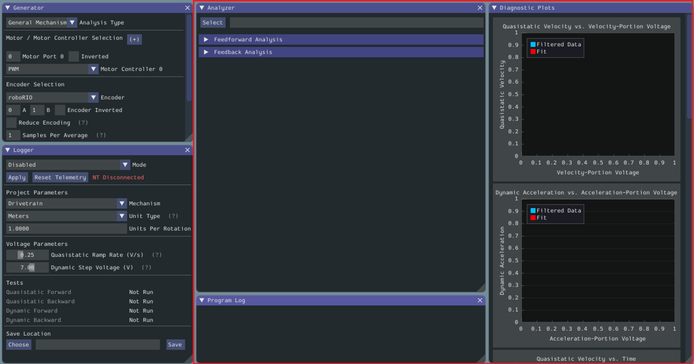
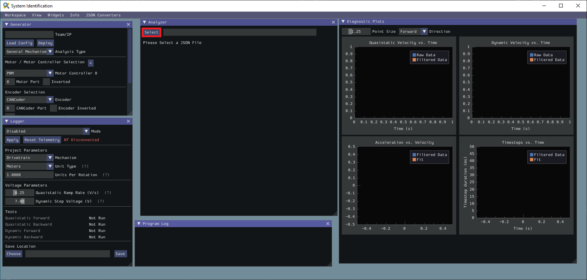
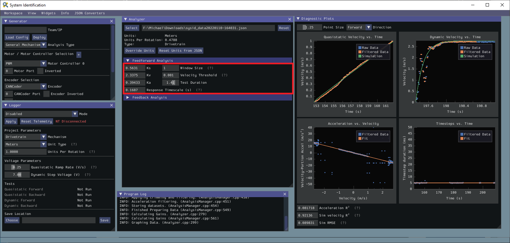

Analyzing Data
==============

.. important:: WPILib standarizes on SI units, so its recommended that the :guilabel:`Units` option is set to **Meters**.

Once we have data from an identification routine, we can analyze it using the :guilabel:`Analyzer` and :guilabel:`Diagnostic Plots` widgets.

Loading your Data File
----------------------

Now it's time to load the data file we saved from the logger tool. Click on :guilabel:`Select`.

In the resulting file dialog, select the JSON file you want to analyze. If the file appears to be malformed, an error will be shown.

Running Feedforward Analysis
----------------------------

.. note:: For information on what the calculated feedback gains mean, see :ref:`docs/software/advanced-controls/introduction/introduction-to-feedforward:The Permanent-Magnet DC Motor Feedforward Equation`.  For information on using the calculated feedback gains in code, see :ref:`feedforward control <docs/software/advanced-controls/controllers/feedforward:Feedforward Control in WPILib>`.

Click the dropdown arrow on the :guilabel:`Feedforward` Section.

.. note:: If you would like to change units, you will have to press the :guilabel:`Override Units` button and fill out the information on the popup.

.. image:: images/feedback-analysis.png
   :alt: Analyzing data for feedforward

The computed mechanism system parameters will then be displayed.

