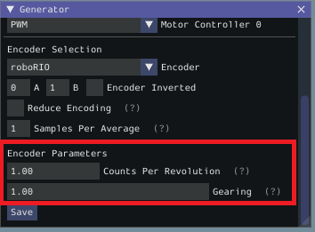

Configuring a Project
=====================

To use the toolsuite, we first need to configure the settings for your specific mechanism.

Configure Project Parameters
----------------------------

In order to run on your robot, the tool must know some parameters about how your robot is set up.

First, you need to use the :guilabel:`Analysis Type` field to select the appropriate project config. ``General Mechanism`` is for non-drivetrain mechanisms (e.g. Simple Motor, Arm, Elevator), ``Drivetrain`` is for Drivetrain mechanisms, and ``Romi`` is for the Romi robots. This allows you to fill out the parameters specific to the type of system you are using.

.. image:: images/analysis-type.png
   :alt: Selecting the appropriate analysis type.

The rest of the Generator widget is focused on the proper settings based off of the analysis type:

Motor Controller Selection
^^^^^^^^^^^^^^^^^^^^^^^^^^

The :guilabel:`Motor / Motor Controller Selection` allows you to add ports for each motor controller that will be used. The :guilabel:`+` and :guilabel:`-` buttons let you add and remove ports respectively.

.. note:: If you are plugging in your encoders into motor controllers make sure that the motor controller type and port(s) are the first ones you specify.

.. image:: images/motor-selection.png
   :alt: Motor selection section.

Each motor port contains the following parts:

- :guilabel:`Motor Port` is where you add the port number for a specific controller
- :guilabel:`Inverted` should be checked if the motorcontroller should be inverted
- :guilabel:`Motor Controller` is the type of motor controller that will be used.

Encoder Selection
^^^^^^^^^^^^^^^^^
The :guilabel:`Encoder Selection` allows you to configure the encoders that will be used. The types of encoder you can use will vary with the first motor controller type specified (see note :ref:`above <docs/software/pathplanning/system-identification/configuring-project:Motor Controller Selection>`).

.. image:: images/encoder-selection.png
   :alt: Encoder selection section.

Encoder Types
~~~~~~~~~~~~~
- **General Types** (consistent across all motor controller selections): ``roboRIO`` corresponds to any encoders that are plugged into the roboRIO, ``CANCoder`` corresponds to the CTRE CANCoder.
- **TalonSRX**: ``Built-in`` corresponds to any quadrature encoder plugged into the encoder port, ``Tachometer`` corresponds to the CTRE Tachometer plugged into the encoder port.
- **TalonFX**: ``Built-in`` corresponds to the integrated encoder on the TalonFX motor.
- **Spark MAX**: ``Encoder Port`` refers to an encoder plugged into the `encoder port <https://docs.revrobotics.com/sparkmax/feature-description/encoder-port>`__, ``Data Port`` refers to an encoder plugged into the `data port <https://docs.revrobotics.com/sparkmax/feature-description/data-port>`__.
- **Venom**: ``Built-in`` refers to an encoder plugged into the Venom's encoder port.

Encoder Settings
""""""""""""""""
Here are the following settings that can be configured (although the settings that are visible will vary by the previously selected encoder type):

- Ports (either :guilabel:`A` and :guilabel:`B` or :guilabel:`CANCoder Port`
- :guilabel:`Encoder Inverted` should be checked if a positive motor power doesn't correspond to a positive increase in encoder values
- :guilabel:`Samples Per Average` is how many samples will be averaged per velocity measurement. A value greater than one can help reduce encoder noise and 5-10 is recommended for encoders with high CPR. Only mess with this setting if a previous run of SysId resulted in extremely noisy data.
- :guilabel:`Reduce Encoding` should be checked if using high resolution encoders (e.g. CTRE Mag Encoders or REV Through Bore Encoder) that are plugged into the roboRIO. This uses the ``Encoder`` class ``1x`` decoding to reduce velocity noise. If this is checked, you will have to update your team's robot code to also use ``1x`` decoding on the encoders.
- :guilabel:`Time Measurement Window` is the period of time in milliseconds that the velocity measurement will be taken across. This setting can reduce measurement lag at the cost of possibly introducing more noise. Only modify this if data lag is impeding accurate control and data collection.

Encoder Parameters
^^^^^^^^^^^^^^^^^^

:guilabel:`Counts Per Revolution` is the encoder counts per revolution for your encoder which is generally specified on a datasheet. Common values include:

- CTRE Magnetic Encoder: 4096
- Falcon 500 Integrated: 2048
- REV Throughbore: 8192
- NEO (and NEO 550) Integrated Encoders (REV already handles this value): 1

:guilabel:`Gearing` is the gearing between the encoder and output shaft. For example, an magnetic encoder on a kit chassis would have a gearing of one as it is on a 1:1 ratio with the output shaft. However, if is was an integrated encoder in a motor that was in the gearbox, the gearing would be 10.71 (per Andymark) since there is now gearing between the encoder and the output shaft.

Gyro Parameters (Drivetrain Only)
^^^^^^^^^^^^^^^^^^^^^^^^^^^^^^^^^

:guilabel:`Gyro` lets you select the type of supported gyro.
:guilabel:`Gyro Parameter` lets you configure additional settings needed to configure the previously specified gyro.

.. image:: images/gyro-config.png
   :alt: Gyro configuration section.

Loading and Saving Configurations
---------------------------------
Once your robot configuration is set, you may save it to a location/name of your choice with the :guilabel:`Save` button:

.. image:: images/saving-config-file.png
   :alt: Saving the configuration file

Accordingly, you can also load an existing config file with the :guilabel:`Load Config` button:

.. image:: images/loading-config-file.png
   :alt: Loading a saved configuration file

Deploying Project
-----------------

Once your project has been configured, it's time to deploy the robot project to run the identification routine.

.. image:: images/deploy-config.png
   :alt: Deploying the config file

:guilabel:`Team/IP` is where you set your team number or IP. You can then deploy the code with the :guilabel:`Deploy` label.
