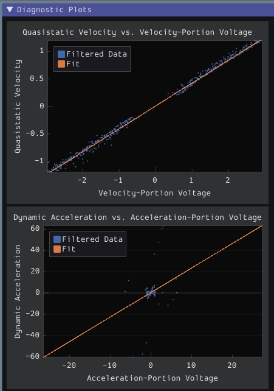
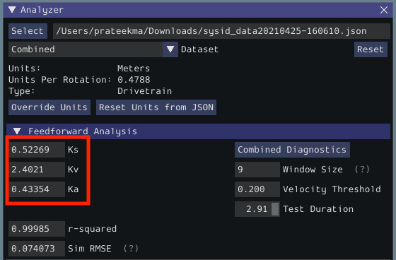
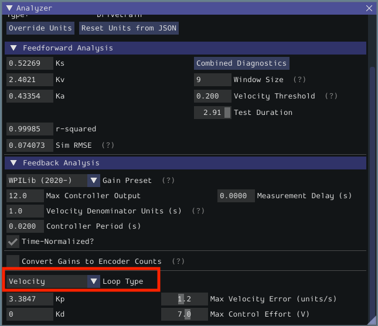
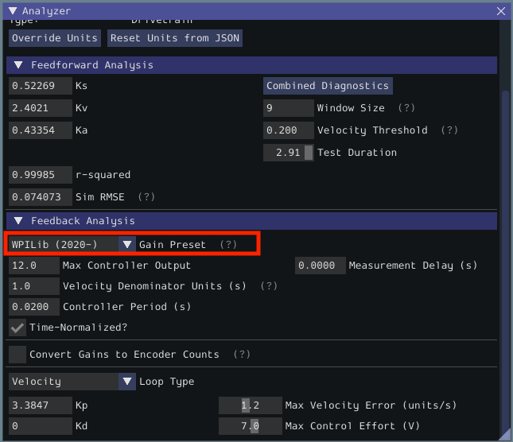
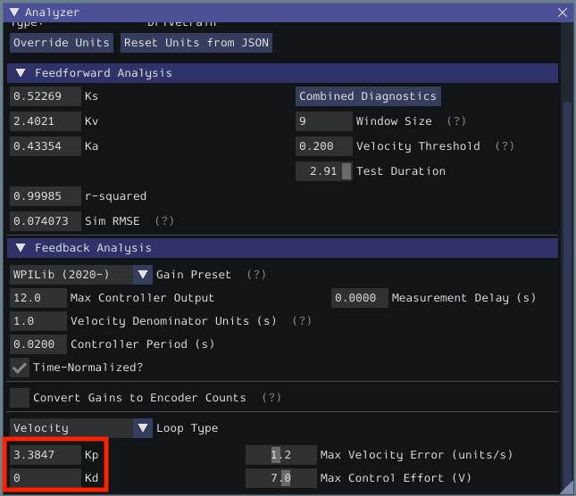

Step 1: Characterizing Your Robot Drive
=======================================

.. note::  For detailed instructions on using the System Identification tool, see its :ref:`dedicated documentation <docs/software/pathplanning/robot-characterization/introduction:Introduction to Robot Characterization>`.

.. note:: The drive characterization process requires ample space for the robot to drive.  Be sure to have *at least* a 10' stretch (ideally closer to 20') in which the robot can drive during the characterization routine.

.. note:: The characterization data for this tutorial has been generously provided by Team 5190, who generated it as part of a demonstration of this functionality at the 2019 North Carolina State University P2P Workshop.

Before accurately following a path with a robot, it is important to have an accurate model for how the robot moves in response to its control inputs.  Determining such a model is a process called "system identification."  WPILib's FRC-Characterization is a tool for drive system identification.

Gathering the Data
------------------

We begin by gathering our drive characterization data.

1. :ref:`Configure and Deploy a robot project <docs/software/pathplanning/robot-characterization/configuring-project:Configuring a Project>`.
2. :ref:`Run the Characterization Routine <docs/software/pathplanning/robot-characterization/characterization-routine:Running the Characterization Routine>`.

Analyzing the Data
------------------

Once the characterization routine has been run and the data file has been saved, it is time to :ref:`open it in the analysis pane <docs/software/pathplanning/robot-characterization/analyzing-data:Analyzing Data>`.

Checking Diagnostics
^^^^^^^^^^^^^^^^^^^^

Per the :ref:`characterization guide <docs/software/pathplanning/robot-characterization/viewing-diagnostics:Viewing Diagnostics>`, we first view the diagnostics to ensure that our data look reasonable:

As our data look reasonably linear and our threshold seems to be set correctly, we may move on to the next step.

Record Feedforward Gains
^^^^^^^^^^^^^^^^^^^^^^^^

.. note:: Feedforward gains do *not*, in general, transfer across robots.  Do *not* use the gains from this tutorial for your own robot.

We now record the feedforward gains calculated by the tool:

Since our wheel diameter was specified in meters, our feedforward gains are in the following units:

* ``kS``: Volts
* ``kV``: Volts * Seconds / Meters
* ``kA``: Volts * Seconds^2 / Meters

If you have specified your units correctly, your feedforward gains will likely be within an order of magnitude of the ones reported here (a possible exception exists for ``kA``, which may be vanishingly small if your robot is light).  If they are not, it is possible you specified one of your drive parameters incorrectly when generating your robot project.  A good test for this is to calculate the "theoretical" value of ``kV``, which is 12 volts divided by the theoretical free speed of your drivetrain (which is, in turn, the free speed of the motor times the wheel circumference divided by the gear reduction).  This value should agree very closely with the ``kV`` measured by the tool - if it does not, you have likely made an error somewhere.

Calculate Feedback Gains
^^^^^^^^^^^^^^^^^^^^^^^^

.. note:: Feedback gains do *not*, in general, transfer across robots.  Do *not* use the gains from this tutorial for your own robot.

We now :ref:`calculate the feedback gains <docs/software/pathplanning/robot-characterization/analyzing-feedback:Feedback Analysis>` for the PID control that we will use to follow the path.  Trajectory following with WPILib's RAMSETE controller uses velocity closed-loop control, so we first select ``Velocity`` mode in the characterization tool:

Since we will be using the WPILib PIDController for our velocity loop, we furthermore select the ``WPILib (2020-)`` option from the drop-down "presets" menu.  This is *very* important, as the feedback gains will not be in the correct units if we do not select the correct preset:

Finally, we calculate and record the feedback gains for our control loop.  Since it is a velocity controller, only a P gain is required:

Assuming we have done everything correctly, our proportional gain will be in units of Volts * Seconds / Meters.  Thus, our calculated gain means that, for each meter per second of velocity error, the controller will output an additional 3.38 volts.
