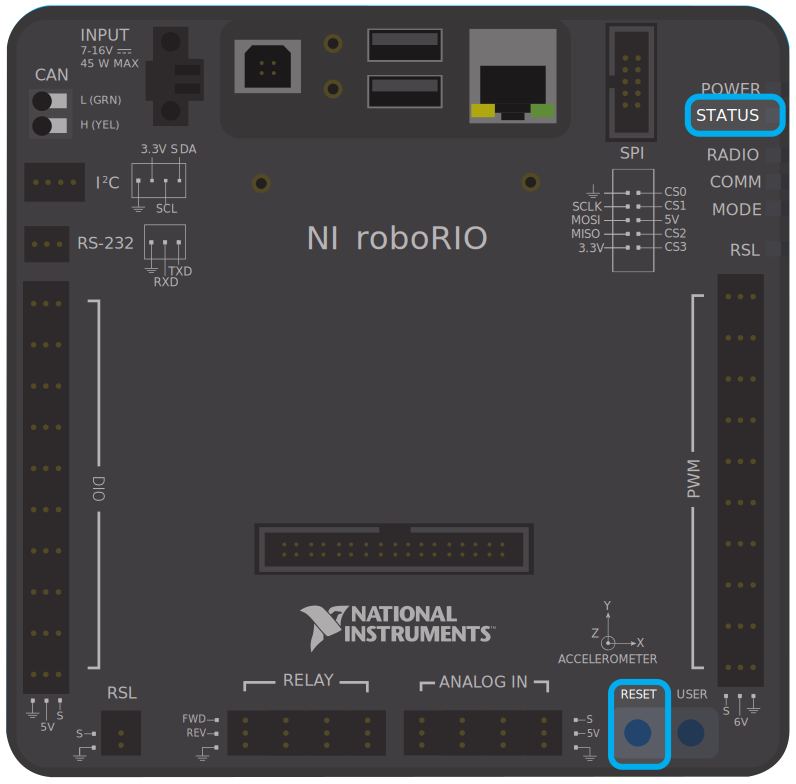

Recovering a roboRIO using Safe Mode
====================================

Occasionally a roboRIO may become corrupted to the point that it cannot be recovered using the normal boot and imaging process. Booting the roboRIO into Safe Mode may allow the device to be successfully re-imaged.

.. important:: These steps are not applicable to the roboRIO 2. Reimaging the SD card following :doc:`roboRIO 2.0 microSD card imaging process</docs/zero-to-robot/step-3/roborio2-imaging>` will fully reformat the device.

Booting into Safe Mode
----------------------

To boot the roboRIO into Safe Mode:

#. Apply power to the roboRIO
#. Press and hold the Reset button until the Status LED lights up (~5 seconds) then release the Reset button
#. The roboRIO will boot in Safe Mode (indicated by the Status LED flashing in groups of 3)

Recovering the roboRIO
----------------------

The roboRIO can now be imaged by using the roboRIO Imaging Tool as described in :ref:`Imaging your roboRIO <docs/zero-to-robot/step-3/imaging-your-roborio:Imaging your roboRIO 1>`.

About Safe Mode
---------------

In Safe Mode, the roboRIO boots a separate copy of the operating system into a RAM Disk. This allows you to recover the roboRIO even if the normal copy of the OS is corrupted. While in Safe Mode, any changes made to the OS (such as changes made by accessing the device via SSH or Serial) will not persist to the normal copy of the OS stored on disk.
