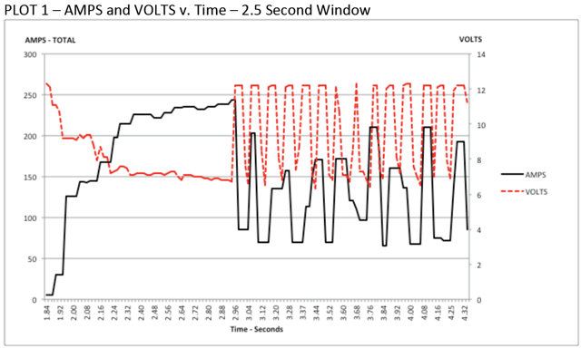
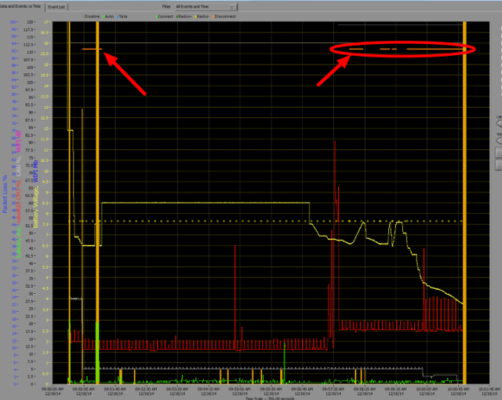

.. include:: <isonum.txt>

roboRIO Brownout and Understanding Current Draw
===============================================

In order to help maintain battery voltage to preserve itself and other control system components such as the radio during high current draw events, the roboRIO contains a staged brownout protection scheme. This article describes this scheme, provides information about proactively planning for system current draw, and describes how to use the new functionality of the PDP as well as the DS Log File Viewer to understand brownout events if they do happen on your robot.

roboRIO Brownout Protection
---------------------------

The roboRIO uses a staged brownout protection scheme to attempt to preserve the input voltage to itself and other control system components in order to prevent device resets in the event of large current draws pulling the battery voltage dangerously low.

Stage 1 - 6v output drop
~~~~~~~~~~~~~~~~~~~~~~~~~

**Voltage Trigger - 6.8V**

When the voltage drops below 6.8V, the 6V output on the PWM pins will start to drop.

Stage 2 - Output Disable
~~~~~~~~~~~~~~~~~~~~~~~~

**Voltage Trigger - 6.3V**

When the voltage drops below 6.3V, the controller will enter the brownout protection state. The following indicators will show that this condition has occurred:

-  Power LED on the roboRIO will turn Amber
-  Background of the voltage display on the Driver Station will turn red
-  Mode display on the Driver Station will change to Voltage Brownout
-  The CAN/Power tab of the DS will increment the 12V fault counter by 1.
-  The DS will record a brownout event in the DS log.

The controller will take the following steps to attempt to preserve the battery voltage:

-  PWM outputs will be disabled. For PWM outputs which have set their neutral value (all motor controllers in WPILib) a single neutral pulse will be sent before the output is disabled.
-  6V, 5V, 3.3V User Rails disabled (This includes the 6V outputs on the PWM pins, the 5V pins in the DIO connector bank, the 5V pins in the Analog bank, the 3.3V pins in the SPI and I2C bank and the 5V and 3.3V pins in the MXP bank)
-  GPIO configured as outputs go to High-Z
-  Relay Outputs are disabled (driven low)
-  CAN-based motor controllers are sent an explicit disable command
-  Pneumatic Devices such as the CTRE Pneumatics Control Module and REV Pneumatic Hub are disabled

**The controller will remain in this state until the voltage rises to greater than 7.5V or drops below the trigger for the next stage of the brownout**

Stage 3 - Device Blackout
~~~~~~~~~~~~~~~~~~~~~~~~~

**Voltage Trigger - 4.5V**

Below 4.5V the device may blackout. The exact voltage may be lower than this and depends on the load on the device.

**The controller will remain in this state until the voltage rises above 4.65V when the device will begin the normal boot sequence.**

Avoiding Brownout - Proactive Current Draw Planning
---------------------------------------------------

The key to avoiding a brownout condition is to proactively plan for the current draw of your robot. The best way to do this is to create some form of power budget. This can be a complex document that attempts to quantify both estimated current draw and time in an effort to most completely understand power usage and therefore battery state at the end of a match, or it can be a simple inventory of current usage. To do this:

1. Establish the max "sustained" current draw (with sustained being loosely defined here as not momentary). This is probably the most difficult part of creating the power budget. The exact current draw a battery can sustain while maintaining a voltage of 7+ volts is dependent on a variety of factors such as battery health (see :ref:`this <docs/hardware/hardware-basics/robot-battery:Robot Battery Basics>` article for measuring battery health) and state of charge. As shown in the `NP18-12 data sheet <https://www.farnell.com/datasheets/575631.pdf>`__, the terminal voltage chart gets very steep as state of charge decreases, especially as current draw increases. This datasheet shows that at 3CA continuous load (54A) a brand new battery can be continuously run for over 6 minutes while maintaining a terminal voltage of over 7V. As shown in the image above (used with permission from `Team 234s Drive System Testing document <https://www.chiefdelphi.com/t/paper-new-control-functions-drive-system-testing/139165>`__), even with a fresh battery, drawing 240A for more than a second or two is likely to cause an issue. This gives us some bounds on setting our sustained current draw. For the purposes of this exercise, we'll set our limit at 180A.
2. List out the different functions of your robot such as drivetrain, manipulator, main game mechanism, etc.
3. Start assigning your available current to these functions. You will likely find that you run out pretty quickly. Many teams gear their drivetrain to have enough  :term:`torque` to slip their wheels at 40-50A of current draw per motor. If we have 4 motors on the drivetrain, that eats up most, or even exceeds, our power budget! This means that we may need to put together a few scenarios and understand what functions can (and need to be) be used at the same time. In many cases, this will mean that you really need to limit the current draw of the other functions if/while your robot is maxing out the drivetrain (such as trying to push something). Benchmarking the "driving" current requirements of a drivetrain for some of these alternative scenarios is a little more complex, as it depends on many factors such as number of motors, robot weight, gearing, and efficiency. Current numbers for other functions can be done by calculating the power required to complete the function and estimating efficiency (if the mechanism has not been designed) or by determining the  :term:`torque` load on the motor and using the torque-current curve to determine the current draw of the motors.

4. If you have determined mutually exclusive functions in your analysis, consider enforcing the exclusion in software. You may also use the current monitoring of the PDP (covered in more detail below) in your robot program to provide output limits or exclusions dynamically (such as don't run a mechanism motor when the drivetrain current is over X or only let the motor run up to half output when the drivetrain current is over Y).

Settable Brownout
-----------------

The NI roboRIO 1.0 does not support custom brownout voltages. It is fixed at 6.3V as mentioned in Stage 2 above.

The NI roboRIO 2.0 adds the option for a software settable brownout level.  The default brownout level (Stage 2) of the roboRIO 2.0 is 6.75V.

.. tabs::

  .. code-tab:: java

    RobotController.setBrownoutVoltage(7.0);

  .. code-tab:: c++

    frc::RobotController::SetBrownoutVoltage(7_V);

Measuring Current Draw using the PDP/PDH
----------------------------------------

The FRC\ |reg| Driver Station works in conjunction with the roboRIO and PDP/PDH to extract logged data from the PDP/PDH and log it on your DS PC. A viewer for this data is still under development.

In the meantime, teams can use their robot code and manual logging, a LabVIEW front panel or the SmartDashboard to visualize current draw on their robot as mechanisms are developed. In LabVIEW, you can read the current on a PDP/PDH channel using the Get PD Currents VI found on the Power pallet. For C++ and Java teams, use the PowerDistribution class as described in the :doc:`Power Distribution </docs/software/can-devices/power-distribution-module>` article. Plotting this information over time (easiest with a LV Front Panel or with the SmartDashboard by using a Graph indicator can provide information to compare against and update your power budget or can locate mechanisms which do not seem to be performing as expected (due to incorrect load calculation, incorrect efficiency assumptions, or mechanism issues such as binding).

Identifying Brownouts
---------------------

The easiest way to identify a brownout is by clicking on the CAN\\Power tab of the DS and checking the 12V fault count. Alternately, you can review the Driver Station Log after the fact using the Driver Station Log Viewer. The log will identify brownouts with a bright orange line, such as in the image above (note that these brownouts were induced with a benchtop supply and may not reflect the duration and behavior of brownouts on a typical FRC robot).
