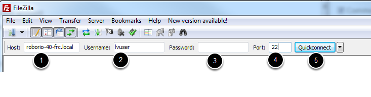
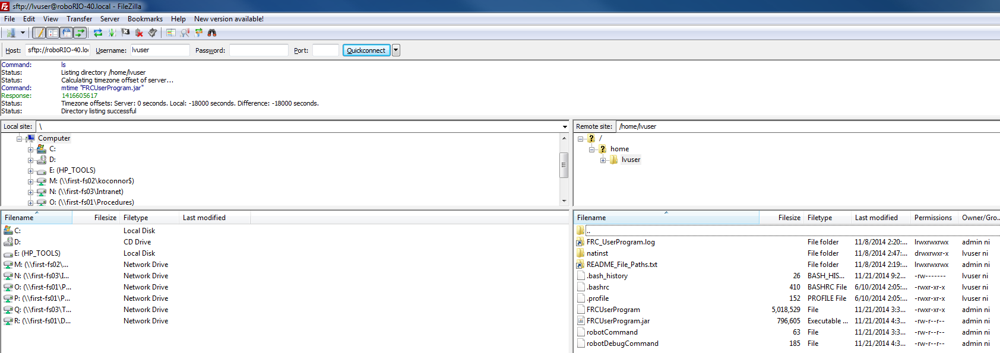
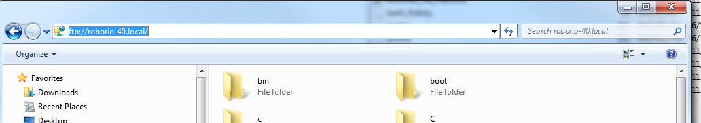

RoboRIO FTP
===========

.. note:: The roboRIO has both SFTP and anonymous FTP enabled. This article describes how to use each to access the roboRIO file system.

SFTP
----
SFTP is the recommended way to access the RoboRIO file system. Because you will be using the same account that your program will run under, files copied over should always have permissions compatible with your code.

Software 
^^^^^^^^
There are a number of freely available programs for SFTP. This article will discuss using FileZilla. You can either download and install FileZilla_ before proceeding or extrapolate the directions below to your SFTP client of choice.

.. _FileZilla: https://filezilla-project.org/download.php?type=client

Connecting to the RoboRIO
^^^^^^^^^^^^^^^^^^^^^^^^^

To connect to your roboRIO:

1. Enter the mDNS name (roboRIO-TEAM-frc.local) in the "Host" box
2. Enter "lvuser" in the Username box (this is the account your program runs under)
3. Leave the Password box blank
4. Enter "22" in the port box (the SFTP default port)
5. Click Quickconnect

Browsing the RoboRIO filesystem
^^^^^^^^^^^^^^^^^^^^^^^^^^^^^^^

After connecting to the roboRIO, Filezilla will open to the \\home\\lvuser directory. The right pane is the remote system (the roboRIO), the left pane is the local system (your computer). The top section of each pane shows you the hierarchy to the current directory you are browsing, the bottom pane shows contents of the directory. To transfer files, simply click and drag from one side to the other. To create directories on the roboRIO, right click and select "Create Directory".

FTP
---

The roboRIO also has anonymous FTP enabled. It is recommended to use SFTP as described above, but depending on what you need FTP may work in a pinch with no additional software required. To FTP to the roboRIO, open a Windows Explorer window (on Windows 7, you can click Start->My Computer). In the address bar, type ftp://roboRIO-TEAM-frc.local and press enter. You can now browse the roboRIO file system just like you would browse files on your computer.