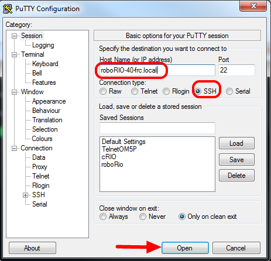
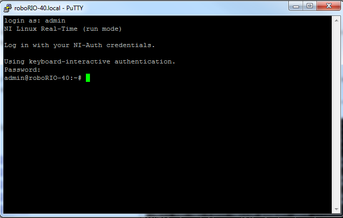

.. include:: <isonum.txt>

roboRIO User Accounts and SSH
=============================

.. note:: This document contains advanced topics not required for typical FRC\ |reg| programming

The roboRIO image contains a number of accounts, this article will highlight the two used  for FRC and provide some detail about their purpose. It will also describe how to connect  to the roboRIO over SSH.

roboRIO User Accounts
---------------------
The roboRIO image contains a number of user accounts, but there are two of primary interest for FRC.

Admin
^^^^^
The "admin" account has root access to the system and can be used to manipulate OS files or settings. Teams should take caution when using this account as it allows for the modification of settings and files that may corrupt the operating system of the roboRIO. The credentials for this account are:

``Username: admin``

``Password:``

.. note:: The password is intentionally blank.

Lvuser
^^^^^^
The "lvuser" account is the account used to run user code for all three languages. The credentials for this account should not be changed. Teams may wish to use this account (via ssh or sftp) when working with the roboRIO to ensure that any files or settings changes are being made on the same account as their code will run under.

.. danger:: Changing the default ssh passwords for either "lvuser" or "admin" will prevent C++ and Java teams from uploading code.

SSH
---
SSH (Secure SHell) is a protocol used for secure data communication. When broadly referred to regarding a Linux system (such as the one running on the roboRIO) it generally refers to accessing the command line console using the SSH protocol. This can be used to execute commands on the remote system. A free client which can be used for SSH is PuTTY: https://www.chiark.greenend.org.uk/~sgtatham/putty/latest.html

Open Putty
^^^^^^^^^^

Open Putty (clicking OK at any security prompt). Then set the following settings:

1. Host Name: roboRIO-TEAM-frc.local (where TEAM is your team number, example shows team 40)

2. Connection Type: SSH

Other settings can be left at defaults. Click Open to open the connection. If you see a prompt about SSH keys, click OK.

If you are connected over USB you can use 172.22.11.2 as the hostname. If your roboRIO is set to a static IP you can use that IP as the hostname if connected over Ethernet/wireless.

Log In
^^^^^^

When you see the prompt, enter the desired username (see above for description) then press enter. At the password prompt press enter (password for both accounts is blank).
