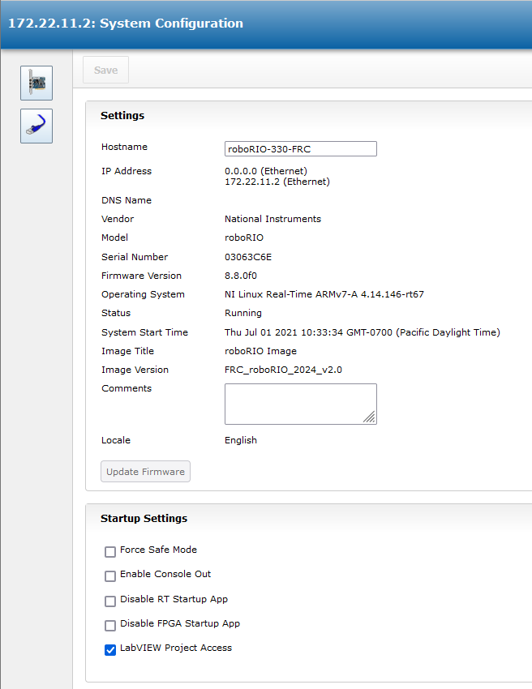
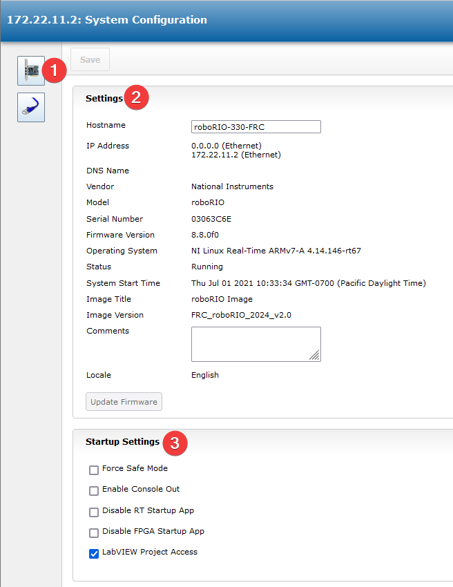
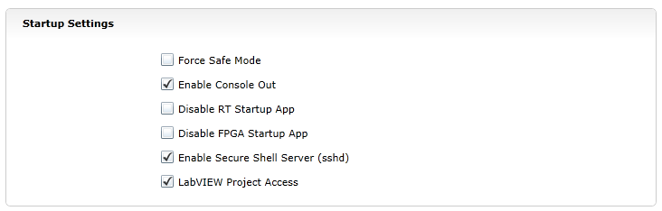
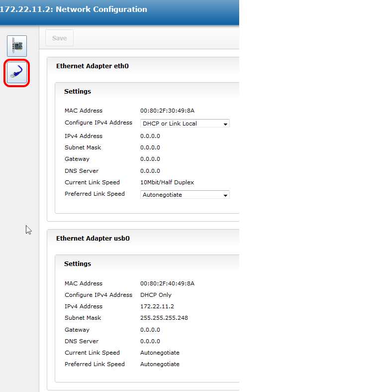

roboRIO Web Dashboard
=====================

The roboRIO web dashboard is a webpage built into the roboRIO that can
be used for checking status and updating settings of the roboRIO.

Users may encounter issues using IE (compatibility)
or Edge (mDNS site access). Alternate browsers such as Google Chrome or
Mozilla Firefox are recommended for the best experience.

Opening the WebDash
-------------------

To open the web dashboard, open a web browser and enter the address of
the roboRIO into the address bar (172.22.11.2 for USB, or
"roboRIO-####-FRC.local where #### is your team number, with no leading
zeroes, for either interface). See this document for more details about
mDNS and roboRIO networking: :ref:`docs/networking/networking-introduction/ip-configurations:IP Configurations`

System Configuration Tab
------------------------

The home screen of the web dashboard is the System Configuration tab
which has 5 main sections:

1. Navigation Bar - This section allows you to navigate to different
   sections of the web dashboard. The different pages accessible through
   this navigation bar are discussed below.
2. System Settings - This section contains information about the System
   Settings. The Hostname field should not be modified manually, instead
   use the roboRIO Imaging tool to set the Hostname based on your team
   number. This section contains information such as the device IP,
   firmware version and image version.
3. Startup Settings - This section contains Startup settings for the
   roboRIO. These are described in the sub-step below
4. System Resources (not pictured) - This section provides a snapshot of
   system resources such as memory and CPU load.

Startup Settings
~~~~~~~~~~~~~~~~

-  Force Safe Mode - Forces the controller into Safe Mode. This can be
   used with troubleshooting imaging issues, but it is recommended to
   use the Reset button on the roboRIO to put the device into Safe Mode
   instead (with power already applied, hold the rest button for 5
   seconds). **Default is unchecked.**
-  Enable Console Out - This enables the on-board RS232 port to be used
   as a Console output. It is recommended to leave this enabled unless
   you are using this port to talk to a serial device (note that this
   port uses RS232 levels and should not be connected to many
   microcontrollers which use TTL levels). **Default is checked.**
-  Disable RT Startup App - Checking this box disables code from running
   at startup. This may be used for troubleshooting if you find the
   roboRIO is unresponsive to new program download. Default is unchecked
-  Disable FPGA Startup App - **This box should not be checked.**
-  Enable Secure Shell Server (sshd) - **It is recommended to leave this
   box checked.** This setting enables SSH which is a way to remotely
   access a console on the roboRIO. Unchecking this box will prevent C++
   and Java teams from loading code onto the roboRIO.
-  LabVIEW Project Access -\*\* It is recommended to leave this box
   checked.\*\* This setting allows LabVIEW projects to access the
   roboRIO.

Network Configuration
---------------------

This page shows the configuration of the roboRIO's network adapters.
**It is not recommended to change any settings on this page.** For more
information on roboRIO networking see this article: :ref:`docs/networking/networking-introduction/ip-configurations:IP Configurations`
