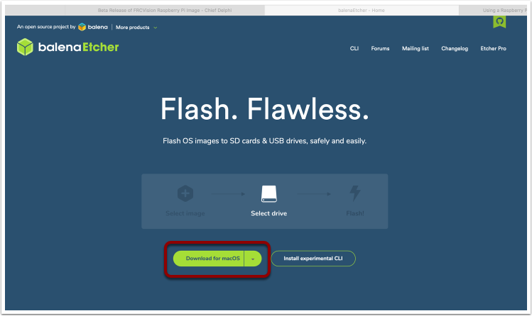
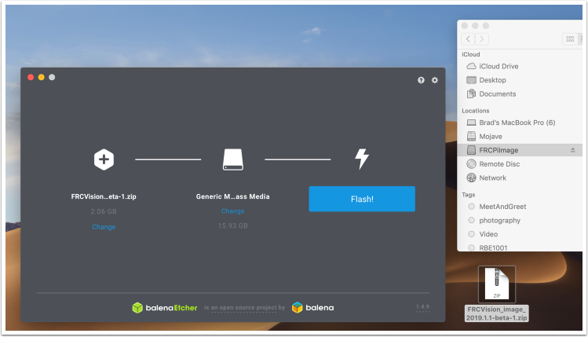

RoboRIO2 Imaging
================

The roboRIO2 uses a microSD card to hold all of it's software and robot code.

Getting the image
-----------------

The image is provided as part of the FRC Game Tools install.  To locate the image you can open the Imaging Tool

Copy the image to your MicroSD card
-----------------------------------

Download and install `Etcher <https://www.balena.io/etcher/>`__ to image the micro SD card. The micro SD card needs to be at least
4 GB. Note: a `micro SD to USB dongle <https://www.amazon.com/gp/product/B0779V61XB>`__ works well for writing to micro SD cards.

Flash the MicroSD card with the image using Etcher by selecting the zip file as the source, your SD card as the destination and
click "Flash". Expect the process to take about 3 minutes on a fairly fast laptop.

