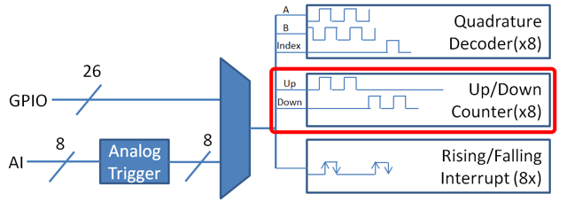

Counters
========

|Counters|

The :code:`Counter` class (Java, C++) is a versatile class that allows the counting of pulse edges on a digital input.  :code:`Counter` is used as a component in several more-complicated WPILib classes (such as :ref:`Encoder <encoders-software>` and :ref:`Ultrasonic <ultrasonics-software>`), but is also quite useful on its own.

.. note:: There are a total of 8 counter units in the RoboRIO FPGA, meaning no more than 8 :code:`Counter` objects may be instantiated at any one time, including those contained as resources in other WPILib objects.  For detailed information on when a :code:`Counter` may be used by another object, refer to the official API documentation.

Counter Modes
-------------

The :code:`Counter` object may be configured to operate in one of four different modes:

1. `Two-pulse mode`_: Counts up and down based on the edges of two different channels.
2. `Semi-period mode`_: Measures the duration of a pulse on a single channel.
3. `Pulse-length mode`_: Counts up and down based on the edges of one channel, with the direction determined by the duration of the pulse on that channel.
4. `External direction mode`_: Counts up and down based on the edges of one channel, with a separate channel specifying the direction.

.. note:: In all modes except semi-period mode, the counter can be configured to increment either once per edge (2X encoding), or once per pulse (1X encoding).  By default, ??? will be used (TODO: figure this out).

To obtain the count in all modes, call the :code:`get()` method.

Two-pulse mode
~~~~~~~~~~~~~~

In two-pulse mode, the :code:`Counter` will count up for every edge/pulse on the specified "up channel," and down for every edge/pulse on the specified "down channel."  A counter can be initialized in two-pulse with the following code:

.. tabs::

    .. code-tab:: c++

        // Create a new Counter object in two-pulse mode
        frc::Counter counter{frc::Counter::Mode::k2Pulse};

        void frc::Robot::RobotInit() {
            // Set up the input channels for the counter
            counter.SetUpSource(1);
            counter.SetDownSource(2);

            // Set the encoding type to 2X
            counter.SetUpSourceEdge(true, true);
            counter.SetDownSourceEdge(true, true);

    .. code-tab:: java

        // Create a new Counter object in two-pulse mode
        Counter counter = new Counter(Counter.Mode.k2Pulse);

        @Override
        public void robotInit() {
            // Set up the input channels for the counter
            counter.setUpSource(1);
            counter.setDownSource(2);

            // Set the encoding type to 2X
            counter.setUpSourceEdge(true, true);
            counter.setDownSourceEdge(true, true);
        }

Semi-period mode
~~~~~~~~~~~~~~~~

In semi-period mode, the :code:`Counter` will count the duration of the pulses on a channel, either from a rising edge to the next falling edge, or from a falling edge to the next rising edge.  A counter can be initialized in semi-period mode with the following code:

.. tabs::

    .. code-tab:: c++

        // Create a new Counter object in two-pulse mode
        frc::Counter counter{frc::Counter::Mode::kSemiperiod};

        void frc::Robot::RobotInit() {
            // Set up the input channel for the counter
            counter.SetUpSource(1);

            // Set the encoder to count pulse duration from rising edge to falling edge
            counter.SetSemiPeriodMode(true);

    .. code-tab:: java

        // Create a new Counter object in two-pulse mode
        Counter counter = new Counter(Counter.Mode.kSemiperiod);

        @Override
        public void robotInit() {
            // Set up the input channel for the counter
            counter.setUpSource(1);

            // Set the encoder to count pulse duration from rising edge to falling edge
            counter.setSemiPeriodMode(true);
        }

To get the pulse width, call the :code:`getPeriod()` method:

.. tabs::

    .. code-tab:: c++

        // Return the measured pulse width in seconds
        counter.getPeriod();

    .. code-tab:: java

        // Return the measured pulse width in seconds
        counter.GetPeriod();

Pulse-length mode
~~~~~~~~~~~~~~~~~

In pulse-length mode, the counter will count either up or down depending on the length of the pulse (TODO: determine whether it counts up or down when the pulse is above the threshold; not documented...).  This is useful for some gear tooth sensors which encode direction in this manner.  A counter can be initialized in this mode as follows:

.. tabs::

    .. code-tab:: c++

        // Create a new Counter object in two-pulse mode
        frc::Counter counter{frc::Counter::Mode::kPulseLength};

        void frc::Robot::RobotInit() {
            // Set up the input channel for the counter
            counter.SetUpSource(1);

            // Set the encoding type to 2X
            counter.SetUpSourceEdge(true, true);

            // Set the counter to count down if the pulses are longer than .05 seconds
            counter.setPulseLengthMode(.05)

    .. code-tab:: java

        // Create a new Counter object in two-pulse mode
        Counter counter = new Counter(Counter.Mode.kPulseLength);

        @Override
        public void robotInit() {
            // Set up the input channel for the counter
            counter.setUpSource(1);

            // Set the encoding type to 2X
            counter.setUpSourceEdge(true, true);

            // Set the counter to count down if the pulses are longer than .05 seconds
            counter.SetPulseLengthMode(.05)
        }

External direction mode
~~~~~~~~~~~~~~~~~~~~~~~

In external direction mode, the counter counts either up or down depending on the level on the second channel (TODO: does it count up if the pin is high or low?  not documented...).  A counter can be initialized in this mode as follows:

.. tabs::

    .. code-tab:: c++

        // Create a new Counter object in two-pulse mode
        frc::Counter counter{frc::Counter::Mode::kExternalDirection};

        void frc::Robot::RobotInit() {
            // Set up the input channels for the counter
            counter.SetUpSource(1);
            counter.SetDownSource(2);

            // Set the encoding type to 2X
            counter.SetUpSourceEdge(true, true);

    .. code-tab:: java

        // Create a new Counter object in two-pulse mode
        Counter counter = new Counter(Counter.Mode.kExternalDirection);

        @Override
        public void robotInit() {
            // Set up the input channels for the counter
            counter.setUpSource(1);
            counter.setDownSource(2);

            // Set the encoding type to 2X
            counter.setUpSourceEdge(true, true);
        }

Configuring units
-----------------

Often, it is useful to have a counter return physically-meaningful units.  This can be accomplished with the :code:`setDistancePerPulse()` method:

.. tabs::

    .. code-tab:: c++

        // Sets the distance per pulse for a counter on a mechanism that travels 4 inches per 256 pulses
        counter.SetDistancePerPulse(4./256.);

        // Returns value in inches
        counter.GetDistance();

    .. code-tab:: java

        // Sets the distance per pulse for a counter on a mechanism that travels 4 inches per 256 pulses
        counter.setDistancePerPulse(4./256.);

        // Returns value in inches
        counter.getDistance();

Using counters in code
----------------------

Counters are useful for a wide variety of robot applications - but since the :code:`Counter` class is so varied, it is difficult to provide a good summary of them here.  Many of these applications overlap with the :code:`Encoder` class - a simple counter is often a cheaper alternative to a quadrature encoder.  For a summary of potential uses for encoders in code, see :ref:`encoders-software`.

