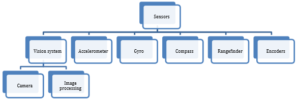

Sensor Overview - Software
==========================

.. note:: This section covers using sensors in software.  For a guide to sensor hardware, see :ref:`docs/hardware/sensors/sensor-overview-hardware:Sensor Overview - Hardware`.

.. note:: While cameras may definitely be considered "sensors", vision processing is a sufficiently-complicated subject that it is covered in :ref:`its own section <strategies-for-vision-programming>`, rather than here.

In order to be effective, it is often vital for robots to be able to gather information about their surroundings.  Devices that provide feedback to the robot on the state of its environment are called "sensors."  WPILib innately supports a large variety of sensors through classes included in the library.  This section will provide a guide to both using common sensor types through WPILib, as well as writing code for sensors without official support.

What sensors does WPILIB support?
---------------------------------

The RoboRIO includes a `FPGA <https://en.wikipedia.org/wiki/Field-programmable_gate_array>`__ which allows accurate real-time measuring of a variety of sensor input.  WPILib, in turn, provides a number of classes for accessing this functionality.

TODO: Fix this graphic.  Vision should be removed, counters are omitted but should be included, in general this needs to be made sensible/consistent

|Types of Sensors|

WPILib provides native support for (TODO: make each of these links):

- :ref:`Accelerometers <docs/software/sensors/accelerometers-software:Accelerometers - Software>`
- :ref:`Gyroscopes <docs/software/sensors/gyros-software:Gyroscopes - Software>`
- :ref:`Ultrasonic rangefinders <docs/software/sensors/ultrasonics-software:Ultrasonics - Software>`
- :ref:`Potentiometers <docs/software/sensors/analog-potentiometers-software:Analog Potentiometers - Software>`
- :ref:`Counters <docs/software/sensors/counters:Counters>`
- :ref:`Quadrature encoders <docs/software/sensors/encoders-software:Encoders - Software>`
- :ref:`Limit switches <docs/software/sensors/digital-inputs-software:Digital Inputs - Software>`

Additionally, WPILib includes lower-level classes for interfacing directly with the FPGA's digital and analog inputs and outputs.

