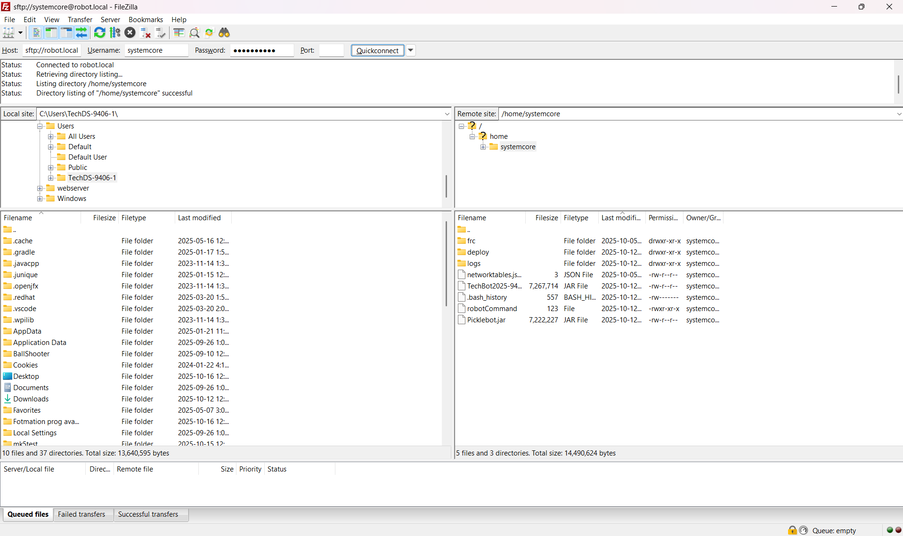

# Systemcore FTP

.. note:: Unlike the roboRIO, the systemcore only has SFTP access. This article describes how to use it to access the Systemcore filesystem.

## SFTP
SFTP is the recommended way to access the roboRIO file system. Because you will be using the same account that your program will run under, files copied over should always have permissions compatible with your code.

### Software
There are a number of freely available programs for SFTP. This article will discuss using FileZilla. You can either download and install [FileZilla](https://filezilla-project.org/download.php?show_all=1) before proceeding or extrapolate the directions below to your SFTP client of choice.

### Connecting to the roboRIO

.. image:: images/roborio-connect.png
   :alt: Each part of the connection information at the top of FileZilla.

To connect to your roboRIO:

1. Enter the mDNS name (roboRIO-TEAM-frc.local) in the "Host" box
2. Enter "systemcore" in the Username box (this is the account your program runs under)
3. Enter "systemcore" in the password box
4. Enter "22" in the port box (the SFTP default port)
5. Click Quickconnect

### Browsing the filesystem

After connecting to the Systemcore, Filezilla will open to the \\home\\systemcore directory. The right pane is the remote system (the roboRIO), the left pane is the local system (your computer). The top section of each pane shows you the hierarchy to the current directory you are browsing, the bottom pane shows contents of the directory. To transfer files, simply click and drag from one side to the other. To create directories on the roboRIO, right click and select "Create Directory".
