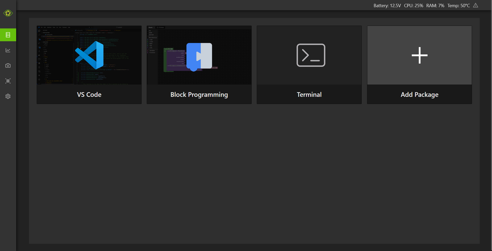
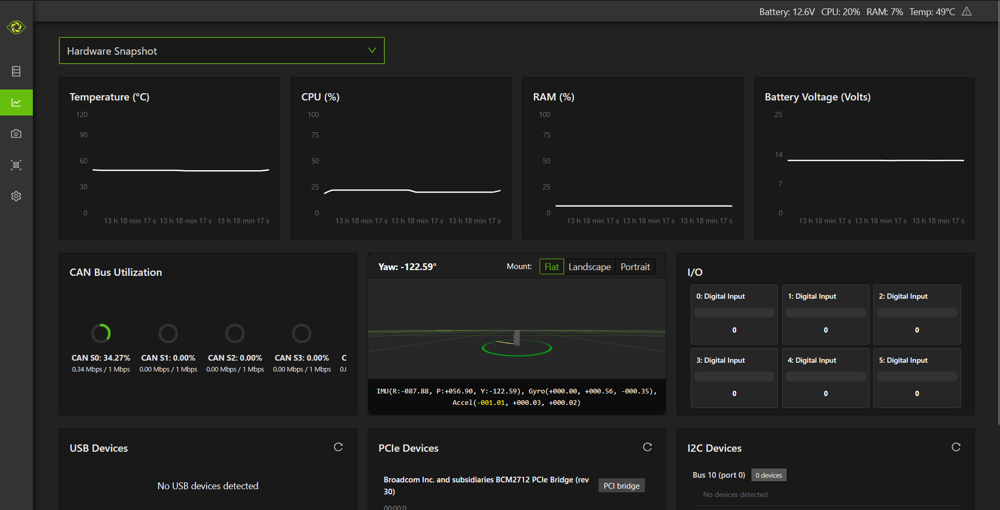
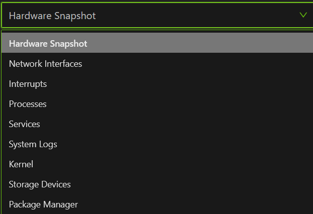
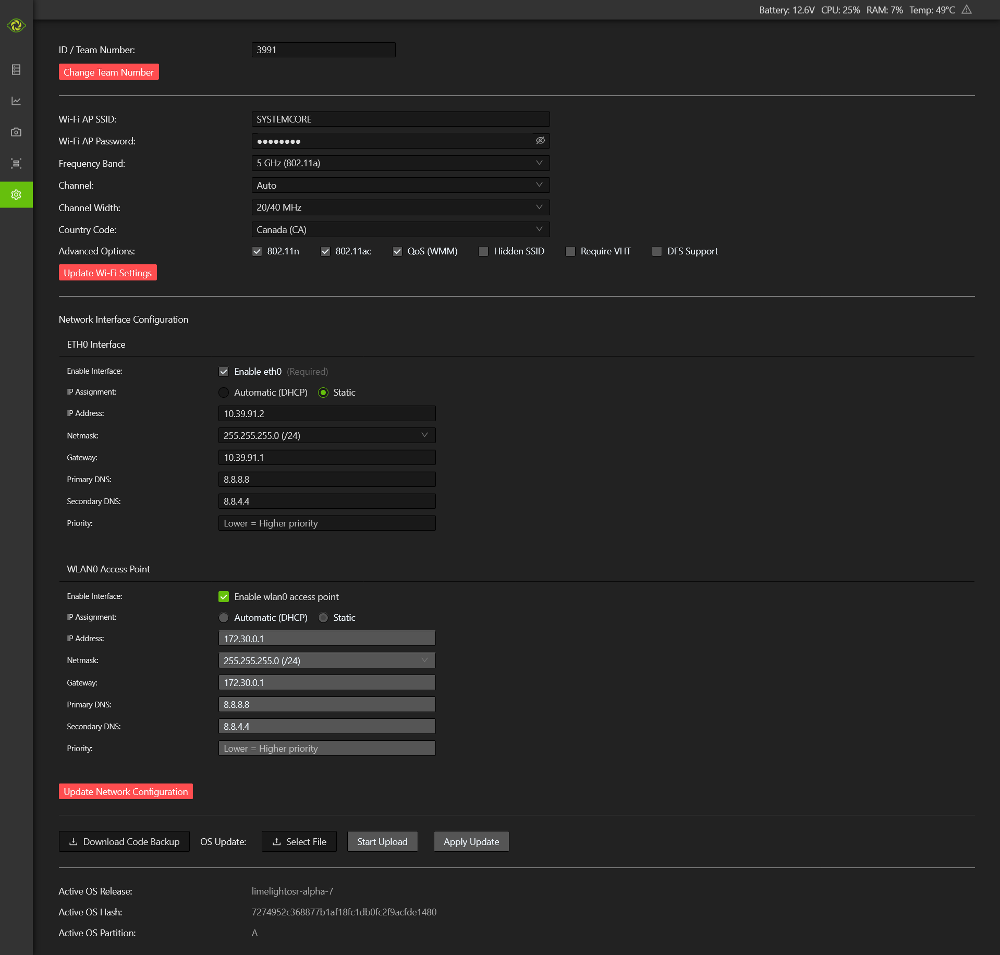

# Systemcore web dashboard

The Systemcore web UI is located at http://robot.local

## Home page

When you open robot.local, you will land on a page where you can open a online version of vscode, a block programming interface, the systemcore terminal or install new IPK packages.

## System page

The second tab on the left is the System tab. It provides useful information about the Systemcore.

The system tab can also display a lot of other information that is not used by the majority of teams

## Update & configure page

This page is the one used for changing the Systemcore team number, ip address and other internet settings

