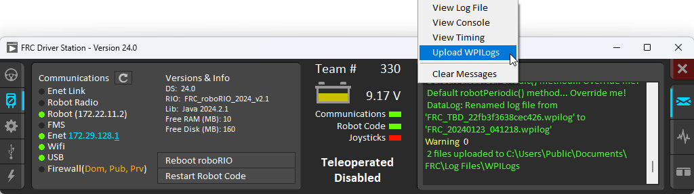

# Downloading & Processing Data Logs

Data logs can be processed and viewed offline by AdvantageScope, the DataLogTool, or custom utilities. If data log files are being stored to the roboRIO integrated flash memory instead of a removable USB flash drive, it's important to periodically download and delete data logs to avoid the storage from filling up.

## Managing Data Logs with AdvantageScope

:ref:`AdvantageScope <docs/software/dashboards/advantagescope:AdvantageScope>` is an analysis tool that supports downloading, visualizing, and exporting data logs. See the relevant sections of the documentation for more details:

- [Downloading log files](https://docs.advantagescope.org/getting-started/manage-files)
- [Exporting to new formats](https://docs.advantagescope.org/more-features/export)

## Managing Data Logs with the DataLogTool

The DataLogTool desktop application integrates a SFTP client for downloading data log files from a network device (e.g. roboRIO or coprocessor) to the local computer.

This process consists of four steps:

1. Connect to roboRIO or coprocessor
2. Navigate to remote directory and select what files to download
3. Select download folder
4. Download files and optionally delete remote files after downloading

### Connecting to RoboRIO

.. note:: The downloader uses SSH, so it will not be able to connect wirelessly if the radio firewall is enabled (e.g. when the robot is on the competition field).

.. image:: images/datalogtool/download-connecting.png
   :alt: Connection display showing team number, username, and password fields.

Either a team number, IP address, or hostname can be entered into the :guilabel:`Team Number / Address` field.  This field specifies the remote host to connect to. If a team number is entered, ``roborio-TEAM-frc.local`` is used as the connection address.

The remote username and password are also entered here.  For the roboRIO, the username should be ``lvuser`` with a blank password.

The tool also supports connecting to network devices other than the roboRIO, such as coprocessors, as long as the device supports SFTP password-based authentication.

Click :guilabel:`Connect` to connect to the remote device.  This will attempt to connect to the device.  The connection attempt can be aborted at any time by clicking :guilabel:`Disconnect`.  If the application is unable to connect to the remote device, an error will be displayed above the :guilabel:`Team Number / Address` field and a new connection can be attempted.

### Downloading Files

After the connection is successfully established, a simplified file browser will be displayed.  This is used to navigate the remote filesystem and select which files to download.  The first text box shows the current directory.  A specific directory can be navigated to by typing it in this text box and pressing Enter.  Alternatively, directory navigation can be performed by clicking on one of the directories that are listed below the remote dir textbox.  Following the list of directories is a table of files.  Only files with a ``.wpilog`` extension are shown, so the table will be empty if there are no log files in the current directory.  The checkbox next to each data log file indicates whether the file should be downloaded.

.. note:: On the roboRIO, log files are typically saved to either ``/home/lvuser/logs`` or ``/u/logs`` (USB stick location).

.. image:: images/datalogtool/download-file-selection.png
   :alt: Remote file browser showing remote directory, list of directories, and list of files with checkboxes next to each one.

Click :guilabel:`Select Download Folder...` to bring up a file browser for the local computer.

If you want to delete the files from the remote device after they are downloaded, check the :guilabel:`Delete after download` checkbox.

Once a download folder is selected, :guilabel:`Download` will appear.  After clicking this button, the display will change to a download progress display.  Any errors will be shown next to each file.  Click :guilabel:`Download complete!` to return to the file browser.

.. image:: images/datalogtool/download-downloading.png
   :alt: Download status showing 100% completion on the first file and a "file exists" error on the second file.

### Converting Data Logs to CSV

As data logs are binary files, the DataLogTool desktop application provides functionality to convert data logs into CSV files for further processing or analysis.  Multiple data logs may be simultaneously loaded into the tool for batch processing, and partial data exports can be performed by selecting only the data that is desired to be output.

.. image:: images/datalogtool/csv-export.png
   :alt: DataLogTool window showing two open files, a tree view of entries with corresponding checkboxes and information about each entry, and an output window with export style option.

The conversion process is started by opening data log files in the "Input Files" window.  Files are opened by clicking :guilabel:`Open File(s)...`.  Summary status on each file (e.g. number of records and entries) is displayed.  Clicking :guilabel:`X` in the table row closes the file.

After at least one file is loaded, the "Entries" window displays a tree view of the entries (this can be changed to a flat view by right clicking on the "Entries" window title bar and unchecking :guilabel:`Tree View`).  Individual entries or entire subtrees can be checked or unchecked to indicate whether they should be included in the export.  The data type information and initial metadata for each entry is also shown in the table.  As the "Entries" view shows a merged view of all entries across all input files, if more than one input file is open, hovering over an entry's name will highlight what input files contain that entry.

The output window is used to specify the output folder (via :guilabel:`Select Output Folder...`) as well as the output style (list or table).  The list output style outputs a CSV file with 3 columns (timestamp, entry name, and value) and a row for every value change (for every exported entry).  The table output style outputs a CSV file with a timestamp column and a column for every exported entry; a row is output for every value change (for every exported entry), but the value is placed in the correct column for that entry.  Clicking :guilabel:`Export CSV` will create a ``.csv`` file in the output folder corresponding to each input file.

## Managing Data Logs with the Driver Station

The Driver Station software can download WPILogs. Click on the gear icon and select :guilabel:`Upload WPILogs`. The logs in ``/home/lvuser/logs`` or ``/u/logs`` will be downloaded automatically to ``C:\Users\Public\Documents\FRC\Log Files\WPILogs``

## Custom Processing of Data Logs

For more advanced processing of data logs (e.g. for processing of binary values that can't be converted to CSV), WPILib provides a ``DataLogReader`` class for reading data logs in [Java](https://github.wpilib.org/allwpilib/docs/release/java/edu/wpi/first/util/datalog/DataLogReader.html), [C++](https://github.wpilib.org/allwpilib/docs/release/cpp/classwpi_1_1log_1_1_data_log_reader.html), or :external:py:class:`Python <wpiutil.log.DataLogReader>`. There is also a pure python datalog reader ([datalog.py](https://github.com/wpilibsuite/allwpilib/blob/main/wpiutil/examples/printlog/datalog.py)). For other languages, the [data log format](https://github.com/wpilibsuite/allwpilib/blob/main/wpiutil/doc/datalog.adoc) is also documented.

DataLogReader provides a low-level view of a data log, in that it supports iterating over a data log's control and data records and decoding of common data types, but does not provide any higher level abstractions such as a NetworkTables-like map of entries.  The printlog example in [Java](https://github.com/wpilibsuite/allwpilib/blob/main/wpiutil/src/printlog/java/printlog/PrintLog.java) and [C++](https://github.com/wpilibsuite/allwpilib/blob/main/wpiutil/examples/printlog/printlog.cpp) (and the Python ``datalog.py``) demonstrates basic usage.
