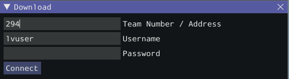
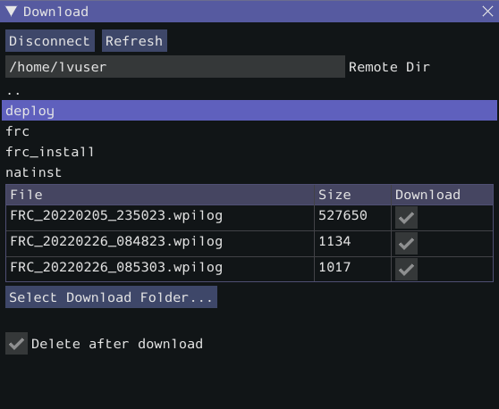
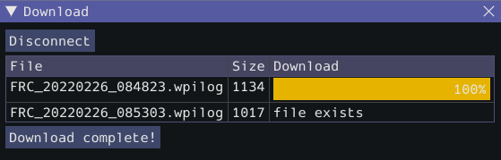
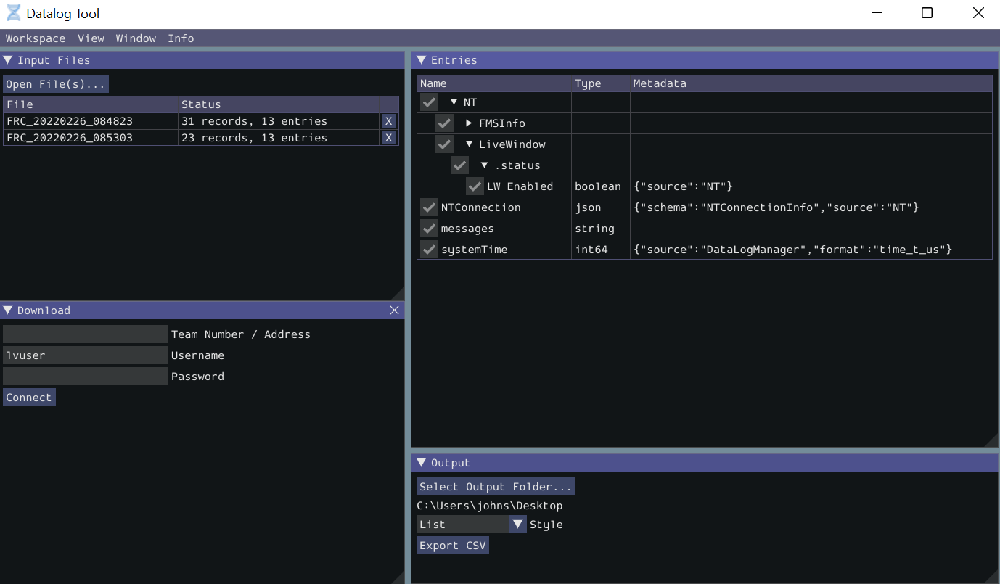

On-Robot Telemetry Recording Into Data Logs
===========================================

.. note:: The DataLog feature and Data Log Tool were added in WPILib 2022.4.1. The Data Log Tool is installed by the WPILib installer only (new tools are not installed when a robot project is upgraded).

By default, no telemetry data is recorded (saved) on the robot. The ``DataLogManager`` class provides a convenient wrapper around the lower-level ``DataLog`` class for on-robot recording of telemetry data into data logs.  The WPILib data logs are binary for size and speed reasons.  In general, the data log facilities provided by WPILib have minimal overhead to robot code, as all file I/O is performed on a separate thread--the log operation consists of mainly a mutex acquisition and copying the data.

Structure of Data Logs
----------------------

Similar to NetworkTables, data logs have the concept of entries with string identifiers (keys) with a specified data type.  Unlike NetworkTables, the data type cannot be changed after the entry is created, and entries also have metadata--an arbitrary (but typically JSON) string that can be used to convey additional information about the entry such as the data source or data schema.  Also unlike NetworkTables, data log operation is unidirectional--the ``DataLog`` class can only write data logs (it does not support read-back of written values) and the ``DataLogReader`` class can only read data logs (it does not support changing values in the data log).

Data logs consist of a series of timestamped records.  Control records allow starting, finishing, or changing the metadata of entries, and data records record data value changes.  Timestamps are stored in integer microseconds; when running on the RoboRIO, the FPGA timestamp is used (the same timestamp returned by ``Timer.getFPGATimestamp()``).

.. note: For more information on the details of the data log file format, see the `WPILib Data Log File Format Specification <https://github.com/wpilibsuite/allwpilib/blob/main/wpiutil/doc/datalog.adoc>`__.

Standard Data Logging using DataLogManager
------------------------------------------

The ``DataLogManager`` class (`Java <https://first.wpi.edu/wpilib/allwpilib/docs/beta/java/edu/wpi/first/wpilibj/DataLogManager.html>`__, `C++ <https://first.wpi.edu/wpilib/allwpilib/docs/beta/cpp/classfrc_1_1_data_log_manager.html>`__) provides a centralized data log that provides automatic data log file management.  It automatically cleans up old files when disk space is low and renames the file based either on current date/time or (if available) competition match number.  The data file will be saved to a USB flash drive if one is attached, or to ``/home/lvuser`` otherwise.

.. note: USB flash drives need to be formatted as FAT32 to work with the roboRIO.  NTFS or exFAT formatted drives will not work.

Log files are initially named ``FRC_TBD_{random}.wpilog`` until the DS connects.  After the DS connects, the log file is renamed to ``FRC_yyyyMMdd_HHmmss.wpilog`` (where the date/time is UTC).  If the FMS is connected and provides a match number, the log file is renamed to ``FRC_yyyyMMdd_HHmmss_{event}_{match}.wpilog``.

On startup, all existing log files where a DS has not been connected will be deleted.  If there is less than 50 MB of free space on the target storage, ``FRC_`` log files are deleted (oldest to newest) until there is 50 MB free OR there are 10 files remaining.

The most basic usage of DataLogManager only requires a single line of code (typically this would be called from ``robotInit``). This will record all NetworkTables changes to the data log.

.. tabs::

    .. code-tab:: java

        import edu.wpi.first.wpilibj.DataLogManager;

        // Starts recording to data log
        DataLogManager.start();

    .. code-tab:: c++

        #include "frc/DataLogManager.h"

        // Starts recording to data log
        frc::DataLogManager::Start();

DataLogManager provides a convenience function (``DataLogManager.log()``) for logging of text messages to the ``messages`` entry in the data log. The message is also printed to standard output, so this can be a replacement for ``System.out.println()``.

DataLogManager also records the current roboRIO system time (in UTC) to the data log every ~5 seconds to the ``systemTime`` entry in the data log.  This can be used to (roughly) synchronize the data log with other records such as DS logs or match video.

For custom logging, the managed ``DataLog`` can be accessed via ``DataLogManager.getLog()``.

Logging Joystick Data
^^^^^^^^^^^^^^^^^^^^^

DataLogManager by default does not record joystick data.  The ``DriverStation`` class provides support for logging of DS control and joystick data via the ``startDataLog()`` function:

.. tabs::

    .. code-tab:: java

        import edu.wpi.first.wpilibj.DataLogManager;
        import edu.wpi.first.wpilibj.DriverStation;

        // Starts recording to data log
        DataLogManager.start();

        // Record both DS control and joystick data
        DriverStation.startDataLog(DataLogManager.getLog());

        // (alternatively) Record only DS control data
        DriverStation.startDataLog(DataLogManager.getLog(), false);

    .. code-tab:: c++

        #include "frc/DataLogManager.h"
        #include "frc/DriverStation.h"

        // Starts recording to data log
        frc::DataLogManager::Start();

        // Record both DS control and joystick data
        DriverStation::StartDataLog(DataLogManager::GetLog());

        // (alternatively) Record only DS control data
        DriverStation::StartDataLog(DataLogManager::GetLog(), false);

Custom Data Logging using DataLog
---------------------------------

The ``DataLog`` class (`Java <https://first.wpi.edu/wpilib/allwpilib/docs/beta/java/edu/wpi/first/util/datalog/DataLog.html>`__, `C++ <https://first.wpi.edu/wpilib/allwpilib/docs/beta/cpp/classwpi_1_1log_1_1_data_log.html>`__) and its associated LogEntry classes (e.g. ``BooleanLogEntry``, ``DoubleLogEntry``, etc) provides low-level access for writing data logs.

.. note: Unlike NetworkTables, there is no change checking performed.  **Every** call to a ``LogEntry.append()`` function will result in a record being written to the data log.  Checking for changes and only appending to the log when necessary is the responsibility of the caller.

The LogEntry classes can be used in conjunction with DataLogManager to record values only to a data log and not to NetworkTables:

.. tabs::

    .. code-tab:: java

        import edu.wpi.first.util.datalog.BooleanLogEntry;
        import edu.wpi.first.util.datalog.DataLog;
        import edu.wpi.first.util.datalog.DoubleLogEntry;
        import edu.wpi.first.util.datalog.StringLogEntry;
        import edu.wpi.first.wpilibj.DataLogManager;

        BooleanLogEntry myBooleanLog;
        DoubleLogEntry myDoubleLog;
        StringLogEntry myStringLog;

        public void robotInit() {
          // Starts recording to data log
          DataLogManager.start();

          // Set up custom log entries
          DataLog log = DataLogManager.getLog();
          myBooleanLog = new BooleanLogEntry(log, "/my/boolean");
          myDoubleLog = new DoubleLogEntry(log, "/my/double");
          myStringLog = new StringLogEntry(log, "/my/string");
        }

        public void teleopPeriodic() {
          if (...) {
            // Only log when necessary
            myBooleanLog.append(true);
            myDoubleLog.append(3.5);
            myStringLog.append("wow!");
          }
        }

    .. code-tab:: c++

        #include "frc/DataLogManager.h"
        #include "wpi/DataLog.h"

        wpi::log::BooleanLogEntry myBooleanLog;
        wpi::log::DoubleLogEntry myDoubleLog;
        wpi::log::StringLogEntry myStringLog;

        void RobotInit() {
          // Starts recording to data log
          frc::DataLogManager::Start();

          // Set up custom log entries
          wpi::log::DataLog& log = DataLogManager::GetLog();
          myBooleanLog = wpi::Log::BooleanLogEntry(log, "/my/boolean");
          myDoubleLog = wpi::log::DoubleLogEntry(log, "/my/double");
          myStringLog = wpi::log::StringLogEntry(log, "/my/string");
        }

        void TeleopPeriodic() {
          if (...) {
            // Only log when necessary
            myBooleanLog.Append(true);
            myDoubleLog.Append(3.5);
            myStringLog.Append("wow!");
          }
        }

Downloading Data Logs from the Robot
------------------------------------

If data log files are being stored to the roboRIO integrated flash memory instead of a removable USB flash drive, it's important to periodically download and delete data logs to avoid the storage from filling up.

To facilitate this, the DataLogTool desktop application integrates a SFTP client for downloading data log files from a network device (e.g. roboRIO or coprocessor) to the local computer.

This process consists of four steps:

1. Connect to roboRIO or coprocessor
2. Navigate to remote directory and select what files to download
3. Select download folder
4. Download files and optionally delete remote files after downloading

Connecting to RoboRIO
^^^^^^^^^^^^^^^^^^^^^

.. note:: The downloader uses SSH, so it will not be able to connect wirelessly if the radio firewall is enabled (e.g. when the robot is on the competition field).

Either a team number, IP address, or hostname can be entered into the :guilabel:`Team Number / Address` field.  This field specifies the remote host to connect to. If a team number is entered, ``roborio-TEAM-frc.local`` is used as the connection address.

The remote username and password are also entered here.  For the roboRIO, the username should be ``lvuser`` with a blank password.

The tool also supports connecting to network devices other than the roboRIO, such as coprocessors, as long as the device supports SFTP password-based authentication.

Click :guilabel:`Connect` to connect to the remote device.  This will attempt to connect to the device.  The connection attempt can be aborted at any time by clicking :guilabel:`Disconnect`.  If the application is unable to connect to the remote device, an error will be displayed above the :guilabel:`Team Number / Address` field and a new connection can be attempted.

Downloading Files
^^^^^^^^^^^^^^^^^

After the connection is successfully established, a simplified file browser will be displayed.  This is used to navigate the remote filesystem and select which files to download.  The first text box shows the current directory.  A specific directory can be navigated to by typing it in this text box and pressing Enter.  Alternatively, directory navigation can be performed by clicking on one of the directories that are listed below the remote dir textbox.  Following the list of directories is a table of files.  Only files with a ``.wpilog`` extension are shown, so the table will be empty if there are no log files in the current directory.  The checkbox next to each data log file indicates whether the file should be downloaded.

.. note: On the roboRIO, log files are typically saved to either ``/home/lvuser`` or ``/u`` (USB stick location).

Click :guilabel:`Select Download Folder...` to bring up a file browser for the local computer.

If you want to delete the files from the remote device after they are downloaded, check the :guilabel:`Delete after download` checkbox.

Once a download folder is selected, :guilabel:`Download` will appear.  After clicking this button, the display will change to a download progress display.  Any errors will be shown next to each file.  Click :guilabel:`Download complete!` to return to the file browser.

Converting Data Logs to CSV
---------------------------

As data logs are binary files, the DataLogTool desktop application provides functionality to convert data logs into CSV files for further processing or analysis.  Multiple data logs may be simultaneously loaded into the tool for batch processing, and partial data exports can be performed by selecting only the data that is desired to be output.

The conversion process is started by opening data log files in the "Input Files" window.  Files are opened by clicking :guilabel:`Open File(s)...`.  Summary status on each file (e.g. number of records and entries) is displayed.  Clicking :guilabel:`X` in the table row closes the file.

After at least one file is loaded, the "Entries" window displays a tree view of the entries (this can be changed to a flat view by right clicking on the "Entries" window title bar and unchecking :guilabel:`Tree View`).  Individual entries or entire subtrees can be checked or unchecked to indicate whether they should be included in the export.  The data type information and initial metadata for each entry is also shown in the table.  As the "Entries" view shows a merged view of all entries across all input files, if more than one input file is open, hovering over an entry's name will highlight what input files contain that entry.

The output window is used to specify the output folder (via :guilabel:`Select Output Folder...`) as well as the output style (list or table).  The list output style outputs a CSV file with 3 columns (timestamp, entry name, and value) and a row for every value change (for every exported entry).  The table output style outputs a CSV file with a timestamp column and a column for every exported entry; a row is output for every value change (for every exported entry), but the value is placed in the correct column for that entry.  Clicking :guilabel:`Export CSV` will create a ``.csv`` file in the output folder corresponding to each input file.

Custom Processing of Data Logs
------------------------------

For more advanced processing of data logs (e.g. for processing of binary values that can't be converted to CSV), WPILib provides a ``DataLogReader`` class for reading data logs in `Java <https://first.wpi.edu/wpilib/allwpilib/docs/beta/java/edu/wpi/first/util/datalog/DataLogReader.html>`__, `C++ <https://first.wpi.edu/wpilib/allwpilib/docs/beta/cpp/classwpi_1_1log_1_1_data_log_reader.html>`__, or `Python <https://github.com/wpilibsuite/allwpilib/blob/main/wpiutil/examples/printlog/datalog.py>`__.  For other languages, the `data log format <https://github.com/wpilibsuite/allwpilib/blob/main/wpiutil/doc/datalog.adoc>`__ is also documented.

DataLogReader provides a low-level view of a data log, in that it supports iterating over a data log's control and data records and decoding of common data types, but does not provide any higher level abstractions such as a NetworkTables-like map of entries.  The printlog example in `Java <https://github.com/wpilibsuite/allwpilib/blob/main/wpiutil/src/printlog/java/printlog/PrintLog.java>`__ and `C++ <https://github.com/wpilibsuite/allwpilib/blob/main/wpiutil/examples/printlog/printlog.cpp>`__ (and the Python ``datalog.py``) demonstrates basic usage.
