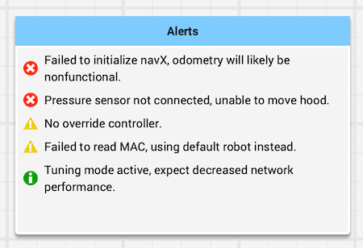

# Recording Faults with Persistent Alerts

Robots encounter a variety of fault conditions: disconnected sensors/motors, invalid mechanism states, initialization failures, etc. While the FRC Driver Station provides a :ref:`console interface <docs/software/driverstation/driver-station:Messages Tab>` for instantaneous alerts, the risk of missing important messages makes it poorly suited to communicate faults that persist over time.

Instead, the ``Alert`` class ([Java](https://github.wpilib.org/allwpilib/docs/release/java/edu/wpi/first/wpilibj/Alert.html), [C++](https://github.wpilib.org/allwpilib/docs/release/cpp/classfrc_1_1_alert.html)) can be used for managing persistent alerts published via Network Tables. Alerts are assigned a priority (*error*, *warning*, or *info*) and can be *activated* or *deactivated* in robot code. The set of active alerts can be displayed on a dashboard, as shown below in Shuffleboard.

Active alerts are automatically displayed in order based on priority and how recently they were activated, with newer and more critical alerts at the top of the list. This provides a mechanism for drivers (on the field) and programmers (off the field) to quickly assess the state of the robot and determine whether it is in a "match-ready" state. Highly descriptive alerts also allow drive teams to adapt to faults in real time, such as switching strategies in case of a subsystem failure.

## API Usage

Alerts are created and managed using the ``Alert`` class. Typically, an alert should be instantiated once and stored as a class member. The ``set`` method accepts a boolean for the alert state, which activates or deactivates the alert. Change detection is built-in, so calling ``set`` multiple times with the same value does affect the order in which alerts are displayed.

Alert states are often expressed most easily as a conditional, such as whether the latest signal from a CAN device is up-to-date. In this case, we recommend calling the ``set`` method in a periodic loop and relying on the built-in change detection to activate the alert.

.. tab-set-code::
   .. code-block:: java

      class Robot {
        Alert alert = new Alert("Something went wrong", AlertType.kWarning);

        periodic() {
          alert.set(...);
        }
      }

   .. code-block:: c++

      class Robot {
        frc::Alert alert{"Something went wrong", frc::Alert::AlertType::kWarning};
      }

      Robot::periodic() {
        alert.Set(...);
      }

   .. code-block:: python

      self.alert = Alert("Something went wrong", AlertType.kWarning)

      def periodic() {
        self.alert.set(...)
      }

.. note:: Suggested usage of each alert type (error, warning, or info) is provided in the enum API documentation.

The text description of an alert can be updated after the alert has been created by calling ``setText``, allowing additional information to be provided inline. For example, an alert indicating that a motor is overheating could include the motor's current temperature.

Optionally, a group name can also be provided to the ``Alert`` constructor. Alerts are published to Network Tables using this name, allowing multiple sets of alerts to be displayed on separate widgets (such as "Auto" and "Teleop" alert sets). If the group name is omitted, the alert is published to a group called "Alerts".

## Dashboard Usage

Alerts are published to Network Tables using the key ``/SmartDashboard/<Group Name>``. Shuffleboard automatically populates data from this table to the "SmartDashboard" tab, or the widget can be manually created by dragging the alert table from the Network Tables tree to the main view as described :ref:`here <docs/software/dashboards/shuffleboard/getting-started/shuffleboard-displaying-data:Displaying data from your robot>`.

.. note:: In addition to Shuffleboard, the alerts API is supported by many third-party dashboards. Check the documentation of your preferred dashboard for details.
