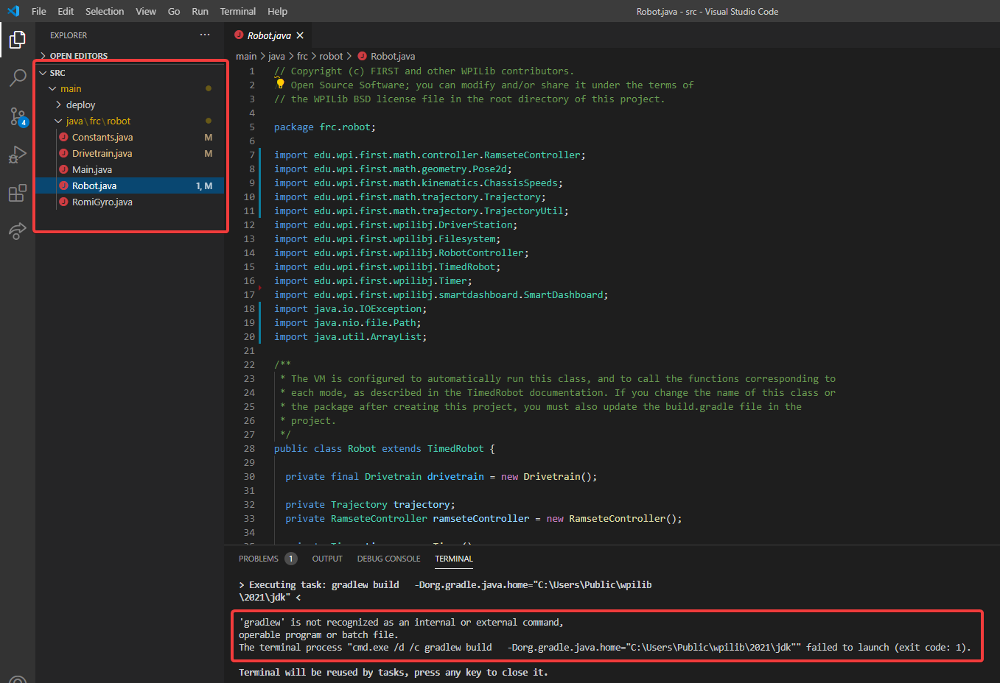

Debugging Issues while Building Code
====================================

Common Symptoms
---------------

gradlew is not recognized...
^^^^^^^^^^^^^^^^^^^^^^^^^^^^

``gradlew is not recognized as an internal or external command`` is a common error that can occur when the project or directory that you are currently in does not contain a ``gradlew`` file. This usually occurs when you open the wrong directory.

In the above screenshot, you can see that the left-hand sidebar does not contain many files. At a minimum, VS Code needs a couple of files to properly build and deploy your project.

- ``gradlew``
- ``build.gradle``
- ``gradlew.bat``

If you do not see any one of the above files in your project directory, then you have two possible causes.

- A corrupt or bad project.
- You are in the wrong directory.

Fixing gradlew is not recognized...
~~~~~~~~~~~~~~~~~~~~~~~~~~~~~~~~~~~

``gradlew is not recognized...`` is a fairly easy problem to fix. First identify the problem source:

**Are you in the wrong directory?**
- Verify that the project directory is the correct directory and open this.

**Is your project missing essential files?**
- This issue is more complex to solve. The recommended solution is to :ref:`recreate your project <docs/software/vscode-overview/creating-robot-program:Creating a Robot Program>` and manually copy necessary code in.
