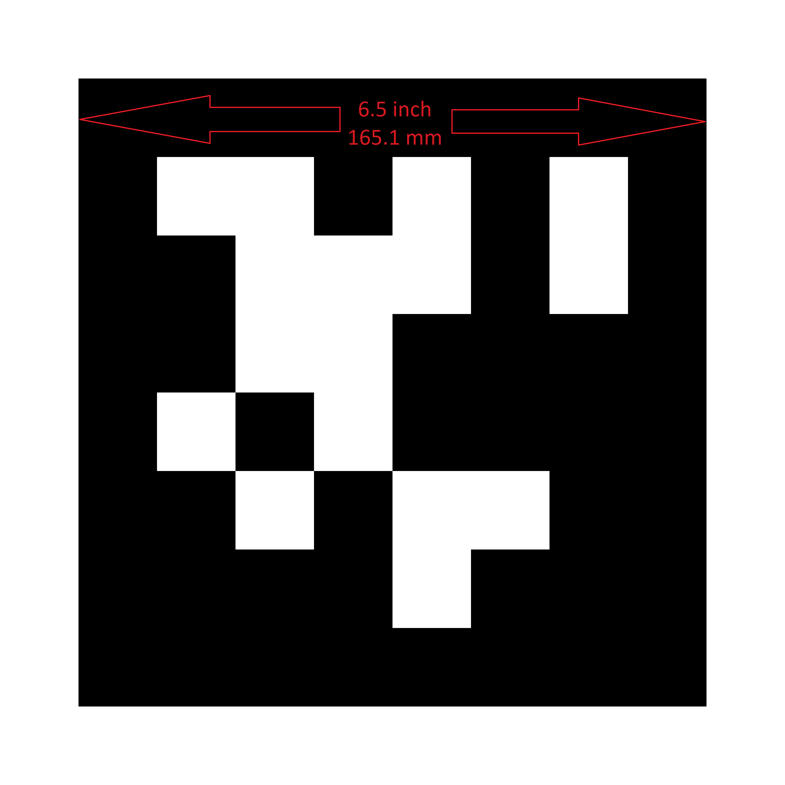
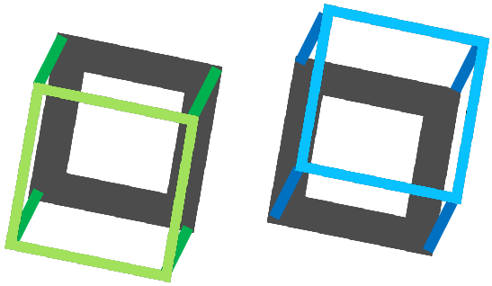

.. include:: <isonum.txt>

What Are AprilTags?
===================

.. image:: images/apriltagrobots_overlay.png

AprilTags are a system of visual tags developed by researchers at the University of Michigan to provide low overhead, high accuracy localization for many different applications.

Application to FRC
------------------

In the context of FRC, AprilTags are useful for helping your robot know where it is at on the field, so it can align itself to some goal position.

AprilTags have been in development since 2011, and have been refined over the years to increase the robustness and speed of detection.

Starting in 2023, FIRST is providing a number of tags, scattered throughout the field, each at a known :term:`pose`.

All of the tags are from the 36H11 family, which means that:

1) Each tag carries 36 bits of information
2) It would take at least 11 bit "flips" before one tag could be mistaken for another.

All tags will be printed such that their outer black border is 8.125 inches on a side.

For home usage, `these pdf files <https://github.com/rgov/apriltag-pdfs/tree/main/tag36h11>`_ may be printed off and placed around your practice area. Mount them to a rigid backing material to ensure the tag stays flat, as the processing algorithm assumes the tags are flat.

Software Support
----------------

The main repository for the source code that detects and decodes AprilTags `is located here <https://github.com/AprilRobotics/apriltag>`_.

WPILib has forked the repository to add new features for FRC. These include:

1. Building the source code for common FRC targets, including the roboRIO and Raspberry Pi.
2. Adding Java Native Interface (JNI) support to allow invoking its functionality from Java
3. Gradle & Maven publishing support

TODO: this is actually what photonvision did. wpilib...?

Processing Technique
--------------------

While most FRC teams should not have to implement their own code to identify AprilTags in a camera image, it is useful to know the basics of how the underlying libraries function.

.. tabs::

   .. tab:: Original Image

      .. image:: images/orig_img.png

      An image from a camera is simply an array of values, corresponding to the color and brightness of each pixel. The first step is to determine which pixels, if any, represent an AprilTag.

   .. tab:: Remove Colors

      .. image:: images/bw_img.png

      * Convert the image to a grey-scale (brightness-only) image.
         * Color information is not needed to detect the black-and-white tags.

   .. tab:: Decimate

      .. image:: images/decimate.png

      * Convert the image to a lower resolution.
         * Working with fewer pixels helps the algorithm work faster.
         * The full-resolution image will be used later to refine early estimates.

   .. tab:: Adaptive Threshold

      .. image:: images/adaptive_threshold.png

      * Apply an adaptive threshold algorithm to classify each pixel as "definitely light", "definitely dark", or "not sure".
         * The threshold is calculated by looking at the pixel's brightness, compared to a small neighborhood of pixels around it.

   .. tab:: Segmentation

      .. image:: images/segmentation.png

      * Analyze the known pixels to "clump" them together.
         * Discard any clumps which are too small to reasonably be a meaningful part of a tag.

   .. tab:: Quad Detection

      .. image:: images/detected_quads.png

      * Fit a quadrilateral to each clump
         * Identify likely "corner" candidates by pixels which are outliers in both dimensions.
         * Iterate through all possible combinations of corners, evaluating the fit each time
         * Pick the best-fit quadrilateral

      * Identify a suspect set of quadrilateral which is likely a tag.
         * For example, a single large exterior quadrilateral with many interior quadrilateral is likely a good candidate

      If all has gone well so far, we are left with a four-sided region of pixels that is likely a valid tag.

   .. tab:: Tag Detection

      .. image:: images/tag_detection.png

      Now that we have one or more regions of pixels which we believe to be a valid AprilTag, we need to identify which tag we are looking at. This is done by "decoding" the pattern of light and dark squares on the inside.

      * Calculate the expected interior pixel coordinates where the center of each bit should be
      * Mark each location as "1" or "0" by comparing the pixel intensity to a threshold
      * Find the tag ID which most closely matches what was seen in the image, allowing for one or two bit errors.

      It is possible there is no valid tag ID which matches the suspect tag. In this case, the decoding process stops.

   .. tab:: Fit External Quad

      .. image:: images/fit_ext_quad.png

      Now that we have a tag ID for the region of pixels, we need to do something useful with it.

      For most FRC applications, we care about knowing the precise location of the corners of the tag, or its center. In both cases, we expect the resolution-lowering operation we did at the beginning to have distorted the image, and we want to undo those effects.

      The algorithm to do this is:

      * Use the detected tag location to define a region of interest in the original-resolution image
      * Calculate the :term:`gradient` at pre-defined points in the region of interest to detect where the image most sharply transitions between black to white
      * Use these gradient measurements to rapidly re-fit an exterior quadrilateral at full resolution
      * Use geometry to calculate the exact center of the re-fit quadrilateral

      Note that this step is optional, and can be skipped for faster image processing. However, skipping it can induce significant errors into your robot's behavior, depending on how you are using the tag outputs.

Usage
-----

2D Alignment
^^^^^^^^^^^^

A simple strategy for using targets is to move the robot until the target is centered in the image. Assuming the field and robot are constructed such that the gamepiece, scoring location, vision target, and camera are all aligned, this method should proved a straightforward method to automatically align the robot to the scoring position.

Using a camera, identify the _centroid_ of the apriltags in view. If the tag's ID is correct, apply drivetrain commands to rotate the robot left or right until the tag is centered in the camera image.

This method does not require calibrating the camera or performing the homography step.

.. tabs::

  .. code-tab:: java

    // Coming soon!

  .. code-tab:: c++

    // Coming soon!

3D Alignment
^^^^^^^^^^^^

A more advanced usage of AprilTags is to use their corner locations to help perform on-field localization.

This method requires calibrating the camera to measure how its optics distort 3d space onto the 2d sensor.

Once calibrated, each image is searched for AprilTags using the above algorithm.

Given each tag's ID, the position of the tag on the field can be identified.

.. tabs::

  .. code-tab:: java

    // Coming soon!

  .. code-tab:: c++

    // Coming soon!

Using the information about the camera's distortion, along with the known size of the tag, an estimate of the camera's position relative to the tag is calculated.

.. tabs::

  .. code-tab:: java

    // Coming soon!

  .. code-tab:: c++

    // Coming soon!

In turn, using the `Pose3d` classes and the known positions of tags on the field, the robot's position on the field may be estimate.

These estimates can be incorporated into the WPILib pose estimation classes.

2D to 3D Ambiguity
------------------

The process of translating the four known corners of the target in the image (two-dimensional) into a real-world position relative to the camera (three-dimensional") is inherently ambiguous. That is to say, there are multiple real-world positions that result in the target corners ending up in the same spot in the image.

Humans can often use lighting or background clues to understand how objects are oriented in space. However, computers do not have this benefit. They can be tricked by similar-looking targets:

  

Resolving which position is "correct" can be done in a few different ways:

1. Use your odometry history from all sensors to pick the pose closest to where you expect the robot to be.
2. Reject poses which are very unlikely (ex: outside the field perimiter, or up in the air)
3. Ignore pose estimates which are very close together (and hard to differentiate)
4. Use multiple cameras to look at the same target, such that at least one camera can generate a good pose estimate
5. Look at many targets at once, using each to generate multiple pose estimates. Discard the outlying estimates, use the ones which are tightly clustered together.

Adjustable Parameters
---------------------

`Decimation factor` impacts how much the image is down-sampled before processing. Increasing it will increase detection speed, at the cost of not being able to see tags which are far away.

`Blur` applies smoothing to the input image to decrease noise, which increases speed when fitting quads to pixels, at the cost of precision. For most good cameras, this may be left at zero.

`Threads` changes the number of parallel threads which the algorithm uses to process the image. Certain steps may be sped up by allowing multithreading. In general, you want this to be approximately equal to the number of physical cores in your CPU, minus the number of cores which will be used for other processing tasks.

Detailed information about the tunable parameters `can be found here <https://github.com/AprilRobotics/apriltag/wiki/AprilTag-User-Guide#tuning-the-detector-parameters>`_.

Further Learning
----------------

The three major versions of AprilTags are described in three academic papers. It's recommended to read them in order, as each builds upon the previous:

* :download:`AprilTags v1 <files/olson2011tags.pdf>`
* :download:`AprilTags v2 <files/wang2016iros.pdf>`
* :download:`AprilTags v3 <files/krogius2019iros.pdf>`
* :download:`Pose Ambiguity <files/mmsp2014_spe.pdf>`

Additional information about the tag system and its creators `can be found on their website <https://april.eecs.umich.edu/software/apriltag>`_
