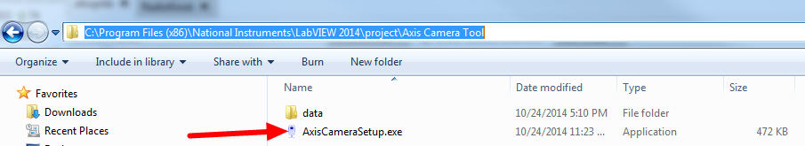
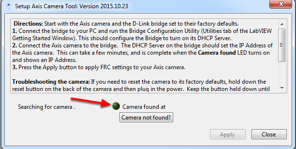
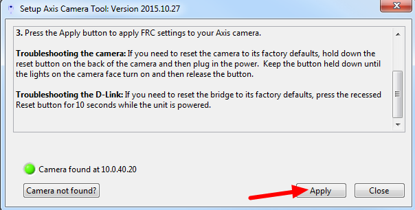
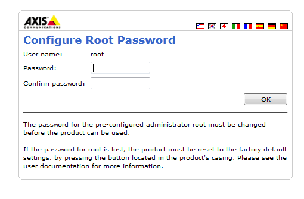
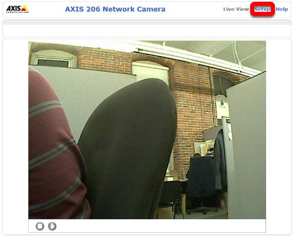
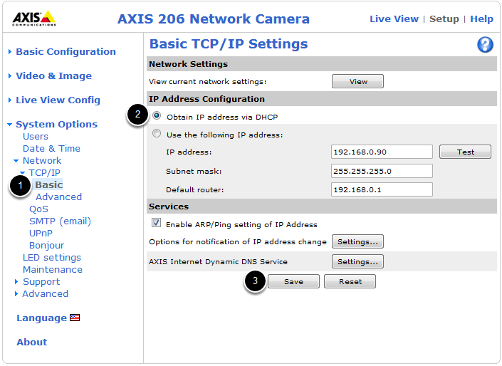
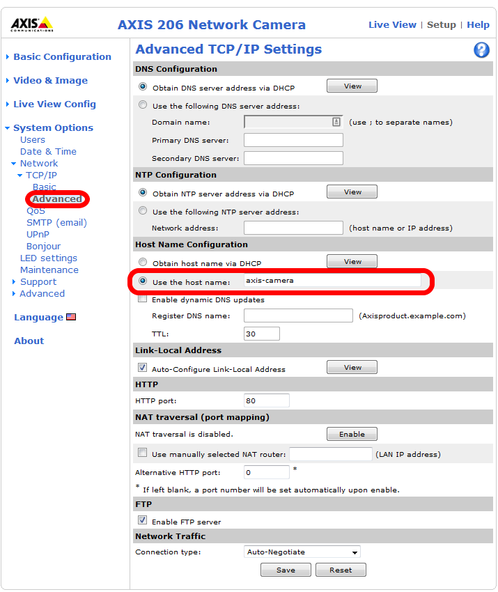
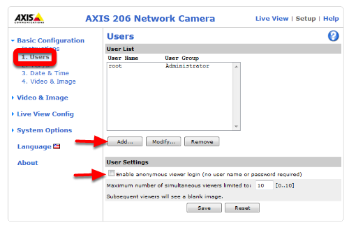
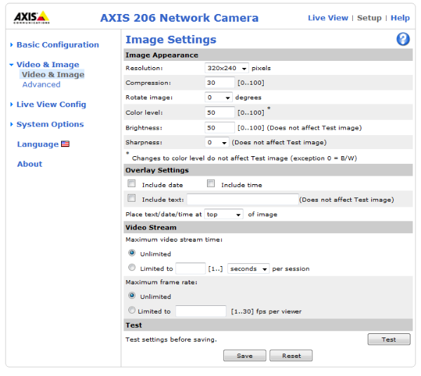

Configuring an Axis Camera
==========================

.. note:: Three different Axis camera models are supported by the FRC software, the Axis 206, Axis M1011 and Axis M1013. This document provides instructions on how to configure one of these cameras for FRC use. To follow the instructions in this document, you must have installed the NI FRC Game Tools and Configured your radio

Connect the camera
------------------

Connect the Axis camera to the radio using an Ethernet cable. Connect your computer to the radio using an Ethernet cable or via a wireless connection.

Axis Camera Setup Tool
----------------------

Browse to ``C:\Program Files (x86)\National Instruments\LabVIEW 2019\project\Axis Camera Tool`` and double-click on ``AxisCameraSetup.exe`` to start the Axis Camera Setup Tool.

Tool Overview
^^^^^^^^^^^^^

The camera should be automatically detected and the green indicator light should be lit. If it is not, make sure the camera is powered on (the ring on the camera face should be green) and connected to your computer. If the indicator remains off follow the instructions in the tool textbox next to Troubleshooting the camera to reset the camera. You can also use the "Camera not found?" button to check the IP address of your computer, one of the addresses listed should be of the form ``10.TE.AM.XX`` where ``TEAM`` is your 4 digit team number.

Setup the Camera
^^^^^^^^^^^^^^^^

To configure the camera, press Apply. This will configure many of the necessary/recommended settings for using the camera for FRC. Currently the tool does not properly configure the DNS name of the camera in many cases.

Camera Webpage
^^^^^^^^^^^^^^

To set the network settings, open a web browser and enter the address shown next to Camera found at in the tool (in the example above this is 10.0.40.20) in the address bar and press enter. You should see a Configure Root Password page, set this password to whatever you would like, but admin is recommended.

Setup Page
^^^^^^^^^^

Click Setup to go to the setup page.

Configure Basic Network Settings
^^^^^^^^^^^^^^^^^^^^^^^^^^^^^^^^

To configure the network settings of the camera, click the arrow to expand the System Options pane, then click the arrow to expand Network, then expand TCP/IP and select Basic. Set the camera to obtain an IP address via DHCP by selecting the bubble. Alternately, you may choose to set a static IP in the range ``10.TE.AM.3`` to ``10.TE.AM.19``. This is outside the range handed out by the radio (home use) or FMS system (event use) so you will avoid any IP conflicts.

Click Save.

Configure Advanced Network Settings
^^^^^^^^^^^^^^^^^^^^^^^^^^^^^^^^^^^

Next click Advanced under TCP/IP. Set the Host Name Configuration to "Use the host name:" and set the value to ``axis-camera`` as shown. If you plan to use multiple cameras on your robot, select a unique host name for each. You will need to modify the dashboard and/or robot code to work with the additional cameras and unique host names.

Click Save.

Manual Camera Configuration
---------------------------

It is recommended to use the Setup Axis Camera Tool to configure the Axis Camera. If you need to configure the camera manually, connect the camera directly to the computer, configure your computer to have a static IP of ``192.168.0.5``, then open a web browser and enter ``192.168.0.90`` in the address bar and press enter. You should see a Configure Root Password page, set this password to whatever you would like, but admin is recommended.

If you do not see the camera webpage come up, you may need to reset the camera to factory defaults. To do this, remove power from the camera, hold the reset button while applying power to the camera and continue holding it until the lights on the camera face turn on, then release the reset button and wait for the lights to turn green. The camera is now reset to factory settings and should be accessible via the ``192.168.0.90`` address.

Manual - Setup Page
^^^^^^^^^^^^^^^^^^^

Click Setup to go to the setup page.

Manual - Configure Users
^^^^^^^^^^^^^^^^^^^^^^^^

On the left side click Users to open the users page. Click Add then enter the Username FRC Password FRC and click the Administrator bubble, then click OK. If using the SmartDashboard, check the Enable anonymous viewer login box. Then click Save.

Manual - Configure Image Settings
^^^^^^^^^^^^^^^^^^^^^^^^^^^^^^^^^

Click Video & Image on the left side to open the image settings page. Set the Resolution and Compression to the desired values (recommended 320x240, 30). To limit the framerate to under 30 FPS, select the Limited to bubble under Maximum frame rate and enter the desired rate in the box. Color, Brightness and Sharpness may also be set on this screen if desired. Click Save when finished.

Manual - Configure Basic Network Settings
^^^^^^^^^^^^^^^^^^^^^^^^^^^^^^^^^^^^^^^^^

To configure the network settings of the camera, click the arrow to expand the System Options pane, then click the arrow to expand Network, then expand TCP/IP and select Basic. Set the camera to obtain an IP address via DHCP by selecting the bubble. Alternately, you may choose to set a static IP in the range 10.TE.AM.3 to 10.TE.AM.19. This is outside the range handed out by the radio (home use) or FMS system (event use) so you will avoid any IP conflicts.

Click Save.

Manual - Configure Advanced Network Settings
^^^^^^^^^^^^^^^^^^^^^^^^^^^^^^^^^^^^^^^^^^^^

Next click Advanced under TCP/IP. Set the Host Name Configuration to "Use the host name:" and set the value to ``axis-camera`` as shown. If you plan to use multiple cameras on your robot, select a unique host name for each. You will need to modify the dashboard and/or robot code to work with the additional cameras and unique host names.

Click Save.
