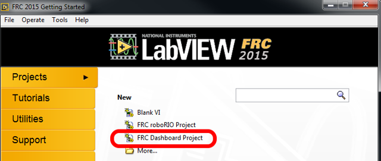
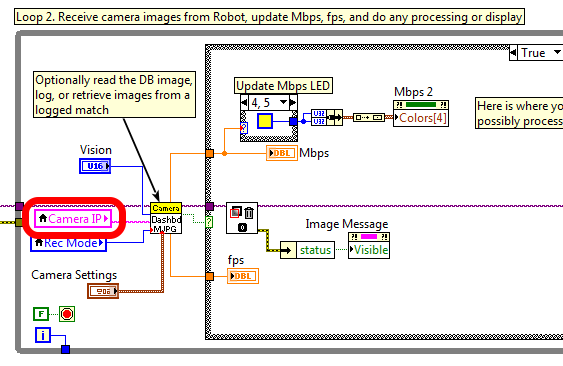
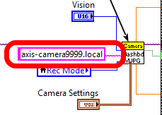
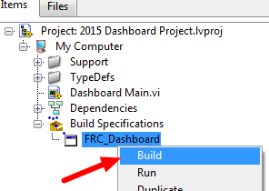
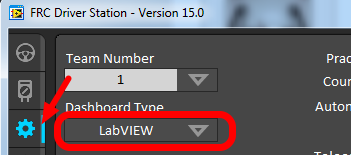
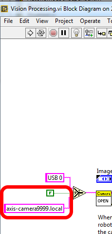

.. include:: <isonum.txt>

Using the Axis Camera at Single Network Events
==============================================

The convention for using the Axis camera uses mDNS with the camera name set to ``axis-camera.local``. At home, this works fine as there is only one camera on the network. At official events, this works fine as each team is on their own VLAN and therefore doesn't have visibility to another team's camera. However, at an off-season event using a single network, this will cause an issue where all teams will connect to whichever team's camera "wins" the mDNS resolution and becomes ``axis-camera``. The other cameras will see that the name is taken and use an alternative name. This article describes how to modify the Dashboard and/or robot code to use a different mDNS name to separate the camera streams.

Changing the Camera mDNS Name
-----------------------------

To change the mDNS name in the camera, follow the instructions in :doc:`configuring-an-axis-camera`, but substitute the new name such as ``axis-cameraTEAM`` where ``TEAM`` is your team number.

Viewing the Camera on the DS PC -  Browser or SmartDashboard
------------------------------------------------------------

If you are using a web-browser or SmartDashboard (which accepts mDNS names for the Simple Camera Viewer widget), updating to use the new mDNS name is simple. Simply change the URL in the browser or the address in the Simple Camera Viewer widget properties to the new mDNS name and you are all set.

Viewing the Camera on the DS PC - LabVIEW Dashboard
---------------------------------------------------

To view the camera stream in the LabVIEW Dashboard, you will need to build a customized version of the Dashboard. Note that this customized version will only work for the Axis camera and will no longer work for a USB camera. Revert to the default Dashboard to use a USB camera.

Creating a Dashboard Project
^^^^^^^^^^^^^^^^^^^^^^^^^^^^

From the LabVIEW Splash screen, select "FRC\ |reg| Dashboard Project". Name the project as desired, then click Finish.

Locating Loop 2 - Camera IP
^^^^^^^^^^^^^^^^^^^^^^^^^^^

Double click on ``Dashboard Main.vi`` in the project explorer to open it and press :kbd:`Ctrl+E` to see the block diagram. Scroll down to the loop with the comment that says Loop 2 and locate the "Camera IP" input.

Editing the Camera IP
^^^^^^^^^^^^^^^^^^^^^

Delete the Camera IP node, right click on the broken wire and click Create Constant (connect the constant to the wire if necessary). In the box, enter the mDNS name of your camera with a ``.local`` suffix (e.g. ``axis-cameraTEAM.local`` where ``TEAM`` is replaced with your team number). The example above shows a sample name for team 9999. Then click File->Save or :kbd:`Ctrl+S` to save the VI.

.. note:: You may also wish to make a minor modification to the Front Panel to verify that you are running the right dashboard later.

Building the Dashboard
^^^^^^^^^^^^^^^^^^^^^^

To build the new dashboard, expand Build Specifications in the Project Explorer, right click on FRC_Dashboard and select Build.

Setting the Driver Station to Launch the Modified Dashboard
^^^^^^^^^^^^^^^^^^^^^^^^^^^^^^^^^^^^^^^^^^^^^^^^^^^^^^^^^^^

On the Setup tab of the Driver Station, change to dropdown box to LabVIEW to launch your new Dashboard.

Accessing the Camera from Robot Code
------------------------------------

If you wish to access the renamed camera from your robot code, you will have to modify it as well. In C++ and Java, just change the String used for the camera host name to match the new name. In LabVIEW follow the step below.

Modifying LabVIEW Robot Code
^^^^^^^^^^^^^^^^^^^^^^^^^^^^

In the Project Explorer, locate ``Vision Processing.VI`` and double click to open it. Then press :kbd:`Ctrl+E` to open the Block Diagram. Locate the string ``axis-camera.local`` near the left of the image and replace with ``axis-cameraTEAM.local``. Also make sure the constant is set to ``False`` to use the Axis camera instead of USB.
