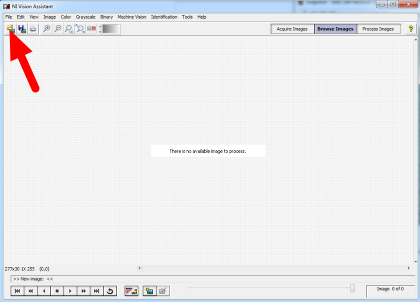

Calibration
===========
While many of the numbers for the Vision Processing code can be determined theoretically, there are a few parameters that
are typically best to measure empirically then enter back into the code (a process typically known as calibration). This
article will show how to perform calibration for the Color (masking), and View Angle (distance) using the NI Vision
Assistant. If you are using C++ or Java and have not yet installed the NI Vision Assistant, see the article Installing NI
Vision Assistant.

Enable Snapshots
----------------
.. figure:: images/calibration/enable-snapshots.png

To capture snapshots from the Axis camera, you must first enable the Snapshot button. Open a web-browser and browse to
camera's address (10.TE.AM.11), enter the Username/Password combo FRC/FRC if prompted, then click Setup->Live View
Config->Layout. Click on the checkbox to Show snapshot button then click Save.

Check Camera Settings
---------------------
.. figure:: images/calibration/check-camera-settings.png

Depending on how you are capturing the image stream in your program, it may be possible to stream a different
resolution, framerate and/or compression than what is saved in the camera and used in the Live View. Before performing
any calibration it is recommended you verify that the settings in the camera match the settings in your code. To check
the settings in the camera, click on the Video and Image header on the left side of the screen, then click Video and Image.

Capture Images
--------------
.. figure:: images/calibration/capture-images.png

Click the Live View button to return to the Live View page and you should now see a Snapshot button. Clicking this button
opens a pop-up window with a static image capture. Right-click on this image, select Save Image as and select your desired
location and file name, then save the image.

Load Image(s) in Vision Assistant
---------------------------------

Open the NI Vision Assistant and select the Browse Images option. Select the Open Images icon in the top left of the
Toolbar, then locate your images. Repeat as necessary to load all desired images.

Color Threshold
---------------
.. figure:: images/calibration/color-threshold.png

Click Process Images in the top right, then select the color tab on the bottom right and click the Color Threshold icon.

HSV Calibration
^^^^^^^^^^^^^^^
.. figure:: images/calibration/hsv-calibration.png

Change the Color Model dropdown to HSV. Next tune the window on each of the three values to cover as much of the target
as possible while filtering everything else. If using a green light, you may want to use the values in the sample code as
a starting point. If you have multiple images you can use the controls in the top left to cycle through them. Use the c
enter two arrow controls or the slider to change the preview image in the top left window, then click the right-most arrow
to make it the active image. When you are happy with the values you have selected, note down the ranges for the Hue,
Saturation and Value. You will need to enter these into the appropriate place in the vision code. Click OK to finish adding
the step to the script.

You may wish to take some new sample images using the time for camera calibration at your event to verify or tweak your
ranges slightly based on the venue lighting conditions.

View Angle/Distance Calibration
-------------------------------
While a theoretical view angle for each camera model can be found in the datasheet, empirical testing has found that
these numbers may be a bit off even for the horizontal view angle. Given that this year's code uses the vertical
field-of-view it is best to perform your own calibration for your camera (though empirical values for each camera type
are included in the code as a reference). To do this set up an equation where the view angle, Θ, is the only unknown. To
do this, utilize a target of known size at a known distance, leaving the view angle as the only unknown. Let's take our
equation from the previous article, d = Tft*FOVpixel/(Tpixel*tanΘ), and re-arrange it to solve for Θ:

tanΘ = Tft*FOVpixel/(Tpixel*d)

Θ = arctan(Tft*FOVpixel/(Tpixel*d))

Taking Measurements
^^^^^^^^^^^^^^^^^^^
.. figure:: images/calibration/taking-measurements.png

One way to take the required measurements is to use the same images of the retro-reflective tape that were used for the
color calibration above. We can use Vision Assistant to provide the height of the detected blob in pixels. By measuring
the real-world distance between the camera and the target, we now have all of the variables to solve our equation for the
view angle.

To measure the particles in the image, click the Binary tab, then click the Particle Analysis icon.

Selecting Measurements
^^^^^^^^^^^^^^^^^^^^^^
.. figure:: images/calibration/selecting-measurements.png

Click on the Select Measurements button. In this case, we are only interested in the bounding box height. Click on the
button with the X to deselect all measurements, then locate the Bounding Rect Height measurement and check the box. Click
OK to save.

Measuring the Particle
^^^^^^^^^^^^^^^^^^^^^^
.. figure:: images/calibration/measuring-the-particle.png

The measurements for each particle will now be displayed in the window at the bottom of the screen. If your image has
multiple particles, you can click in each box to have Vision Assistant highlight the particle so you can make sure you
have the right one. This article will show the calculation using a single image, but you may wish to perform the
calculation on multiple images from multiple distances and use a technique such as averaging or least squares fit to
determine the appropriate value for the View angle. You can use the same arrow controls described in the color section
above to change the active image.

Calculation
^^^^^^^^^^^
As seen in the previous step, the particle representing the 32in tall vertical target in this example measured 85 pixels
tall in a 640x480 image. The image shown was taken from (very roughly) 18 ft. away. Plugging these numbers into the
equation from above....

Θ = arctan(2.66*480/(2*85*18)) = 22.65 degrees

Depending on what you use to calculate the arctangent, your answer may be in radians, make sure to convert back to degrees
if entering directly into the sample code as the view angle.

.. note:: The code uses View Angle and we just calculated Θ. Make sure to multiply Θ by 2 if replacing the constants in\
    the code.Multiplying our result by 2 yields 45.3 degrees. This image is from a M1013 camera, so our value is a bit\
    off from the previously measured 29.1 but given that the 18ft. was a very rough measurement this shows that we are\
    in the ballpark and likely performed the calculation correctly.
