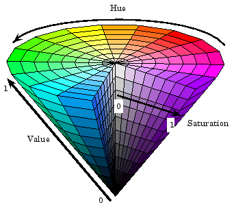

Thresholding an Image
=====================

In order to turn a colored image, such as the one captured by your camera, into a binary image, with the target as the "foreground", we need to threshold the image using the hue, saturation, and value of each pixel.

The HSV Model
_____________

Unlike RGB, HSV allows you to not only filter based on the colors of the pixels, but also by the intensity of color and the brightness.

* Hue: Measures the color of the pixel.
* Saturation: Measures the intensity of color of the pixel.
* Value: Measures the brighness of the pixel.

You can use OpenCV to convert a BGR image matrix to HSV.

.. tabs::

   .. code-tab:: py

      hsv_img = cv2.cvtColor(input_img, cv2.COLOR_BGR2HSV)

.. note::
   OpenCV's hue range is from 1° to 180° instead of the common 1° to 360°. In order to convert a common hue value to OpenCV, divide by 2.

Thresholding
____________

By thresholding the image using HSV, you can seperate the image into the vision target (foreground), and the other things that the camera sees (background). The following code example converts a HSV image into a binary image by thresholding with HSV values.

.. tabs::

   .. code-tab:: py

      binary_img = cv2.inRange(hsv_img, (min_hue, min_sat, min_val), (max_hue, max_sat, max_val))

.. note::
   These values may have to be tuned on an per-venue basis, as ambient lighting may differ across venues.
