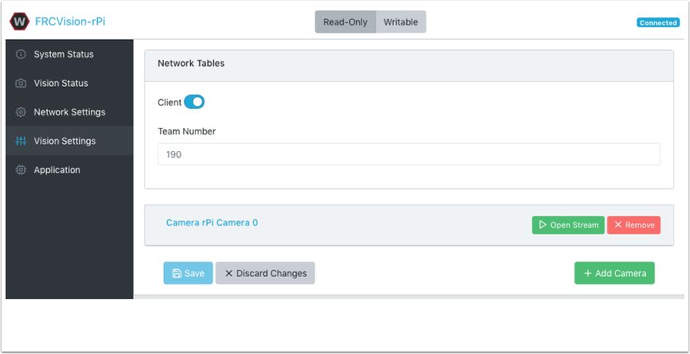

Introduction to FRCVision
=========================

The FRCVision image is a Raspberry Pi image provided by WPILib. It comes preinstalled with OpenCV, CSCore, NTCore, and other libraries in C++, Java, and Python. For information on how to install FRCVision onto your Raspberry Pi, or about the Raspberry Pi in general, consult the `Vision with Raspberry Pi <https://docs.wpilib.org/en/latest/docs/software/vision-processing/raspberry-pi/index.html>`_ documentation.

Advantages of Custom Vision Processing
______________________________________

Custom vision processing requires more development and testing time over prepackaged solutions. However, these custom vision processing solutions can offer more flexibility and performance than prepackaged solutions.

Advantages of Using FRCVision
_____________________________

The FRCVision image helps reduce development time by coming preinstalled with tools needed for custom vision processing. It also has a web dashboard which offers a GUI to configure camera, vision, and system settings.

Configurating using the Dashboard
_________________________________

