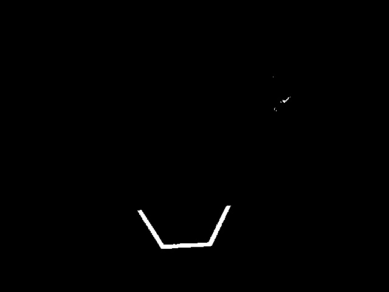
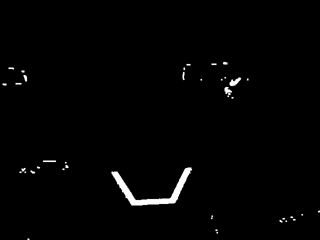

Morphological Operations
========================

Sometimes, after thresholding your image, you have unwanted noise in your binary image. Morphological operations can help remove that noise from the image.

Kernel
------

The kernel is a simple shape where the origin is superimposed on each pixel of value 1 of the binary image. OpenCV limits the kernel to a NxN matrix where N is an odd number. The origin of the kernel is the center. A common kernel is

.. math::
   kernel = \begin{pmatrix}
               1 & 1 & 1\\
               1 & 1 & 1\\
               1 & 1 & 1
            \end{pmatrix}

Different kernels can affect the image differently, such as only eroding or dilating vertically.

For reference, this is our binary image we created:

.. image:: images/morphological-operations-1.jpg

Erosion
-------

Erosion in computer vision is similar to erosion on soil. It takes away from the borders of foreground objects. This process can remove noise from the background.

.. tabs::

   .. code-tab:: py

      kernel = np.ones((3, 3), np.uint8)
      binary_img = cv2.erode(binary_img, kernel, iterations = 1)

During erosion, if the superimposed kernel's pixels are not contained completely by the binary image's pixels, the pixel that it was superimposed on is deleted.

Dilation
--------

Dilation is opposite of erosion. Instead of taking away from the borders, it adds to them. This process can remove small holes inside a larger region.

.. tabs::

   .. code-tab:: py

      kernel = np.ones((3, 3), np.uint8)
      binary_img = cv2.dilate(binary_img, kernel, iterations = 1)

During dilation, every pixel of every superimposed kernel is included in the dilation.

Opening
-------

Opening is erosion followed by dilation. This process removes noise without affecting the shape of larger features.

.. tabs::

   .. code-tab:: py

      kernel = np.ones((3, 3), np.uint8)
      binary_img = cv2.morphologyEx(binary_img, cv2.MORPH_OPEN, kernel)

.. note::
   In this specific case, it is appropriate to do more iterations of opening in order to get rid of the pixels in the top right.

Closing
-------

Closing is dilation followed by erosion. This process removes small holes or breaks without affecting the shape of larger features.

.. tabs::

   .. code-tab:: py

      kernel = np.ones((3, 3), np.uint8)
      binary_img = cv2.morphologyEx(binary_img, cv2.MORPH_CLOSE, kernel)

