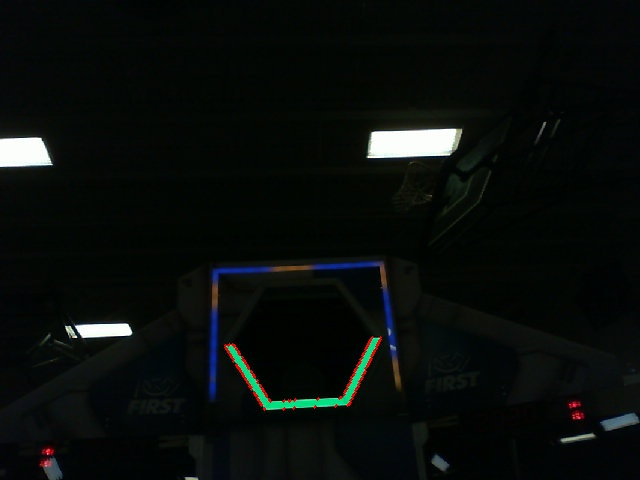

Working with Contours
=====================

After thresholding and removing noise with morphological operations, you are now ready to use OpenCV's ``findContours`` method. This method allows you to generate contours based on your binary image.

Finding and Filtering Contours
______________________________

.. tabs::

   .. code-tab:: py

      _, contours, _ = cv2.findContours(binary_img, cv2.RETR_EXTERNAL, cv2.CHAIN_APPROX_SIMPLE)

In most cases, you want only one contour which is the retroreflective target. However, if there is noise that was not filtered out by morphological operations, you could end up with more in your contour list. A common way to select which contour to use is to simply use the largest.

.. tabs::

   .. code-tab:: py

      if len(contours) > 0:
         largest = contours[0]
         for contour in contours:
            if cv2.contourArea(contour) > cv2.contourArea(largest):
               largest = contour

         #
         # Contour processing code
         #

If you draw the contour you just found, it should look something like this:

Extracting Information from Contours
____________________________________

Now that you've found the contour(s) that you want, you now want to get information about it, such as the center, corners, and rotation.

Center
^^^^^^

In order to find the center of a contour, you can fit a rectangle to it and find the rectangle's center.

.. tabs::

   .. code-tab:: py

      rect = cv2.minAreaRect(contour)
      center, _, _ = rect
      center_x, center_y = rect

Corners
^^^^^^^

In order to find the corners of the contour, you can find the convex hull and then approximate a polygon from it. This works better than either of the methods alone.

.. tabs::

   .. code-tab:: py

      corners = cv2.convexHull(contour)
      corners = cv2.approxPolyDP(corners, 0.1 * cv2.arcLength(contour), True)

Rotation
^^^^^^^^

In order to find the rotation (roll) of the contour, you can fit an ellipse. The ellipse's rotation will be the same as the contour's roll relative to your camera.

.. tabs::

   .. code-tab:: py

      _, _, rotation = cv2.fitEllipse(contour)

Publishing to NetworkTables
___________________________

You can use NetworkTables to send these properties to the Driver Station and the RoboRIO. Additional processing could be done on the Raspberry Pi, or the RoboRIO itself.

.. tabs::

   .. code-tab:: py

      from networktables import NetworkTables

      nt = NetworkTables.getTable('vision')

      #
      # Initialization code here
      #

      while True:

         #
         # Image processing code here
         #

         nt.putNumber('center_x', center_x)
         nt.putNumber('center_y', center_y)
