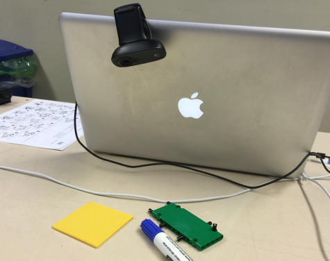
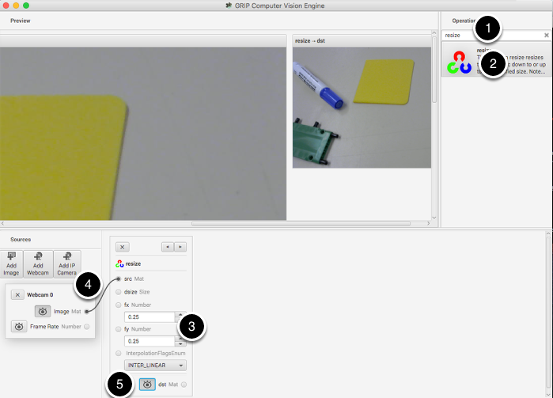
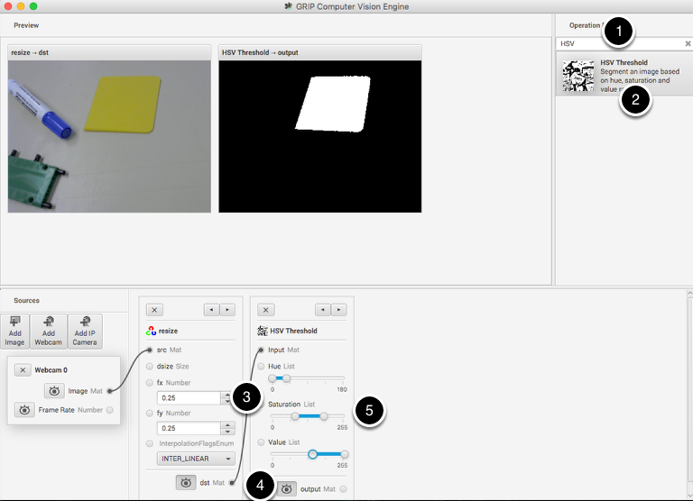
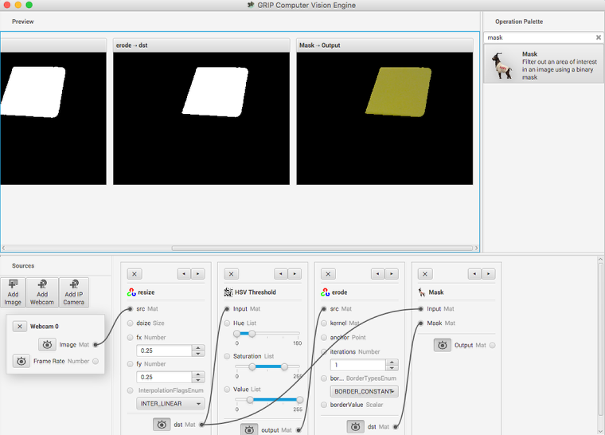

Introduction to GRIP
====================
GRIP is a tool for developing computer vision algorithms interactively rather than through trial and error coding.
After developing your algorithm you may run GRIP in headless mode on your roboRIO, on a Driver Station Laptop, or on
a coprocessor connected to your robot network. With Grip you choose vision operations to create a graphical pipeline
that represents the sequence of operations that are performed to complete the vision algorithm.

GRIP is based on OpenCV, one of the most popular computer vision software libraries used for research, robotics, and
vision algorithm implementations. The operations that are available in GRIP are almost a 1 to 1 match with the
operations available if you were hand coding the same algorithm with some text-based programming language.

The GRIP user interface
-----------------------
.. figure::   images/introduction-to-grip/the-grip-user-interface.png

The GRIP user interface consists of 4 parts:

-   **Image Sources** are the ways of getting images into the GRIP pipeline. You can provide images through attached cameras
    or files. Sources are almost always the beginning of the image processing algorithm.
-   **Operation Palette** contains the image processing steps from the OpenCV library that you can chain together in the
    pipeline to form your algorithm. Clicking on an operation in the palette adds it to the end of the pipeline. You can
    then use the left and right arrows to move the operation within the pipeline.
-   **Pipeline** is the sequence of steps that make up the algorithm. Each step (operation) in the pipeline is connected to
    a previous step from the output of one step to an input to the next step. The data flows from generally from left to
    right through the connections that you create.
-   **Image Preview** are shows previews of the result of each step that has it's preview button pressed. This makes it easy
    to debug algorithms by being able to preview the outputs of each intermediate step.

Finding the yellow square
-------------------------

In this application we will try to find the yellow square in the image and display it's position. The setup is pretty
simple, just a USB web camera connected to the computer looking down at some colorful objects. The yellow plastic square
is the thing that we're interested in locating in the image.

Enable the image source
-----------------------
.. figure::   images/introduction-to-grip/enable-the-image-source.png

The first step is to acquire an image. To use the source, click on the "Add Webcam" button and select the camera number.
In this case the Logitech USB camera that appeared as Webcam 0 and the computer monitor camera was Webcam 1. The web camera
is selected in this case to grab the image behind the computer as shown in the setup. Then select the image preview button
and the real-time display of the camera stream will be shown in the preview area.

Resize the image
----------------

In this case the camera resolution is too high for our purposes, and in fact the entire image cannot even be viewed in the
preview window. The "Resize" operation is clicked from the Operation Palette to add it to the end of the pipeline. To help
locate the Resize operation, type "Resize" into the search box at the top of the palette. The steps are:

1.  Type "Resize" into the search box on the palette
2.  Click the Resize operation from the palette. It will appear in the pipeline.
3.  Enter the x and y resize scale factor into the resize operation in the pipeline. In this case 0.25 was chosen for both.
4.  Drag from the Webcam image output mat socket to the Resize image source mat socket. A connection will be shown
    indicating that the camera output is being sent to the resize input.
5.  Click on the destination preview button on the "Resize" operation in the pipeline. The smaller image will be displayed
    alongside the larger original image. You might need to scroll horizontally to see both as shown.
6.  Lastly, click the Webcam source preview button since there is no reason to look at both the large image and the smaller
    image at the same time.

Find only the yellow parts of the image
---------------------------------------

The next step is to remove everything from the image that doesn't match the yellow color of the piece of plastic that is the
object being detected. To do that a HSV Threshold operation is chosen to set upper and lower limits of HSV values to indicate
which pixels should be included in the resultant binary image. Notice that the target area is white while everything that
wasn't within the threshold values are shown in black. Again, as before:

1.  Type HSV into the search box to find the HSV Threshold operation.
2.  Click on the operation in the palette and it will appear at the end of the pipeline.
3.  Connect the dst (output) socket on the resize operation to the input of the HSV Threshold.
4.  Enable the preview of the HSV Threshold operation so the result of the operation is displayed in the preview window.
5.  Adjust the Hue, Saturation, and Value parameters only the target object is shown in the preview window.

Get rid of the noise and extraneous hits
----------------------------------------
.. figure::   images/introduction-to-grip/get-rid-of-the-noise.png

This looks pretty good so far, but sometimes there is noise from other things that couldn't quite be filtered out. To
illustrate one possible technique to reduce those occasional pixels that were detected, an Erosion operation is chosen.
Erosion will remove small groups of pixels that are not part of the area of interest.

Mask just the yellow area from the original image
-------------------------------------------------

Here a new image is generated by taking the original image and masking (and operation) it with the results of the
erosion. This leaves just the yellow card as seen in the original image with nothing else shown. And it makes it easy to
visualize exactly what was being found through the series of filters.

Find the yellow area (blob)
---------------------------
.. figure::   images/introduction-to-grip/find-the-yellow-area.png

The last step is actually detecting the yellow card using a Blob Detector. This operation looks for a grouping of pixels that
have some minimum area. In this case, the only non-black pixels are from the yellow card after the filtering is done. You can
see that a circle is drawn around the detected portion of the image. In the release version of GRIP (watch for more updates
between now and kickoff) you will be able to send parameters about the detected blob to your robot program using :term:`NetworkTables`.

Status of GRIP
--------------
As you can see from this example, it is very easy and fast to be able to do simple object recognition using GRIP. While this is
a very simple example, it illustrates the basic principles of using GRIP and feature extraction in general. Over the coming
weeks the project team will be posting updates to GRIP as more features are added. Currently it supports cameras (Axis ethernet
camera and web cameras) and image inputs. There is no provision for output yet although NetworkTables and ROS (Robot Operating
System) are planned.

You can either download a pre-built release of the code from the GitHub page "Releases" section
(https://github.com/WPIRoboticsProjects/GRIP) or you can clone the source repository and built it yourself. Directions on
building GRIP are on the project page. There is also additional documentation on the project wiki.

So, please play with GRiP and give us feedback here on the forum. If you find bugs, you can either post them here or as a
GitHub project issue on the project page.
