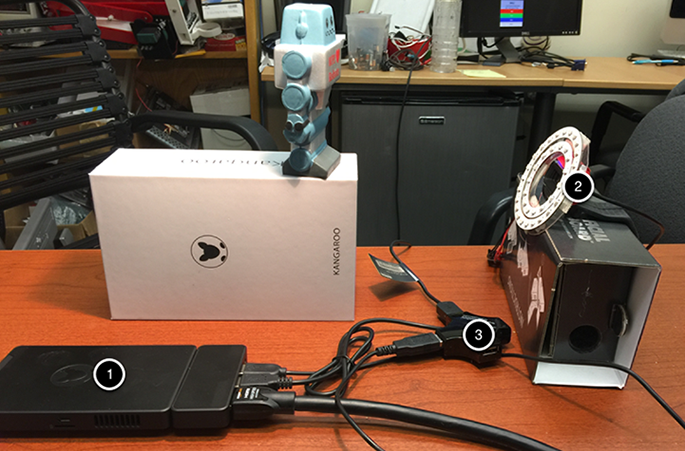

.. include:: <isonum.txt>

Using GRIP with a Kangaroo Computer
===================================

A recently available computer called the Kangaroo looks like a great platform for running GRIP on FRC\ |reg| robots. Some of the specs
for this processor include:

-   Quad core 1.4Ghz Atom processor
-   HDMI port
-   2 USB ports (1 USB2 and 1 USB3)
-   2GB RAM
-   32GB Flash
-   Flash card slot
-   WiFi
-   Battery with 4 hours running time
-   Power supply
-   Windows 10
-   and a fingerprint reader

The advantage of this setup is that it offloads the roboRIO from doing image processing and it is a normal Windows system so all
of our software should work without modification. Be sure to read the caveats at the end of this page before jumping in.

**More detailed instructions** for using a Kangaroo for running GRIP can be found in the following PDF document created by
Scott Taylor and FRC 1735. His explanation goes beyond what is shown here, detailing how to get the GRIP program to auto-start
on boot and many other details.

    `Grip Plus Kangaroo <grip-plus-kangaroo.pdf>`_

Setup
-----

The nice thing about this setup is that you just need to plug in a monitor, keyboard, mouse and (in this case) the Microsoft web
camera and you are good to go with programming the GRIP pipeline. When you are finished, disconnect the keyboard, mouse and monitor
and put the Kangaroo on your robot. You will need to disable the WiFi on the Kangaroo and connect it to the robot with a USB
ethernet dongle to the extra ethernet port on the robot radio.

In this example you can see the Kangaroo computer (1) connected to a USB hub (3), keyboard, and an HDMI monitor for programming.
The USB hub is connected to the camera and mouse.

Sample GRIP program
-------------------

.. figure:: images/using-grip-with-a-kangaroo-computer/sample-grip-program.png

Attached is the sample program running on the Kangaroo detecting the red heart on the little foam robot in the image (left panel).
It is doing a HSV threshold to only get that red color then finding contours, and then filtering the contours using the size and
solidity. At the end of the pipeline, the values are being published to NetworkTables.

Viewing Contours Report in NetworkTables
----------------------------------------

.. figure:: images/using-grip-with-a-kangaroo-computer/viewing-contours-report-in-networktables.png

This is the output from the OutlineViewer (<username>/WPILib/tools/OutlineViewer.jar), running on a different computer as a server
(since there is no roboRIO on the network in this example) and the values being reported back for the single contour that the
program detected that met the requirements of the Filter Contours operation.

Considerations
--------------

The Kangaroo runs Windows 10, so care must to be taken to make sure GRIP will keep running on the robot during a match or testing.
For example, it should not try to do a Windows Update, Virus scan refresh, go to sleep, etc. Once configured, it has the advantage
of being a normal Intel Architecture and should give predictable performance since it is running only one application.
