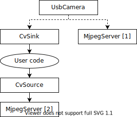
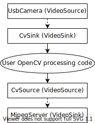

.. include:: <isonum.txt>

Read and Process Video: CameraServer Class
==========================================

Concepts
--------

The cameras typically used in FRC\ |reg| (commodity USB and Ethernet cameras such as the Axis camera) offer relatively limited modes of operation. In general, they provide only a single image output (typically in an RGB compressed format such as JPG) at a single resolution and frame rate. USB cameras are particularly limited as only one application may access the camera at a time.

CameraServer supports multiple cameras. It handles details such as automatically reconnecting when a camera is disconnected, and also makes images from the camera available to multiple "clients" (e.g. both your robot code and the dashboard can connect to the camera simultaneously).

Camera Names
^^^^^^^^^^^^

Each camera in CameraServer must be uniquely named. This is also the name that appears for the camera in the Dashboard. Some variants of the CameraServer ``startAutomaticCapture()`` and ``addAxisCamera()`` functions will automatically name the camera (e.g. "USB Camera 0" or "Axis Camera"), or you can give the camera a more descriptive name (e.g. "Intake Cam"). The only requirement is that each camera have a unique name.

USB Camera Notes
----------------

CPU Usage
^^^^^^^^^

The CameraServer is designed to minimize CPU usage by only performing compression and decompression operations when required and automatically disabling streaming when no clients are connected.

To minimize CPU usage, the dashboard resolution should be set to the same resolution as the camera; this allows the CameraServer to not decompress and recompress the image, instead, it can simply forward the JPEG image received from the camera directly to the dashboard. It's important to note that changing the resolution on the dashboard does *not* change the camera resolution; changing the camera resolution may be done by calling ``setResolution()`` on the camera object.

USB Bandwidth
^^^^^^^^^^^^^

The roboRIO can only transmit and receive so much data at a time over its USB interfaces. Camera images can require a lot of data, and so it is relatively easy to run into this limit. The most common cause of a USB bandwidth error is selecting a non-JPEG video mode or running too high of a resolution, particularly when multiple cameras are connected.

Architecture
------------

The CameraServer consists of two layers, the high level WPILib **CameraServer class** and the low level **cscore library**.

CameraServer Class
------------------

The CameraServer class (part of WPILib) provides a high level interface for adding cameras to your robot code. It also is responsible for publishing information about the cameras and camera servers to NetworkTables so that Driver Station dashboards such as the LabVIEW Dashboard and Shuffleboard can list the cameras and determine where their streams are located. It uses a singleton pattern to maintain a database of all created cameras and servers.

Some key functions in CameraServer are:

- ``startAutomaticCapture()``: Add a USB camera (e.g. Microsoft LifeCam) and starts a server for it so it can be viewed from the dashboard.
- ``addAxisCamera()``: Add an Axis camera. Even if you aren't processing images from the Axis camera in your robot code, you may want to use this function so that the Axis camera appears in the Dashboard's drop down list of cameras. It also starts a server so the Axis stream can still be viewed when your driver station is connected to the roboRIO via USB (useful at competition if you have both the Axis camera and roboRIO connected to the two robot radio Ethernet ports).
- ``getVideo()``: Get OpenCV access to a camera. This allows you to get images from the camera for image processing on the roboRIO (in your robot code).
- ``putVideo()``: Start a server that you can feed OpenCV images to. This allows you to pass custom processed and/or annotated images to the dashboard.

cscore Library
--------------

The cscore library provides the lower level implementation to:

- Get images from USB and HTTP (e.g. Axis) cameras
- Change camera settings (e.g. contrast and brightness)
- Change camera video modes (pixel format, resolution and frame rate)
- Act as a web server and serve images as a standard MJPEG stream
- Convert images to/from OpenCV ``Mat`` objects for image processing

Sources and Sinks
^^^^^^^^^^^^^^^^^

The basic architecture of the cscore library is similar to that of MJPGStreamer, with functionality split between sources and sinks. There can be multiple sources and multiple sinks created and operating simultaneously.

An object that generates images is a source and an object that accepts/consumes images is a sink. The generate/consume is from the perspective of the library. Thus cameras are sources (they generate images). The MJPEG web server is a sink because it accepts images from within the program (even though it may be forwarding those images on to a web browser or dashboard). Sources may be connected to multiple sinks, but sinks can be connected to one and only one source. When a sink is connected to a source, the cscore library takes care of passing each image from the source to the sink.

- **Sources** obtain individual frames (such as provided by a USB camera) and fire an event when a new frame is available. If no sinks are listening to a particular source, the library may pause or disconnect from a source to save processor and I/O resources. The library autonomously handles camera disconnects/reconnects by simply pausing and resuming firing of events (e.g. a disconnect results in no new frames, not an error).
- **Sinks** listen to a particular source's event, grab the latest image, and forward it to its destination in the appropriate format. Similarly to sources, if a particular sink is inactive (e.g. no client is connected to a configured MJPEG over HTTP server), the library may disable parts of its processing to save processor resources.

User code (such as that used in a FRC robot program) can act as either a source (providing processed frames as if it were a camera) or as a sink (receiving a frame for processing) via OpenCV source and sink objects. Thus an image processing pipeline that gets images from a camera and serves the processed images out looks like the below graph:

Because sources can have multiple sinks connected, the pipeline may branch. For example, the original camera image can also be served by connecting the UsbCamera source to a second MjpegServer sink in addition to the CvSink, resulting in the below graph:

When a new image is captured by the camera, both the CvSink and the MjpegServer [1] receive it.

The above graph is what the following CameraServer snippet creates:

.. tabs::

    .. code-tab:: java

        import edu.wpi.first.cameraserver.CameraServer;
        import edu.wpi.cscore.CvSink;
        import edu.wpi.cscore.CvSource;

        // Creates UsbCamera and MjpegServer [1] and connects them
        CameraServer.startAutomaticCapture();

        // Creates the CvSink and connects it to the UsbCamera
        CvSink cvSink = CameraServer.getVideo();

        // Creates the CvSource and MjpegServer [2] and connects them
        CvSource outputStream = CameraServer.putVideo("Blur", 640, 480);

    .. code-tab:: c++

        #include "cameraserver/CameraServer.h"

        // Creates UsbCamera and MjpegServer [1] and connects them
        frc::CameraServer::StartAutomaticCapture();

        // Creates the CvSink and connects it to the UsbCamera
        cs::CvSink cvSink = frc::CameraServer::GetVideo();

        // Creates the CvSource and MjpegServer [2] and connects them
        cs::CvSource outputStream = frc::CameraServer::PutVideo("Blur", 640, 480);

The CameraServer implementation effectively does the following at the cscore level (for explanation purposes). CameraServer takes care of many of the details such as creating unique names for all cscore objects and automatically selecting port numbers. CameraServer also keeps a singleton registry of created objects so they aren't destroyed if they go out of scope.

.. tabs::

    .. code-tab:: java

        import edu.wpi.cscore.CvSink;
        import edu.wpi.cscore.CvSource;
        import edu.wpi.cscore.MjpegServer;
        import edu.wpi.cscore.UsbCamera;

        // Creates UsbCamera and MjpegServer [1] and connects them
        UsbCamera usbCamera = new UsbCamera("USB Camera 0", 0);
        MjpegServer mjpegServer1 = new MjpegServer("serve_USB Camera 0", 1181);
        mjpegServer1.setSource(usbCamera);

        // Creates the CvSink and connects it to the UsbCamera
        CvSink cvSink = new CvSink("opencv_USB Camera 0");
        cvSink.setSource(usbCamera);

        // Creates the CvSource and MjpegServer [2] and connects them
        CvSource outputStream = new CvSource("Blur", PixelFormat.kMJPEG, 640, 480, 30);
        MjpegServer mjpegServer2 = new MjpegServer("serve_Blur", 1182);
        mjpegServer2.setSource(outputStream);

    .. code-tab:: c++

        #include "cscore_oo.h"

        // Creates UsbCamera and MjpegServer [1] and connects them
        cs::UsbCamera usbCamera("USB Camera 0", 0);
        cs::MjpegServer mjpegServer1("serve_USB Camera 0", 1181);
        mjpegServer1.SetSource(usbCamera);

        // Creates the CvSink and connects it to the UsbCamera
        cs::CvSink cvSink("opencv_USB Camera 0");
        cvSink.SetSource(usbCamera);

        // Creates the CvSource and MjpegServer [2] and connects them
        cs::CvSource outputStream("Blur", cs::PixelFormat::kMJPEG, 640, 480, 30);
        cs::MjpegServer mjpegServer2("serve_Blur", 1182);
        mjpegServer2.SetSource(outputStream);

Reference Counting
^^^^^^^^^^^^^^^^^^

All cscore objects are internally reference counted. Connecting a sink to a source increments the source's reference count, so it's only strictly necessary to keep the sink in scope. The CameraServer class keeps a registry of all objects created with CameraServer functions, so sources and sinks created in that way effectively never go out of scope (unless explicitly removed).
