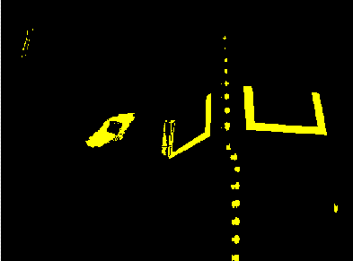

.. include:: <isonum.txt>

# Identifying Game Pieces

A common task in FRC\ |reg| is locating and navigating to game pieces on the field. This document describes approaches for detecting game pieces using vision processing and converting that information into actionable data for your robot.

## Detection Methods: Traditional Vision vs Machine Learning

There are two primary approaches to detecting game pieces: traditional computer vision and machine learning (AI) models. Choosing the right approach depends on your specific use case.

### When to Use Traditional Vision Methods

Traditional vision methods work best when:

- The game piece has a **distinctive, consistent color** that stands out from the background
- The object looks **similar from all angles** (e.g., a sphere or simple geometric shape)
- **Lighting conditions are controlled** (e.g., using ring lights or consistent field lighting)
- You want **fast, predictable performance** with lower computational requirements

Examples: Detecting brightly colored balls, simple geometric shapes with consistent colors

### When to Use Machine Learning

Machine learning models are better suited when:

- The game piece has **variable appearance** depending on viewing angle
- The object has **complex geometry** or texture that's hard to describe with simple color rules
- There is **visual variability** in the objects themselves (wear, damage, manufacturing differences)
- Background conditions vary significantly

Examples: Detecting cargo with logos, irregularly shaped objects, pieces that look very different when viewed from different angles

.. note:: Most common FRC vision processing solutions (`PhotonVision <https://docs.photonvision.org>`__, `Limelight <https://docs.limelightvision.io>`__, etc.) offer support for both traditional vision pipelines and machine learning models.

.. important:: Machine learning inference requires significant computational resources. While possible on devices like the Raspberry Pi, performance may be limited. For better ML performance, consider using hardware accelerators such as:

   - **Google Coral USB/M.2 Accelerator** - Works with coprocessors running PhotonVision or custom code
   - **Orange Pi 5/5B with NPU** - Single-board computer with neural processing unit, compatible with PhotonVision
   - **Hailo-8 Accelerator** - High-performance ML accelerator that can be added to compatible vision solutions

   Many teams successfully use Google Coral accelerators with coprocessors like the Raspberry Pi or Orange Pi.

## Traditional Vision Method

Traditional vision processing works by identifying pixels that match specific criteria (usually color and brightness), then analyzing the resulting shapes to find objects matching your target.

### Color-Based Masking

The first step is to create a binary mask that isolates pixels matching your target color. This is typically done in the HSV (Hue, Saturation, Value) color space, which makes it easier to isolate specific colors regardless of lighting variations.

The masking operation compares each pixel against threshold values and creates a mask showing which pixels match your criteria. For game pieces, you'll typically look for:

- **Hue range**: The specific color of your game piece
- **Saturation range**: How "colorful" vs "gray" the pixel is (helps filter out shadows and reflections)
- **Value range**: The brightness level (helps filter out dark areas)

### Particle Analysis

After masking, you'll have one or more "particles" (clusters of matching pixels). Particle analysis examines these clusters to determine which ones are actually your target game piece.

Common filtering criteria include:

#### Area and Coverage

Compare the area of the particle to the area of the bounding box around it. This ratio helps identify specific shapes. For example, a circular game piece should have an area-to-bounding-box ratio of approximately 0.785 (π/4), while a square object would be closer to 1.0.

#### Aspect Ratio

The width-to-height ratio can help distinguish your target from other objects. Use the particle's equivalent rectangle (a rectangle with the same area and perimeter) rather than the bounding box for more accurate results that aren't affected by rotation.

#### Solidity

Solidity measures how "filled in" a shape is by comparing the particle area to its convex hull area. This helps distinguish solid objects from irregular or broken shapes.

### Limiting Your Field of View

To improve detection accuracy and reduce false positives:

- **Mount your camera strategically** - Position it to primarily see areas where game pieces are expected (floor, human player station, etc.)
- **Adjust camera angle** - Angling the camera downward can limit how much of the far field and walls you see
- **Set appropriate thresholds** - Tighter color ranges reduce false positives but may miss valid targets in different lighting

## Converting Image Coordinates to Robot Coordinates

Once you've identified a game piece in the image, you need to convert pixel coordinates into information your robot can use for navigation.

### Coordinate System Transformation

Camera images use a pixel coordinate system with the origin (0,0) at the top-left corner. For robot control, it's more useful to use a centered coordinate system.

To convert a point from the pixel system to a normalized coordinate system centered on the image:

.. math:: A_{x,y} = \left(P_{x,y} - \frac{\textit{resolution}_{x,y}}{2}\right) / \frac{\textit{resolution}_{x,y}}{2}

This produces coordinates ranging from -1 to +1, with (0,0) at the image center. Note that the Y axis is inverted (positive is down).

.. image:: images/identifying-and-processing-the-targets/position.png
   :alt: Comparison of pixel-based coordinate system and normalized -1 to 1 coordinate system

### Determining Field of View

To calculate real-world measurements, you must first determine your camera's field of view (FOV).

To empirically measure your **vertical FOV**:

1. Place your camera a known distance from a flat surface (perpendicular to the surface)
2. Measure the real-world distance between the topmost and bottommost visible points
3. Calculate: :math:`\frac{1}{2}FOV_{vertical}=\tan^{-1}\left(\frac{\frac{1}{2}\textit{distance}_y}{\textit{distance}_z}\right)`

Repeat this process horizontally to find your **horizontal FOV**.

.. note:: Many camera manufacturers specify the FOV in their documentation, but empirical measurement often provides more accurate results, especially if lens distortion is significant.

### Calculating Angle to Target

Once you know your FOV and the target's position in normalized coordinates, you can calculate the angle from your camera to the target:

.. math::
   \textit{pitch}=A_y \cdot \frac{1}{2}FOV_{vertical}

.. math::
   \textit{yaw}=A_x \cdot \frac{1}{2}FOV_{horizontal}

These angles tell you how far up/down and left/right the game piece is relative to your camera's center axis.

### Calculating Distance to Target

If your camera is mounted at a known angle and height, and you know the approximate height of the game piece, you can calculate the distance:

.. math::
   \textit{distance}=\frac{\textit{height}_{target}-\textit{height}_{camera}}{\tan(\textit{angle}_{camera}+\textit{pitch})}

Where:

- **height_target**: The height of the game piece (often at or near ground level)
- **height_camera**: The mounting height of your camera
- **angle_camera**: The angle your camera is tilted (positive for tilted down, negative for tilted up)
- **pitch**: The calculated pitch angle to the target

.. important:: The camera mounting angle is critical for accurate distance measurements. A camera pointed straight ahead cannot accurately determine distance to objects at the same height. Angling the camera down 15-30 degrees typically provides good results for ground-level game pieces.

### Estimating Target Pose

For more advanced applications, you may want to estimate the full 3D pose (position and orientation) of the game piece relative to your robot. This requires:

1. **Known dimensions** of the game piece
2. **Calibrated camera** to account for lens distortion
3. **Multiple features** on the object to determine orientation

For circular game pieces, orientation may not matter. For asymmetric objects, detecting specific features (corners, markings, etc.) can help determine how the object is oriented.

The WPILib pose estimation classes can incorporate vision measurements to help track your robot's position and plan paths to game pieces.

### Alternative: Area-to-Distance Lookup

If your game piece is always oriented the same way, you can create a lookup table correlating particle area (in pixels) to distance. This is less accurate than trigonometric methods but can be simpler to implement:

1. Place the game piece at known distances from your camera
2. Measure the particle area at each distance
3. Create a lookup table or fit a curve to the data

Note that area varies with the inverse square of distance, so small measurement errors at large distances can cause significant inaccuracy.

## Choosing a Camera

Selecting the right camera is crucial for reliable game piece detection. Key considerations include:

### Field of View (FOV)

- **Wide FOV (>100°)**: Better for detecting game pieces at close range and wide areas, but objects appear smaller at distance. Wide-angle lenses introduce more distortion, especially at the edges of the frame, which can reduce measurement accuracy. Calibration is essential for wide FOV cameras.
- **Narrow FOV (60-90°)**: Better for detecting distant objects with more detail, but limited peripheral vision. Less lens distortion than wide-angle cameras.
- Consider your robot's typical operating distance and whether you need to see multiple game pieces simultaneously

### Resolution

- **Higher resolution (1920x1080 or more)**: Provides more detail for distant detection and better pose estimation, but requires more processing power
- **Lower resolution (640x480 to 1280x720)**: Faster processing, sufficient for many traditional vision tasks
- Balance resolution with frame rate - a 720p camera at 60 FPS may outperform a 1080p camera at 15 FPS

### Frame Rate

- **Higher frame rate (60+ FPS)**: Reduces motion blur, crucial for detecting pieces while moving
- **Lower frame rate (15-30 FPS)**: Sufficient for stationary detection, uses less bandwidth

### Exposure Control

- **Manual exposure control**: Essential for consistent detection under varying lighting
- **Global shutter vs rolling shutter**: Global shutter cameras capture the entire frame at once, avoiding distortion when moving quickly, making them preferable for fast-moving robots. However, rolling shutter cameras are significantly more common and less expensive. If a camera's specifications don't explicitly mention "global shutter," it's almost certainly rolling shutter. For most FRC applications, rolling shutter cameras work adequately, especially when using ring lights and avoiding excessive robot motion during image capture

### Common Camera Options

- **USB cameras**: Widely compatible, easy to set up with coprocessors
- **CSI cameras**: Lower latency on Raspberry Pi and similar boards, but limited cable length
- **IP cameras**: Can work over Ethernet, useful for multiple camera setups

For specific camera recommendations and compatibility, consult the documentation for your chosen vision processing solution (PhotonVision, Limelight, etc.).

## Best Practices

### Camera Calibration

For best accuracy in distance and angle calculations, calibrate your camera using OpenCV's calibration tools. This generates a calibration matrix that can correct for lens distortion, significantly improving measurement accuracy especially near the edges of the frame.

### Dealing with Lighting Variations

- Use consistent lighting when possible (ring lights around the camera help)
- Test your detection pipeline under various field lighting conditions
- Consider using automatic threshold adjustment or multiple threshold sets for different lighting conditions
- The HSV color space is more robust to lighting changes than RGB

### Multiple Detection Strategies

Consider implementing multiple detection methods:

- Use traditional vision for initial quick detection
- Switch to more detailed analysis or ML when needed
- Combine multiple views from different cameras for better pose estimation

### Testing and Validation

- Test with actual game pieces, not just simulations
- Verify measurements at multiple distances and angles
- Account for motion blur when the robot or game piece is moving
- Consider how worn or damaged game pieces might look different from new ones
