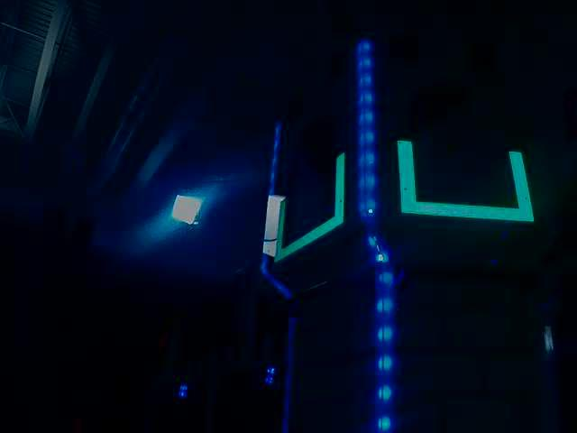
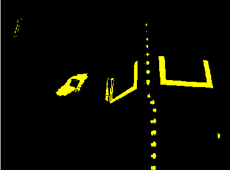
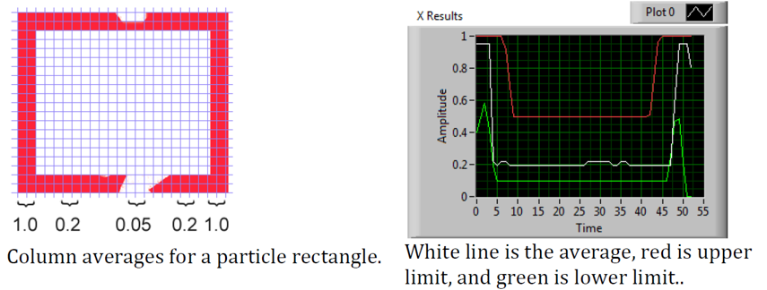
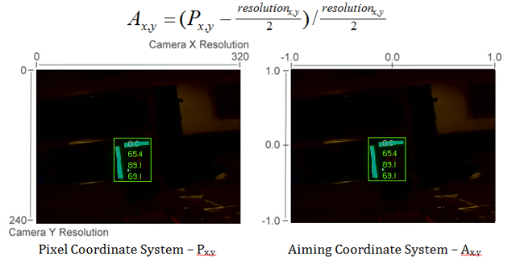

.. include:: <isonum.txt>

Identifying and Processing the Targets
======================================

Once an image is captured, the next step is to identify Vision Target(s) in the image. This document will walk through one approach to identifying the 2016 targets. Note that the images used in this section were taken with the camera intentionally set to underexpose the images, producing very dark images with the exception of the lit targets, see the section on Camera Settings for details.

Additional Options
------------------

This document walks through the approach used by the example code provided in LabVIEW (for PC or roboRIO), C++ and Java. In addition to these options teams should be aware of the following alternatives that allow for vision processing on the Driver Station PC or an on-board PC:

1. `RoboRealm <http://www.roborealm.com/>`_
2. SmartDashboard Camera Extension (programmed in Java, works with any robot language)
3. `GRIP <https://wpiroboticsprojects.github.io/GRIP/>`_

Original Image
--------------

The image shown below is the starting image for the example described here. The image was taken using the green ring light available in *FIRST*\ |reg| Choice combined with an additional ring light of a different size. Additional sample images are provided with the vision code examples.

What is HSL/HSV?
----------------

The Hue or tone of the color is commonly seen on the artist’s color wheel and contains the colors of the rainbow Red, Orange, Yellow, Green, Blue, Indigo, and Violet. The hue is specified using a radial angle on the wheel, but in imaging the circle typically contains only 256 units, starting with red at zero, cycling through the rainbow, and wrapping back to red at the upper end. Saturation of a color specifies amount of color, or the ratio of the hue color to a shade of gray. Higher ratio means more colorful, less gray. Zero saturation has no hue and is completely gray. Luminance or Value indicates the shade of gray that the hue is blended with. Black is 0 and white is 255.

The example code uses the HSV color space to specify the color of the target. The primary reason is that it readily allows for using the brightness of the targets relative to the rest of the image as a filtering criteria by using the Value (HSV) or Luminance (HSL) component. Another reason to use the HSV color system is that the thresholding operation used in the example runs more efficiently on the roboRIO when done in the HSV color space.

Masking
-------

In this initial step, pixel values are compared to constant color or brightness values to create a binary mask shown below in yellow. This single step eliminates most of the pixels that are not part of a target’s retro-reflective tape. Color based masking works well provided the color is relatively saturated, bright, and consistent. Color inequalities are generally more accurate when specified using the HSL (Hue, Saturation, and Luminance) or HSV (Hue, Saturation, and Value) color space than the RGB (Red, Green, and Blue) space. This is especially true when the color range is quite large in one or more dimension.

Notice that in addition to the target, other bright parts of the image (overhead light and tower lighting) are also caught by the masking step.

Particle Analysis
-----------------

After the masking operation, a particle report operation is used to examine the area, bounding rectangle, and equivalent rectangle for the particles. These are used to compute several scored terms to help pick the shapes that are most rectangular. Each test described below generates a score (0-100) which is then compared to pre-defined score limits to decide if the particle is a target or not.

Coverage Area
^^^^^^^^^^^^^

The Area score is calculated by comparing the area of the particle compared to the area of the bounding box drawn around the particle. The area of the retroreflective strips is 80 square inches (~516 :math:`cm^2`). The area of the rectangle that contains the target is 240 square inches (~0.15 :math:`m^2`). This means that the ideal ratio between area and bounding box area is 1/3. Area ratios close to 1/3 will produce a score near 100, as the ratio diverges from 1/3 the score will approach 0.

Aspect Ratio
^^^^^^^^^^^^

The aspect ratio score is based on (Particle Width / Particle Height). The width and height of the particle are determined using something called the "equivalent rectangle". The equivalent rectangle is the rectangle with side lengths :math:`x` and :math:`y` where :math:`2x+2y` equals the particle perimeter and :math:`x \cdot y` equals the particle area. The equivalent rectangle is used for the aspect ratio calculation as it is less affected by skewing of the rectangle than using the bounding box. When using the bounding box rectangle for aspect ratio, as the rectangle is skewed the height increases and the width decreases.

The target is 20" (508 mm) wide by 12" (304.8 mm) tall, for a ratio of 1.6. The detected aspect ratio is compared to this ideal ratio. The aspect ratio score is normalized to return 100 when the ratio matches the target ratio and drops linearly as the ratio varies below or above.

Moment
^^^^^^

The "moment" measurement calculates how spread out each pixel is from the center of the blob. This measurement provides a representation of the pixel distribution in the particle. It can be thought of as analogous to a physics :term:`moment of inertia` calculation. The ideal score for this test is ~0.28.

X/Y Profiles
^^^^^^^^^^^^

The edge score describes whether the particle matches the appropriate profile in both the X and Y directions. As shown, it is calculated using the row and column averages across the bounding box extracted from the original image and comparing that to a profile mask. The score ranges from 0 to 100 based on the number of values within the row or column averages that are between the upper and lower limit values.

Measurements
------------

If a particle scores well enough to be considered a target, it makes sense to calculate some real-world measurements such as position and distance. The example code includes these basic measurements, so let’s look at the math involved to better understand it.

Position
^^^^^^^^

The target position is well described by both the particle and the bounding box, but all coordinates are in pixels with 0,0 being at the top left of the screen and the right and bottom edges determined by the camera resolution. This is a useful system for pixel math, but not nearly as useful for driving a robot; so let’s change it to something that may be more useful.

To convert a point from the pixel system to the aiming system, we can use the formula shown below.

The resulting coordinates are close to what you may want, but the Y axis is inverted. This could be corrected by multiplying the point by [1,-1] (Note: this is not done in the sample code). This coordinate system is useful because it has a centered origin and the scale is similar to joystick outputs and Drive inputs.

.. math:: A_{x,y} = \left(P_{x,y} - \frac{\textit{resolution}_{x,y}}{2}\right) / \frac{\textit{resolution}_{x,y}}{2}

Field of View
^^^^^^^^^^^^^

You can use known constants and the position of the target on the coordinate plane to determine your distance, yaw, and pitch from the target. However, in order to calculate these, you must determine your FOV (field of view). In order to empirically determine vertical field of view, set your camera a set distance away from an flat surface, and measure the distance between the topmost and bottommost row of pixels.

.. math:: \frac{1}{2}FOV_{vertical}=tan\left(\frac{\frac{1}{2}distance_{y}}{distance_{z}}\right)

You can find the horizontal FOV using the same method, but using the distance between the first and last column of pixels.

Pitch and Yaw
^^^^^^^^^^^^^

Finding the pitch and yaw of the target relative to your robot is simple once you know your FOVs and the location of your target in the aiming coordinate system.

.. math::
   pitch=\frac{A_y}{2}FOV_{vertical}

.. math::
   yaw=\frac{A_x}{2}FOV_{horizontal}

Distance
^^^^^^^^

If your target is at a significantly different height than your robot, you can use known constants, such as the physical height of the target and your camera, as well as the angle your camera is mounted, to calculate the distance between your camera and the target.

.. math::
   distance=\frac{height_{target}-height_{camera}}{tan(angle_{camera}+pitch)}

Another option is to create a lookup table for area to distance, or to estimate the inverse variation constant of area and distance. However, this method is less accurate.

.. note::
   For best results for the above methods of estimating angle and distance, you can calibrate your camera using OpenCV to get rid of any distortions that may be affecting accuracy by reprojecting the pixels of the target using the calibration matrix.
