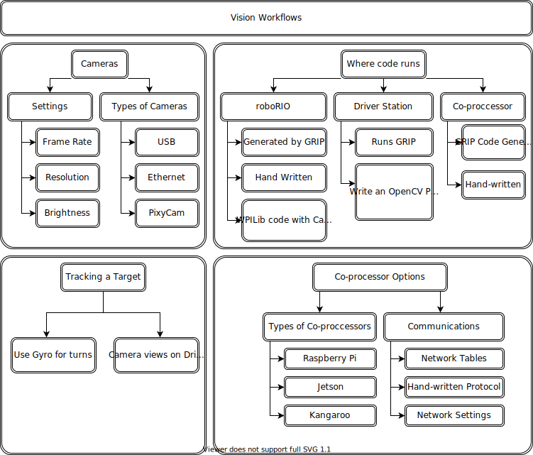
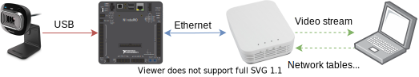

.. include:: <isonum.txt>

Strategies for Vision Programming
=================================

Using computer vision is a great way of making your robot be responsive to the elements on the field and make it much more autonomous. Often in FRC\ |reg| games there are bonus points for autonomously shooting balls or other game pieces into goals or navigating to locations on the field. Computer vision is a great way of solving many of these problems. And if you have autonomous code that can do the challenge, then it can be used during the teleop period as well to help the human drivers.

There are many options for choosing the components for vision processing and where the vision program should run. WPILib and associated tools support a number of options and give teams a lot of flexibility to decide what to do. This article will attempt to give you some insight into many of the choices and tradeoffs that are available.

OpenCV Computer Vision Library
------------------------------

**OpenCV** is an open source computer vision library that is widely used throughout academia and industry. It has support from hardware manufactures providing GPU accelerated processing, it has bindings for a number of languages including C++, Java, and Python. It is also well documented with many web sites, books, videos, and training courses so there are lots of resources available to help learn how to use it. The C++ and Java versions of WPILib include the OpenCV libraries, there is support in the library for capturing, processing and viewing video, and tools to help you create your vision algorithms. For more information about OpenCV see https://opencv.org.

Vision Code on roboRIO
----------------------

.. image:: diagrams/vision-code-on-roborio.drawio.svg
   :alt: The chain from a USB Webcam to roboRIO to Ethernet Switch over a video stream to the driver station computer.

Vision code can be embedded into the main robot program on the roboRIO. Building and running the vision code is straightforward because it is built and deployed along with the robot program. The vision code can be written by hand or generated by GRIP in either C++ or Java. The disadvantage of this approach is that having vision code running on the same processor as the robot program can cause performance issues. This is something you will have to evaluate depending on the requirements for your robot and vision program.

In this approach, the vision code simply produces results that the robot code directly uses. Be careful about synchronization issues when writing robot code that is getting values from a vision thread. The GRIP generated code and the VisionRunner class in WPILib make this easier.

Using functions provided by the CameraServer class, the video stream can be sent to dashboards such as Shuffleboard so operators can see what the camera sees. In addition, annotations can be added to the images using OpenCV commands so targets or other interesting objects can be identified in the dashboard view.

Vision Code on DS Computer
--------------------------

When vision code is running on the DS computer, the video is streamed back to the Driver Station laptop for processing. Even the older Classmate laptops are substantially faster at vision processing than the roboRIO. GRIP can be run on the Driver Station laptop directly with the results sent back to the robot using NetworkTables. Alternatively you can write your own vision program using a language of your choosing. Python makes a good choice since there is a native NetworkTables implementation and the OpenCV bindings are very good.

After the images are processed, the key values such as the target position, distance or anything else you need can be sent back to the robot with NetworkTables. This approach generally has higher latency, as delay is added due to the images needing to be sent to the laptop. Bandwidth limitations also limit the maximum resolution and FPS of the images used for processing.

The video stream can be displayed on Shuffleboard or in GRIP.

Vision Code on Coprocessor
--------------------------

.. image:: diagrams/vision-code-on-a-coprocessor.drawio.svg
   :alt: Coprocessor is on same network as the roboRIO so it off loads the compute without having the latency of going to the Driver Station and back.

Coprocessors such as the Raspberry Pi are ideal for supporting vision code (see :ref:`docs/software/vision-processing/wpilibpi/using-the-raspberry-pi-for-frc:Using the Raspberry Pi for FRC`). The advantage is that they can run full speed and not interfere with the robot program. In this case, the camera is probably connected to the coprocessor or (in the case of Ethernet cameras) an Ethernet switch on the robot. The program can be written in any language; Python is a good choice because of its simple bindings to OpenCV and NetworkTables. Some teams have used high performance vision coprocessors such as the Nvidia Jetson for fastest speed and highest resolution, although this approach generally requires advanced Linux and programming knowledge.

This approach takes a bit more programming expertise as well as a small amount of additional weight, but otherwise it brings the best of both worlds compared to the other two approaches, as coprocessors are much faster than the roboRIO and the image processing can be performed with minimal latency or bandwidth use.

Data can be sent from the vision program on the coprocessor to the robot using NetworkTables or a private protocol over a network or serial connection.

Camera Options
--------------

There are a number of camera options supported by WPILib. Cameras have a number of parameters that affect operation; for example, frame rate and image resolution affect the quality of the received images, but when set too high impact processing time and, if sent to the driver station, may exceed the available bandwidth on the field.

The CameraServer class in C++ and Java is used to interface with cameras connected to the robot. It retrieve frames for local processing through a Source object and sends the stream to your driver station for viewing or processing there.
