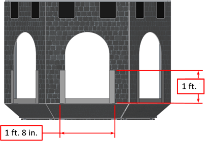
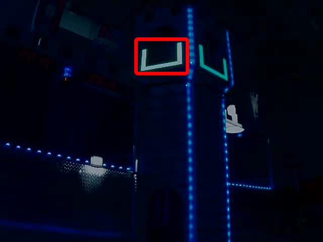
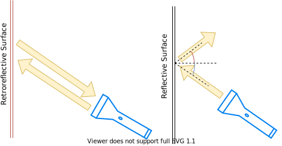
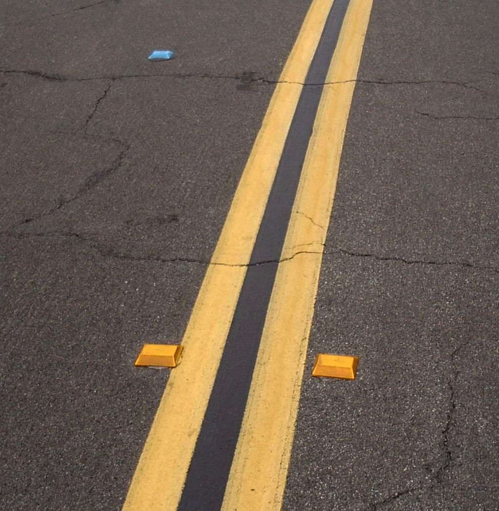
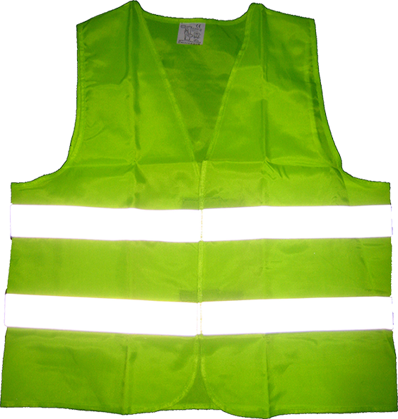
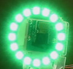

.. include:: <isonum.txt>

Target Info and Retroreflection
===============================

Many FRC\ |reg| games have retroreflective tape attached to field elements to aid in vision processing. This document describes the Vision Targets from the 2016 FRC game and the visual properties of the material making up the targets.

.. note:: For official dimensions and drawings of all field components, please see the Official Field Drawings.

Targets
-------

Each 2016 vision target consists of a 1' 8" wide, 1' tall U-shape made of 2" wide retroreflective material (3M 8830 Silver Marking Film). The targets are located immediately adjacent to the bottom of each high goal. When properly lit, the retroreflective tape produces a bright and/or color-saturated marker.

Retroreflectivity vs. Reflectivity
----------------------------------

Highly reflective materials are generally mirrored so that light "bounces off" at a supplementary angle. As shown above-left, the blue and red angles sum to 180 degrees. An equivalent explanation is that the light reflects about the surface normal the green line drawn perpendicular to the surface. Notice that a light pointed at the surface will return to the light source only if the blue angle is ~90 degrees.

Retro-reflective materials are not mirrored, but it will typically have either shiny facets across the surface, or it will have a pearl-like appearance. Not all faceted or pearl-like materials exhibit :term:`retro-reflection`, however. Retro-reflective materials return the majority of light back to the light source, and they do this for a wide range of angles between the surface and the light source, not just the 90 degree case. Retro-reflective materials accomplish this using small prisms, such as found on a bicycle or roadside reflector, or by using small spheres with the appropriate index of refraction that accomplish multiple internal reflections. In nature, the eyes of some animals, including house cats, also exhibit the retro-reflective effect typically referred to as night-shine.

Examples of Retroreflection
---------------------------

This material should be relatively familiar as it is often used to enhance nighttime visibility of road signs, bicycles, and pedestrians.

Initially, retro-reflection may not seem like a useful property for nighttime safety, but when the light and eye are near one another, as shown above, the reflected light returns to the eye, and the material shines brightly even at large distances. Due to the small angle between the driver’s eyes and vehicle headlights, retro-reflective materials can greatly increase visibility of distant objects during nighttime driving.

Demonstration
-------------

To further explore retro-reflective material properties:

1. Place a piece of the material on a wall or vertical surface
2. Stand 10-20 feet away, and shine a small flashlight at the material.
3. Start with the light held at your belly button, and raise it slowly until it is between your eyes. As the light nears your eyes, the intensity of the returned light will increase rapidly.
4. Alter the angle by moving to other locations in the room and repeating. The bright reflection should occur over a wide range of viewing angles, but the angle from light source to eye is key and must be quite small.

Experiment with different light sources. The material is hundreds of times more reflective than white paint; so dim light sources will work fine. For example, a red bicycle safety light will demonstrate that the color of the light source determines the color of the reflected light. If possible, position several team members at different locations, each with their own light source. This will show that the effects are largely independent, and the material can simultaneously appear different colors to various team members. This also demonstrates that the material is largely immune to environmental lighting. The light returning to the viewer is almost entirely determined by a light source they control or one directly behind them. Using the flashlight, identify other retro-reflective articles already in your environment: on clothing, backpacks, shoes, etc.

Lighting
--------

We have seen that the retro-reflective tape will not shine unless a light source is directed at it, and the light source must pass very near the camera lens or the observer’s eyes. While there are a number of ways to accomplish this, a very useful type of light source to investigate is the ring flash, or ring light, shown above. It places the light source directly on or around the camera lens and provides very even lighting. Because of their bright output and small size, LEDs are particularly useful for constructing this type of device.

As shown above, inexpensive circular arrangements of LEDs are available in a variety of colors and sizes and are easy to attach to cameras, and some can even be powered off of a Raspberry Pi. While not designed for diffuse even lighting, they work quite well for causing retro-reflective tape to shine. A small green LED ring is available through FIRST Choice. Other similar LED rings are available from suppliers such as SuperBrightLEDs.

Sample Images
-------------

Sample images are located with the code examples for each language (packaged with LabVIEW, and in a separate ZIP in the same location as the C++/Java samples).
