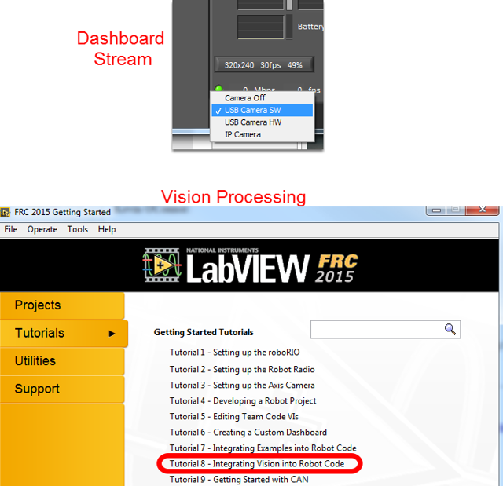

Using the Microsoft Lifecam HD-3000
===================================

The Microsoft Lifecam HD-3000 is a USB webcam that was tested with the roboRIO as part of the Beta testing and software development effort. While other USB webcams may work with the roboRIO, this camera has been tested to be compatible with the provided software.

Connecting the Camera to the roboRIO
------------------------------------

.. image:: /docs/getting-started/getting-started-frc-control-system/images/control-system-hardware/microsoft-lifecam.jpg

The camera can be connected to either of the roboRIO USB ports.

Using the Camera - LabVIEW
--------------------------

To stream the camera back to the Dashboard using LabVIEW, no additional code is necessary. Simply select USB HW (image compression done by the camera, fewer options but lower roboRIO CPU usage) or USB SW (image compressed by roboRIO, more options, but higher roboRIO CPU usage) and the image should begin streaming back.

.. note:: The camera should be plugged in before your LabVIEW code starts running to work properly. If you just plugged in the camera, rebooting the roboRIO is a quick way to make sure it is recognized properly.

The default LabVIEW templates and the image processing examples are already set up for the USB camera if you want to do image processing. On the LabVIEW splash screen, click Tutorials, then click Tutorial 8 for more information about integrating Vision processing in your LabVIEW code.

Using the Camera - C++/Java
---------------------------

To stream the camera back to the Dashboard using C++ or Java robot code, you will need to add some code to your robot project. See :doc:`using-the-cameraserver-on-the-roborio` for instructions on using the CameraServer class to automatically stream images back to the Dashboard.
