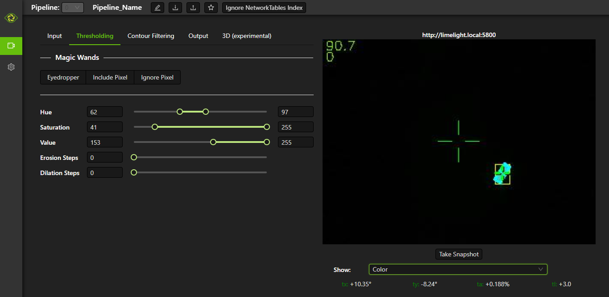

What is Limelight?
=========================================
Limelight is a smart camera purpose-built for FRC teams
--------------------------------------------------------
The Limelight Smart Camera runs configurable 90fps vision processing pipelines. It combines a computer, a camera, green leds, a robust power supply, and software into a package about the size of a credit card. With only a few lines of code, teams can begin tracking vision targets.

.. figure:: images/what-is-limelight/limelight-gradient.png

Getting Started with Limelight
--------------------------------------------------------
To see more detailed instructions and full robot code examples using Limelight, visit the `official Limelight Docs <https://docs.limelightvision.io/>`__.

Once powered, Limelight will begin tracking targets and streaming data to the roboRIO using networkTables. Navigate to its web interface to begin configuring your pipelines:

Example code to retrieve targeting data from Limelight is below.

.. tabs::

    .. tab:: Java

        .. code-block:: java

            NetworkTable table = NetworkTableInstance.getDefault().getTable("limelight");
            NetworkTableEntry tx = table.getEntry("tx");
            NetworkTableEntry ty = table.getEntry("ty");
            NetworkTableEntry ta = table.getEntry("ta");

            //read values periodically
            double x = tx.getDouble(0.0);
            double y = ty.getDouble(0.0);
            double area = ta.getDouble(0.0);

            //post to smart dashboard periodically
            SmartDashboard.putNumber("LimelightX", x);
            SmartDashboard.putNumber("LimelightY", y);
            SmartDashboard.putNumber("LimelightArea", area);

        Don't forget to add these imports:

        .. code-block:: java

            import edu.wpi.first.wpilibj.smartdashboard.SmartDashboard;
            import edu.wpi.first.networktables.NetworkTable;
            import edu.wpi.first.networktables.NetworkTableEntry;
            import edu.wpi.first.networktables.NetworkTableInstance;

    .. tab:: LabView

        .. image:: images/what-is-limelight/limelight-labview.png

    .. tab:: C++

        .. code-block:: c++

            std::shared_ptr<NetworkTable> table = nt::NetworkTableInstance::GetDefault().GetTable("limelight");
            double targetOffsetAngle_Horizontal = table->GetNumber("tx",0.0);
            double targetOffsetAngle_Vertical = table->GetNumber("ty",0.0);
            double targetArea = table->GetNumber("ta",0.0);
            double targetSkew = table->GetNumber("ts",0.0);

        Don't forget to add these includes:

        .. code-block:: c++

            include "frc/smartdashboard/Smartdashboard.h"
            include "networktables/NetworkTable.h"
            include "networktables/NetworkTableInstance.h"

    .. tab:: Python

        .. code-block:: python

            from networktables import NetworkTables

            table = NetworkTables.getTable("limelight")
            tx = table.getNumber('tx',None)
            ty = table.getNumber('ty',None)
            ta = table.getNumber('ta',None)
            ts = table.getNumber('ts',None)