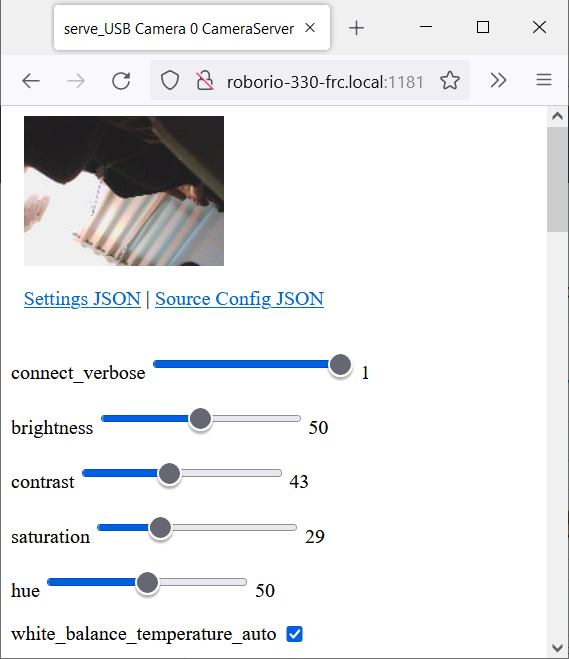
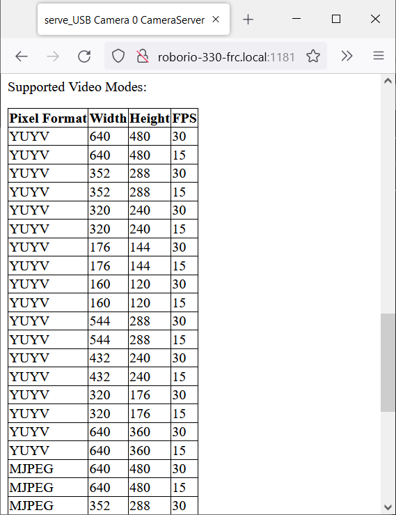

CameraServer Web Interface
==========================

When CameraServer opens a camera, it creates a webpage that you can use to view the camera stream and view the effects of various camera settings. To connect to the web interface, use a web browser to navigate to ``http://roboRIO-TEAM-frc.local:1181``. There is no additional code needed other then :ref:`docs/software/vision-processing/roborio/using-the-cameraserver-on-the-roborio:Simple CameraServer Program`.

.. note:: The port ``1181`` is used for the first camera. The port increments for additional camera, so if you have two cameras, the replace ``1181`` above with ``1182``.

Camera Settings
---------------

The web server will show a live camera image and has sliders to adjust various camera settings, such as brightness, contrast, sharpness and many other options. You can adjust the values and see the results live, and then use the ``VideoCamera`` class to set those in your robot code.

Camera Video Modes
------------------

One useful feature is the list of supported video modes at the bottom of the web page. This shows all the supported modes that the camera supports to enable you to choose the one that is the best combination of resolution and frame rate for your requirements.
