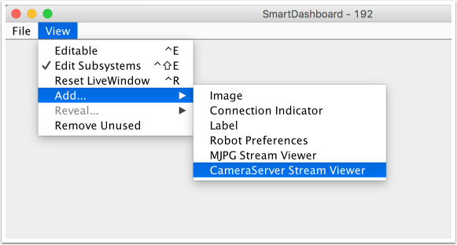

Using the CameraServer on the roboRIO
=====================================

Simple CameraServer Program
---------------------------

The following program starts automatic capture of a USB camera like the Microsoft LifeCam that is connected to the roboRIO. In this mode, the camera will capture frames and send them to the dashboard. To view the images, create a CameraServer Stream Viewer widget using the "View", then "Add" menu in the dashboard. The images are unprocessed and just forwarded from the camera to the dashboard.

.. tabs::

   .. group-tab:: Java

      .. rli:: https://raw.githubusercontent.com/wpilibsuite/allwpilib/v2023.1.1-beta-1/wpilibjExamples/src/main/java/edu/wpi/first/wpilibj/examples/quickvision/Robot.java
         :language: java
         :lines: 7-20
         :linenos:
         :lineno-start: 7

   .. group-tab:: C++

      .. rli:: https://raw.githubusercontent.com/wpilibsuite/allwpilib/main/wpilibcExamples/src/main/cpp/examples/QuickVision/cpp/Robot.cpp
         :language: cpp
         :lines: 7-8,16-18,20,25-31

Advanced Camera Server Program
------------------------------

In the following example a thread created in robotInit() gets the Camera Server instance. Each frame of the video is individually processed, in this case drawing a rectangle on the image using the OpenCV ``rectangle()`` method. The resultant images are then passed to the output stream and sent to the dashboard. You can replace the ``rectangle`` operation with any image processing code that is necessary for your application. You can even annotate the image using OpenCV methods to write targeting information onto the image being sent to the dashboard.

.. tabs::

   .. group-tab:: Java

      .. rli:: https://raw.githubusercontent.com/wpilibsuite/allwpilib/v2023.1.1-beta-1/wpilibjExamples/src/main/java/edu/wpi/first/wpilibj/examples/intermediatevision/Robot.java
         :language: java
         :lines: 7-65
         :linenos:
         :lineno-start: 7

   .. group-tab:: C++

      .. rli:: https://raw.githubusercontent.com/wpilibsuite/allwpilib/main/wpilibcExamples/src/main/cpp/examples/IntermediateVision/cpp/Robot.cpp
         :language: cpp
         :lines: 5-20,23-56,58-61,63-64,69-76

Notice that in these examples, the ``PutVideo()`` method writes the video to a named stream. To view that stream on SmartDashboard or Shuffleboard, select that named stream. In this case that is "Rectangle".
