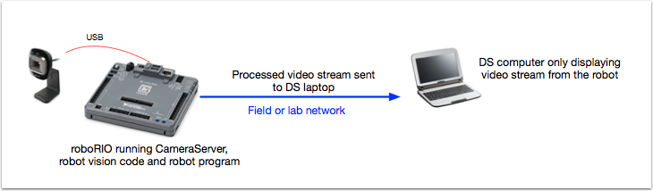

Strategies for vision programming
=================================
Using computer vision is a great way of making your robot be responsive to the elements on the field and
make it much more autonomous. Often in FRC games there are bonus points for autonomously shooting balls or
other game pieces into goals or navigating to locations on the field. Computer vision is a great way of solving
many of these problems. And if you have autonomous code that can do the challenge, then it can be used during
the teleop period as well to help the human drivers.

There are many options for choosing the components for vision processing and where the vision program should run.
WPILib and  associated tools support a number of options and give teams a lot of flexibility to decide what to do.
This article will attempt to give you some insight into many of the choices and tradeoffs that are available.

.. figure:: images/strategies-for-vision-programming/vision-workflows.png

OpenCV computer vision library
______________________________
**OpenCV** is an open source computer vision library that is widely used throughout academia and industry. It has
support from hardware manufactures providing GPU accelerated processing, it has bindings for a number of languages
including C++, Java, and Python. It is also well documented with many web sites, books, videos, and training courses
so there are lots of resources available to help learn how to use it. For these reasons and more we have adopted OpenCV
for use with the C++ and Java versions of WPILib. Starting in 2017 **we have prebuilt OpenCV libraries included with WPILib**,
support in the library for capturing, processing and viewing video, and tools to help you create your vision algorithms.
For more information about OpenCV see http://opencv.org.

Vision code on roboRIO
______________________

The programming is fairly straightforward since the vision program is just part of the overall robot program. Program can
be written by hand or generated by GRIP in either C++ or Java. The disadvantage is that having vision code running on the
same processor as the robot program can have performance issues. This is something you will have to evaluate depending on
the requirements for your robot and vision program.

The vision code simply produces results that the robot code uses. Be careful about synchronization issues when writing
robot code that is getting values from a vision thread. The GRIP generated code and the VisionRunner class in WPILib
will make this easier.

The video stream can be sent to the SmartDashboard by using the camera server interface so operators can see what the c
amera sees. In addition, you can add annotations to the images using OpenCV commands so targets or other interesting
objects can be identified in the dashboard view.

Vision code on DS computer
__________________________
.. figure:: images/strategies-for-vision-programming/vision-code-on-ds-computer.png

The video is streamed back to the Driver Station laptop for processing. Even the Classmate laptops are substantially faster
at vision processing than the roboRIO and don’t have real-time programs running on them. GRIP can be run on the Driver Station
laptop directly with the results sent back to the robot using NetworkTables. Alternatively you can write your own vision program
using a language of your choosing. Python makes a good choice since there is a native NetworkTables implementation and the O
penCV bindings are very good.

After the images are processed, the key values such as the target position, distance or anything else you need can be sent
back to the robot with NetworkTables. Latency may be an issue since there might be delays in the images getting to the laptop
and the results getting back.

The video stream can be displayed on SmartDashboard or in GRIP.

Vision code on a coprocessor
____________________________
.. figure:: images/strategies-for-vision-programming/vision-code-on-a-coprocessor.png

Coprocessors such as the Raspberry PI or Kangaroo are ideal for supporting vision code. The advantage is that they can run
full speed and not interfere with the robot program. In this case, the camera is probably connected to the coprocessor or (in
the case of ethernet cameras) an ethernet switch on the robot. The program can be written in any language although Python is a
good choice because of it’s simple bindings to OpenCV and NetworkTables. Some teams have used high performance vision
coprocessors such as the Nvidia Jetson for fastest speed and highest resolution although it might be too complex for
inexperienced programmers.

Data can be sent from the vision program on the coprocessor to the robot using NetworkTables or a private protocol over
a network or serial connection.

Camera options
______________
There are a number of camera options supported by WPILib. Cameras have a number of parameters than can determine how it
operates. For example, frame rate and image resolution effect the quality of the received images but when set too high
impact processing time and the bandwidth which may have serious effect on your robot program.

New for 2017 there is a CameraServer class available in C++ and Java that interfaces with cameras connected to the robot.
It retrieve frames for local processing through a Source object and send stream to your driver station for viewing or
processing there. The video stream is processed by the CameraServer.

Details on using cameras with WPILib are detailed in the next section.
