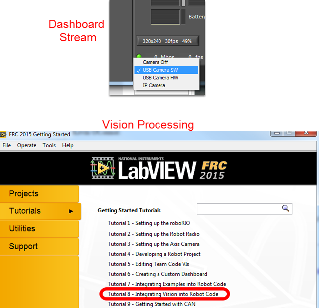
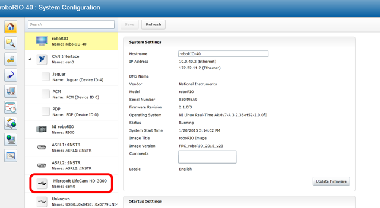
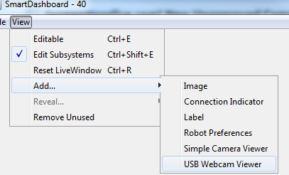

Using the Microsoft Lifecam HD-3000
===================================
The Microsoft Lifecam HD-3000 is a USB webcam that was tested with the roboRIO as part of the Beta testing and software
development effort. While other USB webcams may work with the roboRIO, this camera has been tested to be compatible with
the provided software.

Connecting the camera to the roboRIO
------------------------------------
.. figure:: images/using-the-microsoft-lifecam/connecting-the-camera-to-the-roborio.jpg

The camera can be connected to either of the roboRIO USB ports.

Using the camera - LabVIEW
--------------------------

To stream the camera back to the Dashboard using LabVIEW, no additional code is necessary. Simply select USB HW (image
compression done by the camera, fewer options but lower roboRIO CPU usage) or USB SW (image compressed by roboRIO, more
options, but higher roboRIO CPU usage) and the image should begin streaming back.

.. note:: The camera should be plugged in before your LabVIEW code starts running to work properly. If you just plugged in\
    the camera rebooting the roboRIO is a quick way to make sure it is recognized properly.

The default LabVIEW templates and the image processing examples are already set up for the USB camera if you want to do
image processing. On the LabVIEW splash screen, click Tutorials, then click Tutorial 8 for more information about
integrating Vision processing in your LabVIEW code.

Using the camera - C++/Java
---------------------------
To stream the camera back to the Dashboard using C++ or Java robot code, you will need to add some code to your robot
project. Example have been provided in Eclipse to illustrate the use of the CameraServer class to automatically stream
images back to the Dashboard (SimpleVision) and send back modified images (IntermediateVision and the 2015 Vision examples).
This class will allow images to be streamed back to either the SmartDashboard "USB Webcam Viewer" or the LabVIEW Dashboard
(set to USB HW).

Determining the Camera name
^^^^^^^^^^^^^^^^^^^^^^^^^^^

Unlike the LabVIEW code which attempts to determine the camera name of the camera you want to use, the C++\Java code
requires you to specify the camera name. To determine the name of the desired camera, you will need to use the roboRIO
webdashboard. For more information about accessing the roboRIO webdashboard see RoboRIO Webdashboard. Open the roboRIO
webdashboard and locate the camera in the left pane and note the Name, this is the string you will pass into the camera
server or IMAQDx open (in the image above, the camera name is cam0).

Using the SmartDashboard USB Camera Viewer
^^^^^^^^^^^^^^^^^^^^^^^^^^^^^^^^^^^^^^^^^^

To view the camera stream from the LabVIEW dashboard, set the camera dropdown to USB HW. To view the stream from the
SmartDashboard you will need to add a USB Webcam Viewer widget to your layout. For more information on the SmartDashboard
and widgets see the SmartDashboard manual. To add the USB Webcam Viewer widget to the SmartDashboard, select View -> Add
-> USB Webcam Viewer. To move or resize the viewer widget, make the layout Editable by selecting that option in the View menu
(select again to disable).
