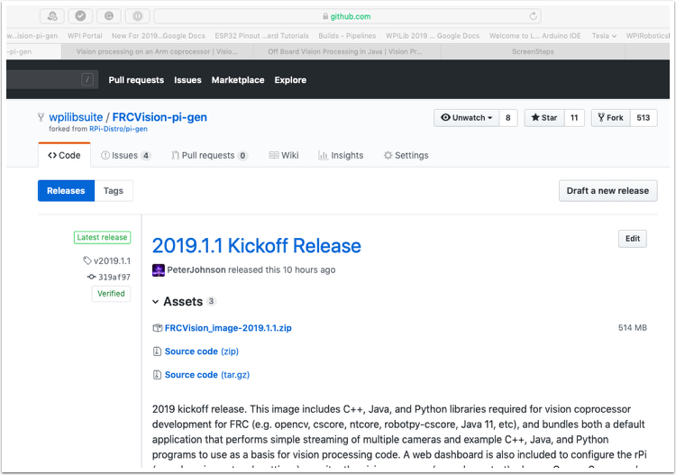
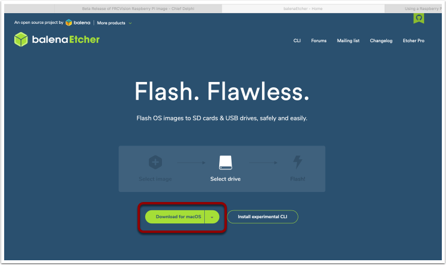

.. include:: <isonum.txt>

Installing the image to your MicroSD card
=========================================

Getting the FRC Raspberry PI image
----------------------------------

The image is stored on the GitHub release page for the WPILibPi `repository
<https://github.com/wpilibsuite/WPILibPi/releases>`__.

In addition to the instructions on this page, see the documentation on the GitHub web page (below).

The image is fairly large so have a fast internet connection when downloading it. Always use the most recent release from the top
of the list of releases.

Copy the image to your MicroSD card
-----------------------------------

Download and install `Etcher <https://www.balena.io/etcher/>`__ to image the micro SD card. The micro SD card needs to be at least
8 GB. A `micro SD to USB dongle <https://www.amazon.com/gp/product/B0779V61XB>`__ works well for writing to micro SD cards.

Flash the MicroSD card with the image using Etcher by selecting the zip file as the source, your SD card as the destination and
click "Flash". Expect the process to take about 3 minutes on a fairly fast laptop.

.. figure:: images/installing-the-image-to-your-microsd-card/flash-etcher.png

Testing the Raspberry PI
^^^^^^^^^^^^^^^^^^^^^^^^

1.  Put the micro SD card in a rPi 3 and apply power.
2.  Connect the rPi 3 ethernet to a LAN or PC. Open a web browser and connect to ``http://wpilibpi.local/`` to open the web dashboard.
    On the first bootup the filesystem will be writable, but later bootups will default to read only, so it's necessary to click
    the "writable" button to make changes.

Logging into the Raspberry PI
^^^^^^^^^^^^^^^^^^^^^^^^^^^^^

Most tasks with the rPi can be done from the web console interface. Sometimes for advanced use such as program development on the
rPi it is necessary to log in. To log in, use the default Raspberry PI password:
::

  Username: pi
   Password: raspberry

