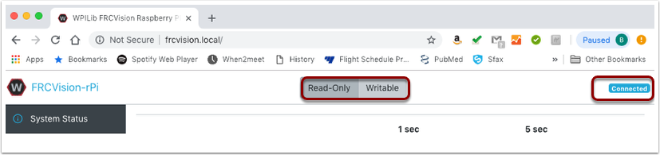
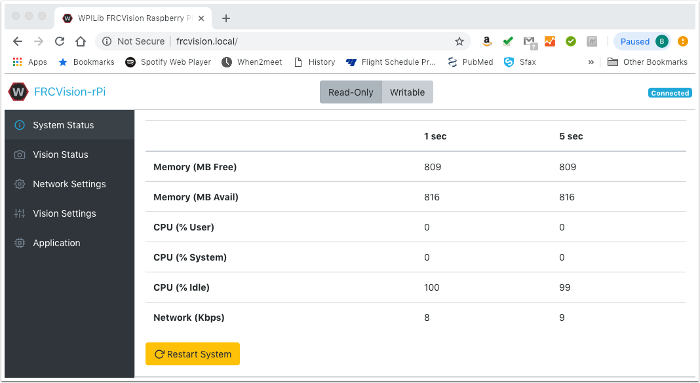
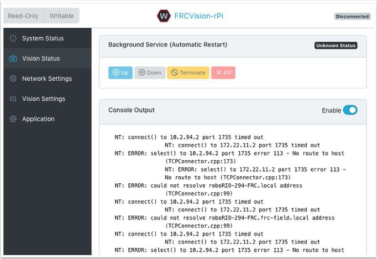
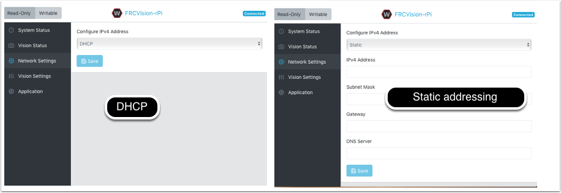
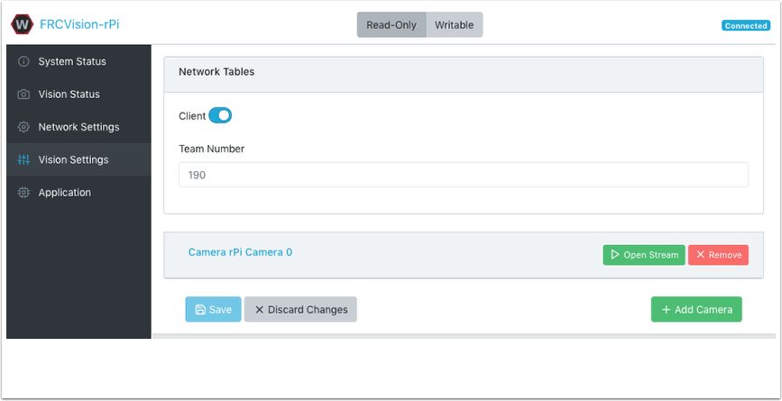
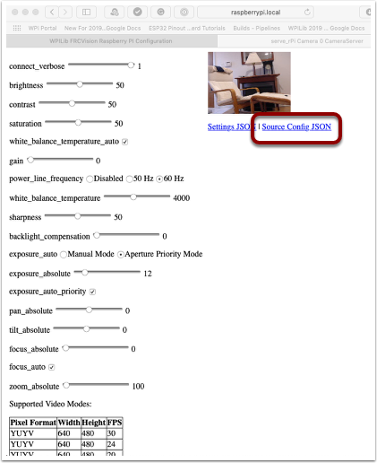
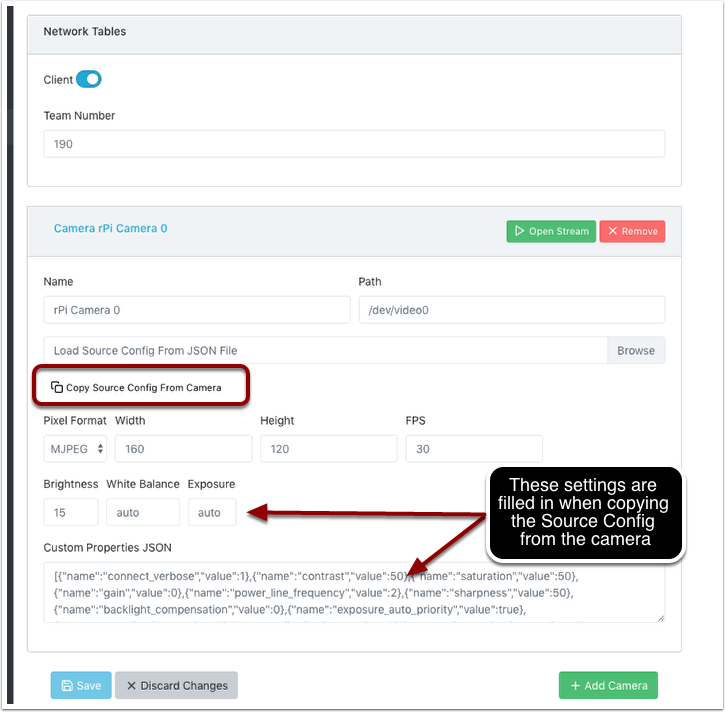
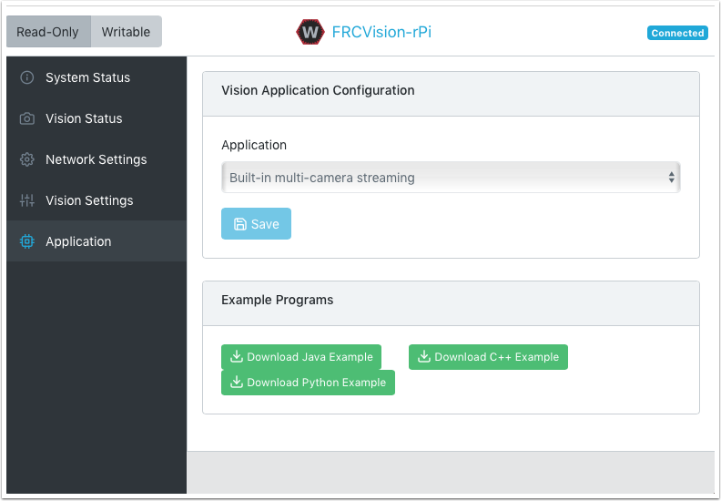
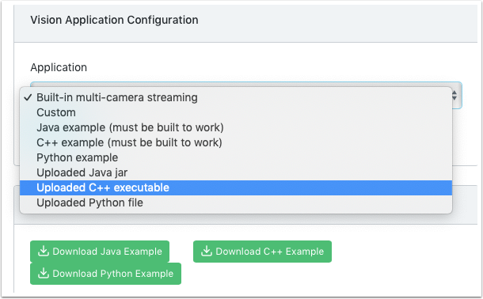
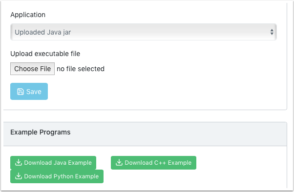

.. include:: <isonum.txt>

The Raspberry PI
================

FRC Console
-----------

The FRC\ |reg| image for the Raspberry PI includes a console that can be viewed in any web browser that makes it easy to:

-   Look at the Raspberry PI status
-   View the status of the background process running the camera
-   View or change network settings
-   Look at each camera plugged into the rPI and add additional cameras
-   Load a new vision program onto the rPI

Setting the rPI to be Read-Only vs. Writable
^^^^^^^^^^^^^^^^^^^^^^^^^^^^^^^^^^^^^^^^^^^^

The rPI is normally set to Read-Only which means that the file system cannot be changed. This ensures that if power is removed
without first shutting down the rPi the file system isn't corrupted. When settings are changed (following sections), the new
settings cannot be saved while the rPI file system is  set as Read-Only. Buttons are provided that allow the file system to be
changed from Read-Only to Writable and back whenever changes are made. If the other buttons that change information stored on the
rPI cannot be press, check the Read-Only status of the system.

Status of the network connection to the rPI
^^^^^^^^^^^^^^^^^^^^^^^^^^^^^^^^^^^^^^^^^^^

There is a label in the top right corner of the console that indicates if the rPi is currently connected. It will change from
Connected to Disconnected if there is no longer a network connection to the rPi.

System status
-------------

The system status shows what the CPU on the rPI is doing at any time. There are two columns of status values, on being a 1 second
average and the other a 5 second average. Shown is:

-   free and available RAM on the PI
-   CPU usage for user processes and system processes as well as idle time.
-   And network bandwidth - which allows one to determine if the used camera bandwidth is exceeding the maximum bandwidth allowed
    in the robot rules for any year.

Vision Status
-------------

Allows monitoring of the task which is running the camera code in the rPI, either one of the default programs or your own
program in Java, C++, or Python. You can also enable and view the console output to see messages coming from the background
camera service. In this case there are number of messages about being unable to connect to :term:`NetworkTables` (NT: connect())
because in this example the rPI is simply connected to a laptop with no NetworkTables server running (usually the roboRIO.)

Network Settings
----------------

The rPI network settings have options to connect to the PI:

-   DHCP - the default name resolution usually used by the roboRIO. The default name is wpilibpi.local.
-   Static - where a fixed IP address, network mask, and router settings are filled in explicitly
-   DHCP with Static Fallback - DHCP with Static Fallback - the PI will try to get an IP address via DHCP, but if it can't find a
    DHCP server, it will use the provided static IP address and parameters

The picture above is showing the settings for both DHCP and Static IP Addressing. The mDNS name for the rPi should always work
regardless of the options selected above.

Vision Settings
---------------

The Vision Settings are to set the parameters for each camera and whether the rPI should be a NetworkTables client or server.
There can only be one server on the network and the roboRIO is always a server. Therefor when connected to a roboRIO, the rPI
should always be in client mode with the team number filled in. If testing on a desktop setup with no roboRIO or anything acting
as a server then it should be set to Server (Client switch is off).

To view and manipulate all the camera settings click on the camera in question. In this case the camera is called "Camera rPi
Camera 0" and clicking on the name reveals the current camera view and the associated settings.

Manipulating the camera settings is reflected in the current camera view. The bottom of the page shows all the possible camera
modes (combinations of Width, Height, and frame rates) that are supported by this camera.

.. note:: If the camera image is not visible on the :guilabel:`Open Stream` screen then check the supported video modes at the bottom of the page.  Then go back to 'Vision Settings' and click on the camera in question and verify that the pixel format, width, height, and FPS are listed in the supported video modes.

Getting the current settings to persist over reboots
^^^^^^^^^^^^^^^^^^^^^^^^^^^^^^^^^^^^^^^^^^^^^^^^^^^^

The rPi will load all the camera settings on startup. Editing the camera configuration in the above screen is temporary. To make
the values persist click on the "Load Source Config From Camera" button and the current settings will be filled in on the camera
settings fields. Then click "Save" at the bottom of the page. Note: you must set the file system Writeable in order to save the
settings. *The Writeable button is at the top of the page.*

There are some commonly used camera settings values shown in the camera settings (above). These values Brightness, White Balance,
and Exposure are loaded into the camera before the user JSON file is applied. So if a user JSON file contains those settings they
will overwrite the ones from the text field.

Application
------------

The Application tab shows the application that is currently running on the rPi.

Vision workflows
^^^^^^^^^^^^^^^^

There is a sample vision program using OpenCV in each of the supported languages, C++, Java, or Python. Each sample program can
capture and stream video from the rPi. In addition, the samples have some minimal OpenCV. They are all set up to be extended to
replace the provided OpenCV sample code with the code needed for the robot application. The rPi Application tab supports a number
of programming workflows:

-   Stream one or more cameras from the rPi for consumption on the driver station computer and displayed using ShuffleBoard
-   Edit and build one of the sample programs (one for each language: Java, C++ or Python) on the rPi using the included
    toolchains
-   Download a sample program for the chosen language and edit and build it on your development computer. Then upload that
    built program back to the rPi
-   Do everything yourself using completely custom applications and scripts (probably based on one of the samples)

The running application can be changed by selecting one of the choices in the drop-down menu. The choices are:

-   Built-in multi camera streaming which steams whatever cameras are plugged into the rPi. The camera configuration including
    number of cameras can be set on the "Vision Settings" tab.
-   Custom application which doesn't upload anything to the rPi and assumes that the developer wants to have a custom program
    and script.
-   Java, C++ or Python pre-installed sample programs that can be edited into your own application.
-   Java, C++, or Python uploaded program. Java programs require a ``.jar`` file with the compiled program and C++ programs require
    an rPi executable to be uploaded to the rPI.

When selecting one of the Upload options, a file chooser is presented where the jar, executable or Python program can be
selected and uploaded to the rPi. In the following picture an Uploaded Java jar is chosen and the "Choose File" button will
select a file and clicking on the "Save" button will upload the selected file.

Note: in order to Save a new file onto the rPi, the file system has to be set writeable using the "Writable" button at the top
left of the web page. After saving the new file, set the file system back to "Read-Only" so that it is protected against
accidental changes.

