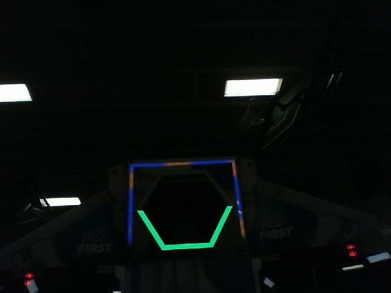
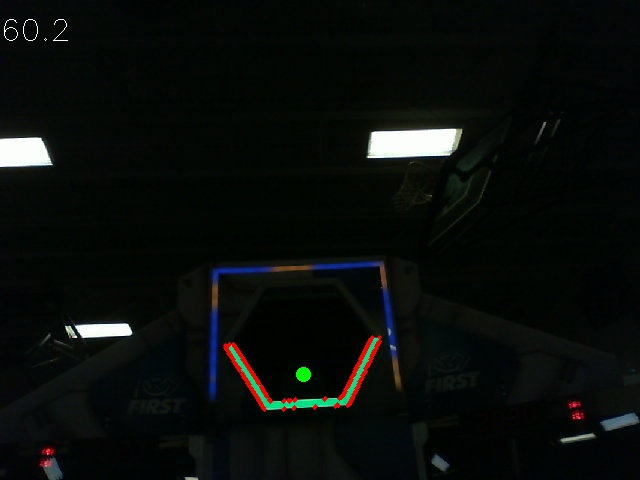

Using CameraServer
==================

Grabbing Frames from CameraServer
---------------------------------

The WPILibPi image comes with all the necessary libraries to make your own vision processing system. In order to get the current frame from the camera, you can use the CameraServer library. For information about CameraServer, the :ref:`docs/software/vision-processing/introduction/cameraserver-class:Read and Process Video: CameraServer Class`.

.. tabs::

   .. code-tab:: py

      from cscore import CameraServer
      import cv2
      import numpy as np

      CameraServer.enableLogging()

      camera = CameraServer.startAutomaticCapture()
      camera.setResolution(width, height)

      sink = cs.getVideo()

      while True:
         time, input_img = cvSink.grabFrame(input_img)

         if time == 0: # There is an error
            continue

.. note:: OpenCV reads in the image as **BGR**, not **RGB** for historical reasons. Use ``cv2.cvtColor`` if you want to change it to RGB.

Below is an example of an image that might be grabbed from CameraServer.

Sending frames to CameraServer
------------------------------

Sometimes, you may want to send processed video frames back to the CameraServer instance for debugging purposes, or viewing in a dashboard application like Shuffleboard.

.. tabs::

   .. code-tab:: py

      #
      # CameraServer initialization code here
      #

      output = cs.putVideo("Name", width, height)

      while True:
         time, input_img = cvSink.grabFrame(input_img)

         if time == 0: # There is an error
            output.notifyError(sink.getError())
            continue

         #
         # Insert processing code here
         #

         output.putFrame(processed_img)

As an example, the processing code could outline the target in red, and show the corners in yellow for debugging purposes.

Below is an example of a fully processed image that would be sent back to CameraServer and displayed on the Driver Station computer.

