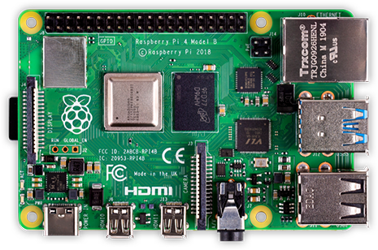

Using the Raspberry Pi for FRC
==============================
One of the most popular coprocessor choices is the Raspberry Pi because:

-   Low cost - around $35
-   High availability - it's easy to find Raspberry Pis from a number of suppliers, including Amazon
-   Very good performance - the current Raspberry Pi 3b+ has the following specifications:
-   Technical Specifications:
    -   Broadcom BCM2837BO 64 bit ARMv8 QUAD Core A53 64bit Processor powered Single Board Computer run at 1.4GHz
    -   1GB RAM - BCM43143 WiFi on board
    -   Bluetooth Low Energy (BLE) on board
    -   40 pin extended GPIO - 4 x USB2 ports
    -   4 pole Stereo output and Composite video port
    -   Full size HDMI
    -   CSI camera port for connecting the Raspberry
    -   Pi camera - DSI display port for connecting the Raspberry
    -   Pi touch screen display - MicroSD port for loading your operating system and storing data
    -   Upgraded switched Micro USB power source (now supports up to 2.5 Amps.

Pre-built Raspberry Pi image
----------------------------
To make using the Raspberry Pi as easy as possible for teams, there is a provided Raspberry Pi image. The image can be copied to
a micro SD card, inserted into the Pi, and booted. By default it supports:

-   A web interface for configuring it for the most common functions
-   Supports an arbitrary number camera streams (defaults to one) that are published on the network interface
-   OpenCV, :term:`NetworkTables`, Camera Server, and language libraries for C++, Java, and Python custom programs

If the only requirement is to stream one or more cameras to the network (and dashboard) then no programming is required and can
be completely set up through the web interface.

The next section discusses how to install the image onto a flash card and boot the Pi.
