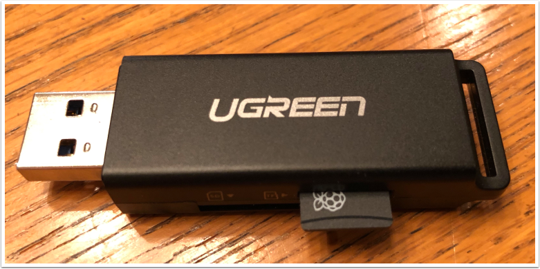

.. include:: <isonum.txt>

What you need to get the Pi image running
=========================================

To start using the Raspberry Pi as a video or image coprocessor you need the following:

-   A Raspberry Pi 3 B, Raspberry Pi 3 B+, or a Raspberry Pi 4 B
-   A micro SD card that is at least 8 GB to hold all the provided software, with a recommended Speed Class of 10 (10MB/s)
-   An ethernet cable to connect the Pi to your roboRIO network
-   A USB micro power cable to connect to the Voltage Regulator Module (VRM) on your robot. It is recommended to use the
    VRM connection for power rather than powering it from one of the roboRIO USB ports for higher reliability
-   A laptop that can write the MicroSD card, either using a USB dongle (preferred) or a SD to MicroSD adapter that ships with
    most MicroSD cards

Shown is an inexpensive USB dongle that will write the FRC\ |reg| image to the  MicroSD card.
