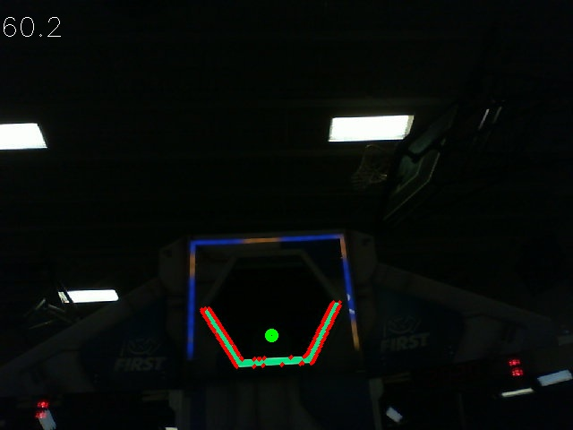

Working with Contours
=====================

After thresholding and removing noise with morphological operations, you are now ready to use OpenCV's ``findContours`` method. This method allows you to generate contours based on your binary image.

Finding and Filtering Contours
------------------------------

.. tabs::

   .. code-tab:: py

      _, contours, _ = cv2.findContours(binary_img, cv2.RETR_EXTERNAL, cv2.CHAIN_APPROX_SIMPLE)

In cases where there is only one vision target, you can just take the largest contour and assume that is the target you are looking for. When there is more than one vision target, you can use size, shape, fullness, and other properties to filter unwanted contours out.

.. tabs::

   .. code-tab:: py

      if len(contours) > 0:
         largest = contours[0]
         for contour in contours:
            if cv2.contourArea(contour) > cv2.contourArea(largest):
               largest = contour

         #
         # Contour processing code
         #

If you draw the contour you just found, it should look something like this:

Extracting Information from Contours
------------------------------------

Now that you've found the contour(s) that you want, you now want to get information about it, such as the center, corners, and rotation.

Center
^^^^^^

.. tabs::

   .. code-tab:: py

      rect = cv2.minAreaRect(contour)
      center, _, _ = rect
      center_x, center_y = center

Corners
^^^^^^^

.. tabs::

   .. code-tab:: py

      corners = cv2.convexHull(contour)
      corners = cv2.approxPolyDP(corners, 0.1 * cv2.arcLength(contour), True)

Rotation
^^^^^^^^

.. tabs::

   .. code-tab:: py

      _, _, rotation = cv2.fitEllipse(contour)

For more information on how you can use these values, see :ref:`docs/software/vision-processing/introduction/identifying-and-processing-the-targets:Measurements`

Publishing to NetworkTables
---------------------------

You can use NetworkTables to send these properties to the Driver Station and the RoboRIO. Additional processing could be done on the Raspberry Pi, or the RoboRIO itself.

.. tabs::

   .. code-tab:: py

      from networktables import NetworkTables

      nt = NetworkTables.getTable('vision')

      #
      # Initialization code here
      #

      while True:

         #
         # Image processing code here
         #

         nt.putNumber('center_x', center_x)
         nt.putNumber('center_y', center_y)
