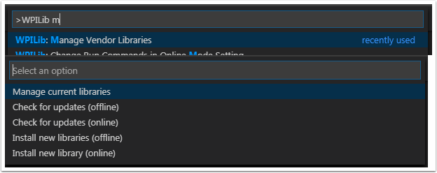
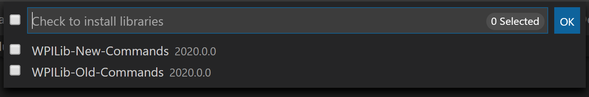

3rd Party Libraries
===================

Teams that are not using parts provided in the KoP will likely need to install external dependencies. Please view the below section to see information on adding an external library.

The Mechanism
-------------

In support of this effort NI (for LabVIEW) and FIRST/WPI (for Java/C++) have developed mechanisms that should make it easy for vendors to plug their code into the WPILib software and for teams to use that code once it has been installed. A brief description of how the system works for each language can be found below.

The Mechanism - Java/C++
^^^^^^^^^^^^^^^^^^^^^^^^

For Java and C++ a JSON file describing the vendor library is installed on your system to ``~/wpilib/YYYY/vendordeps`` (where YYYY is the year and ~ is ``C:\Users\Public`` on Windows). This can either be done by an offline installer or the file can be fetched from an online location using the menu item in Visual Studio Code. This file is then used from VS Code to add to the library to each individual project. Vendor library information is managed on a per-project basis to make sure that a project is always pointing to a consistent version of a given vendor library. The libraries themselves are placed in the Maven cache at ``C:\Users\Public\wpilib\YYYY\maven``. Vendors can place a local copy here with an offline installer (recommended) or require users to be online for an initial build to fetch the library from a remote Maven location.

The JSON file allows specification of complex libraries with multiple components (Java, C++, JNI, etc.) and also helps handle some complexities related to simulation. Vendors choosing to provide a remote URL in the JSON also enable users to check for updates from within VS Code.

.. note:: The vendor JSON files are actually processed by GradleRIO once they are in your projects ``vendordeps`` folder. If you are using another IDE, you will need to manually create a "vendordeps" folder in your project and copy any desired vendor JSON files from the "wpilib/YYYY" folder (where they should be placed by an offline installer) or download them directly from the vendor and place them into the folder in the project.

The Mechanism - LabVIEW
^^^^^^^^^^^^^^^^^^^^^^^

For LabVIEW teams, you may notice a few new Third Party items on various palettes (specifically, one in :guilabel:`Actuators`, one in :guilabel:`Actuators` -> :guilabel:`Motor Control` labeled :guilabel:`CAN Motor`, and one in :guilabel:`Sensors`). These correspond to folders in ``C:\Program Files\National Instruments\LabVIEW YYYY\vi.lib\Rock Robotics\WPI\Third Party`` where ``YYYY`` is the current year - 1. If it’s 2020, the directory would be ``LabVIEW 2019``.

To use installed "Third Party" libraries, simply locate the VIs in one of these 3 locations and drag them into your project as you would with any other VI.

Managing VS Code Libraries
--------------------------

Adding Offline Libraries
^^^^^^^^^^^^^^^^^^^^^^^^

VS Code
~~~~~~~

To add a vendor library that has been installed by an offline installer, press :kbd:`Ctrl+Shift+P` and type WPILib or click on the WPILib icon in the top right to open the WPILib Command Palette and begin typing :guilabel:`Manage Vendor Libraries`, then select it from the menu. Select the option to :guilabel:`Install new libraries (offline)`.

Select the desired libraries to add to the project by checking the box next to each, then click :guilabel:`OK`. The JSON file will be copied to the ``vendordeps`` folder in the project, adding the library as a dependency to the project.

Command-line
~~~~~~~~~~~~

Adding a vendor library dependency from the vendor URL can also be done through the command-line via a gradle task. Open a command-line instance at the project root, and enter ``gradlew vendordep --url=<url>`` where ``<url>`` is the vendor JSON URL. This will add the vendor library dependency JSON file to the ``vendordeps`` folder of the project. Vendor libraries can be updated the same way.

The ``vendordep`` gradle task can also fetch vendordep JSONs from the user ``wpilib`` folder. To do so, pass ``FRCLOCAL/Filename.json`` as the file URL. For example, ``gradlew vendordep --url=FRCLOCAL/WPILibNewCommands.json`` will fetch the JSON for the new command-based framework.

Checking for Updates (Offline)
^^^^^^^^^^^^^^^^^^^^^^^^^^^^^^

Dependencies are now version managed and done on a per-project bases. Even if you have installed an updated library using an offline installer, you will need to :guilabel:`Manage Vendor Libraries` and select :guilabel:`Check for updates (offline)` for each project you wish to update.

Checking for Updates (Online)
^^^^^^^^^^^^^^^^^^^^^^^^^^^^^

Part of the JSON file that vendors may optionally populate is an online update location. If a library has an appropriate location specified, running :guilabel:`Check for updates (online)` will check if a newer version of the library is available from the remote location.

Removing a Library Dependency
^^^^^^^^^^^^^^^^^^^^^^^^^^^^^

To remove a library dependency from a project, select :guilabel:`Manage Current Libraries` from the :guilabel:`Manage Vendor Libraries` menu, check the box for any libraries to uninstall and click :guilabel:`OK`. These libraries will be removed as dependencies from the project.

Libraries
---------

.. warning:: Many vendors, such as CTRE & REV, recommend using their offline installers over using the online vendor json URL.  This recommendation is because the offline installer is bundled with additional programs that are extremely useful when working with their devices.

Click these links to visit the vendor site to see whether they offer online installers, offline installers, or both.  URLs below are to plug in to the :guilabel:`VS Code` -> :guilabel:`Install New Libraries (online)` feature.  The online vendor json will break if a team has not ran an "online" build after 30 days, since the cache will clear.

`Copperforge LibCu Software Library <https://copperforge.cc/docs/software/libcu/>`__ - Library for all Copperforge devices including the Lasershark
   ``https://copperforge.cc/files/dev/vendordeps/LibCu-latest.json``

`CTRE Phoenix Framework <https://store.ctr-electronics.com/software/>`__ - Contains CANcoder, CANifier, Pigeon IMU, Talon FX, Talon SRX, and Victor SPX Libraries and Phoenix Tuner program for configuring CTRE CAN devices
   ``https://maven.ctr-electronics.com/development/com/ctre/phoenix/Phoenix-frc2022-latest.json``

`Digilent <https://reference.digilentinc.com/dmc-60c/getting-started>`__ - DMC-60C library
   ``Offline only``

`Playing With Fusion Driver <https://www.playingwithfusion.com/docview.php?docid=1205>`__ - Library for all PWF devices including the Venom motor/controller
   ``https://www.playingwithfusion.com/frc/playingwithfusion2022.json``

`Kauai Labs <https://pdocs.kauailabs.com/navx-mxp/software/roborio-libraries/>`__ - Libraries for NavX-MXP, NavX-Micro, and Sensor Fusion
   ``https://www.kauailabs.com/dist/frc/2022/navx_frc.json``

`REV Robotics REVLib <https://docs.revrobotics.com/sparkmax/software-resources/spark-max-api-information>`__ - Library for all REV devices including SPARK MAX and Color Sensor V3
   ``https://software-metadata.revrobotics.com/REVLib.json``

Community Libraries
-------------------

`PhotonVision <https://docs.photonvision.org/en/latest/docs/programming/photonlib/adding-vendordep.html>`_ - Library for PhotonVision CV software
   ``https://maven.photonvision.org/repository/internal/org/photonvision/PhotonLib-json/1.0/PhotonLib-json-1.0.json``

WPILib Command Libraries
------------------------

The WPILib :doc:`new </docs/software/commandbased/index>` command library has been split into a vendor library. It is installed by the WPILib installer for offline installation. It may also be installed with the following online link:

`New Command Library <https://raw.githubusercontent.com/wpilibsuite/allwpilib/main/wpilibNewCommands/WPILibNewCommands.json>`__

To remove a library dependency from a project, select **Manage Current Libraries** from the **Manage Vendor Libraries** menu, check the box for any libraries to uninstall and click OK. These libraries will be removed as dependencies from the project.

Romi Library
------------

A Romi Library has been created to contain several helper classes that are a part of the ``RomiReference`` example.

`Romi Vendordep <https://raw.githubusercontent.com/wpilibsuite/romi-vendordep/main/RomiVendordep.json>`__.
