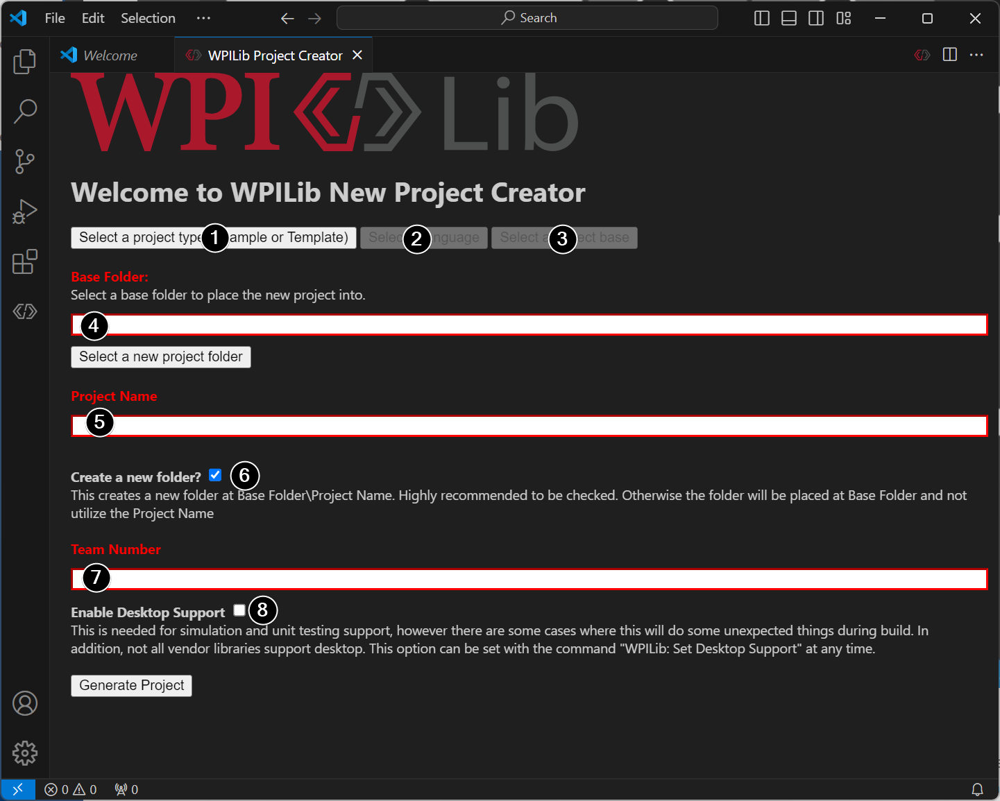
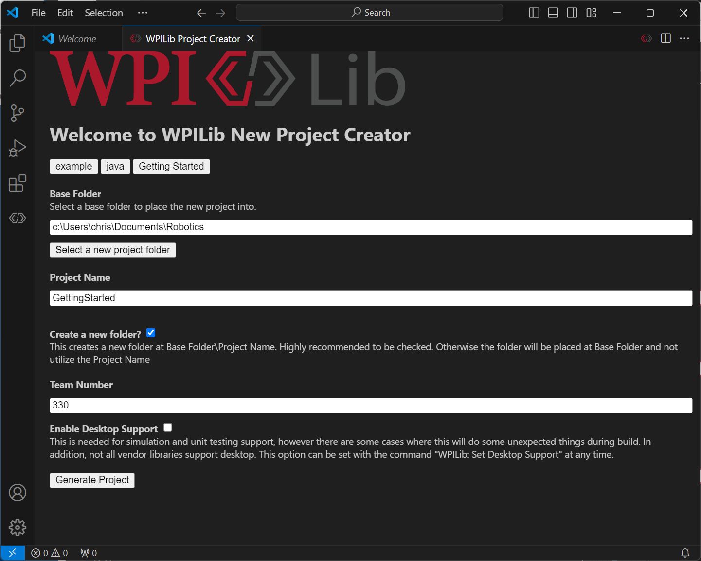
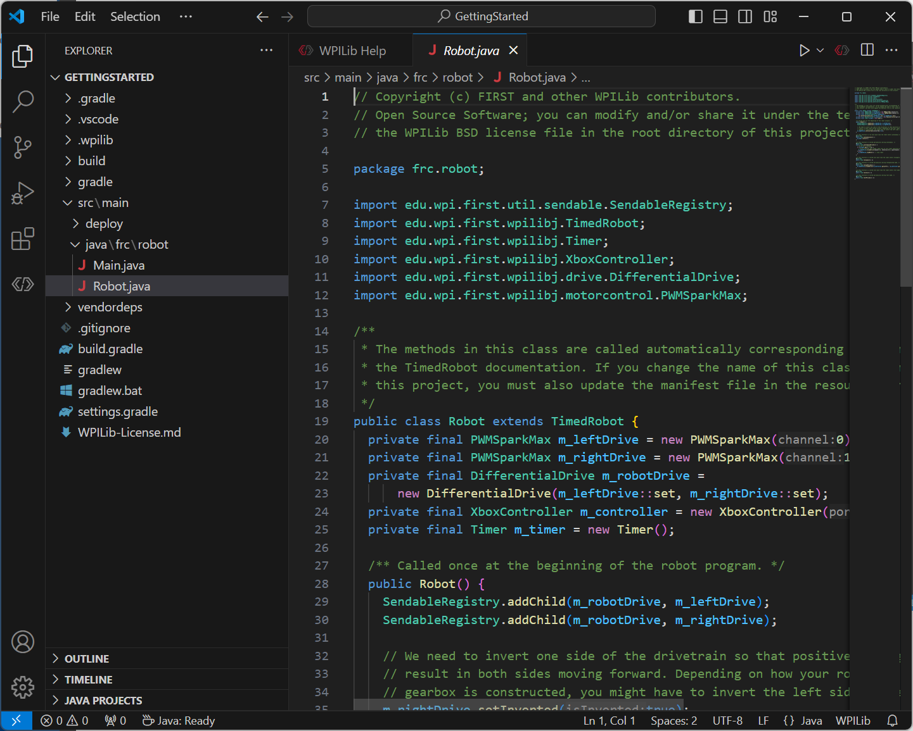

Creating a Robot Program
========================

Once everything is installed, we're ready to create a robot program.  WPILib comes with several templates for robot programs.  Use of these templates is highly recommended for new users; however, advanced users are free to write their own robot code from scratch.

Choosing a Base Class
---------------------

To start a project using one of the WPILib robot program templates, users must first choose a base class for their robot.  Users subclass these base classes to create their primary :code:`Robot` class, which controls the main flow of the robot program.  There are three choices available for the base class:

TimedRobot
^^^^^^^^^^

Documentation:
`Java <https://first.wpi.edu/wpilib/allwpilib/docs/development/java/edu/wpi/first/wpilibj/TimedRobot.html>`__
- `C++ <https://first.wpi.edu/wpilib/allwpilib/docs/development/cpp/classfrc_1_1_timed_robot.html>`__

Source:
`Java <https://github.com/wpilibsuite/allwpilib/blob/main/wpilibj/src/main/java/edu/wpi/first/wpilibj/TimedRobot.java>`__
- `C++ <https://github.com/wpilibsuite/allwpilib/blob/main/wpilibc/src/main/native/cpp/TimedRobot.cpp>`__

The :code:`TimedRobot` class is the base class recommended for most users.  It provides control of the robot program through a collection of :code:`init()`, :code:`periodic()`, and :code:`exit()` methods, which are called by WPILib during specific robot states (e.g. autonomous or teleoperated). During these calls, your code typically polls each input device and acts according to the data it receives.  For instance, you would typically determine the position of the joystick and state of the joystick buttons on each call and act accordingly.  The ``TimedRobot`` class also provides an example of retrieving autonomous routines through SendableChooser (`Java <https://first.wpi.edu/wpilib/allwpilib/docs/development/java/edu/wpi/first/wpilibj/smartdashboard/SendableChooser.html>`__/ `C++ <https://first.wpi.edu/wpilib/allwpilib/docs/development/cpp/classfrc_1_1_sendable_chooser.html>`__

.. note:: A `TimedRobot Skeleton` template is available that removes some informative comments and the autonomous example. You can use this if you're already familiar with `TimedRobot`. The example shown below is of `TimedRobot Skeleton`.

.. tabs::

   .. group-tab:: Java

      .. rli:: https://raw.githubusercontent.com/wpilibsuite/allwpilib/v2022.4.1/wpilibjExamples/src/main/java/edu/wpi/first/wpilibj/templates/timedskeleton/Robot.java
         :language: java
         :lines: 7-55
         :linenos:
         :lineno-start: 7

   .. group-tab:: C++

      .. rli:: https://raw.githubusercontent.com/wpilibsuite/allwpilib/v2022.4.1/wpilibcExamples/src/main/cpp/templates/timedskeleton/cpp/Robot.cpp
         :language: cpp
         :lines: 5-29
         :linenos:
         :lineno-start: 5

Periodic methods are called every 20 ms by default. This can be changed by calling the superclass constructor with the new desired update rate.

.. danger:: Changing your robot rate can cause some unintended behavior (loop overruns). Teams can also use `Notifiers <https://first.wpi.edu/wpilib/allwpilib/docs/development/java/edu/wpi/first/wpilibj/Notifier.html>`__ to schedule methods at a custom rate.

.. tabs::

   .. code-tab:: java

      public Robot() {
        super(0.03); // Periodic methods will now be called every 30 ms.
      }

   .. code-tab:: c++

      Robot() : frc::TimedRobot(30_ms) {}

RobotBase
^^^^^^^^^

Documentation:
`Java <https://first.wpi.edu/wpilib/allwpilib/docs/development/java/edu/wpi/first/wpilibj/RobotBase.html>`__
- `C++ <https://first.wpi.edu/wpilib/allwpilib/docs/development/cpp/classfrc_1_1_robot_base.html>`__

Source:
`Java <https://github.com/wpilibsuite/allwpilib/blob/main/wpilibj/src/main/java/edu/wpi/first/wpilibj/RobotBase.java>`__
- `C++ <https://github.com/wpilibsuite/allwpilib/blob/main/wpilibc/src/main/native/cppcs/RobotBase.cpp>`__

The :code:`RobotBase` class is the most minimal base-class offered, and is generally not recommended for direct use.  No robot control flow is handled for the user; everything must be written from scratch inside the :code:`startCompetition()` method. The template by default showcases how to process the different operation modes (teleop, auto, etc).

.. note:: A ``RobotBase Skeleton`` template is available that offers a blank ``startCompetition()`` method.

Command Robot
^^^^^^^^^^^^^

The ``Command Robot`` framework adds to the basic functionality of a ``Timed Robot`` by automatically polling inputs and converting the raw input data into events.  These events are tied to user code, which is executed when the event is triggered.  For instance, when a button is pressed, code tied to the pressing of that button is automatically called and it is not necessary to poll or keep track of the state of that button directly.  The ``Command Robot`` framework makes it easier to write compact easy-to-read code with complex behavior, but requires an additional up-front time investment from a programmer in order to understand how the Command Robot framework works.

Teams using ``Command Robot`` should see the :ref:`Command-Based Programming Tutorial <docs/software/commandbased/index:Command-Based Programming>`.

Romi
^^^^

Teams using a :ref:`Romi <docs/romi-robot/index:Getting Started with Romi>` should use the ``Romi - Timed`` or ``Romi - Command Bot`` template.

Romi - Timed
~~~~~~~~~~~~

The ``Romi - Timed`` template provides a ``RomiDrivetrain`` class that exposes an ``arcadeDrive(double xaxisSpeed, double zaxisRotate)`` method. It's up to the user to feed this arcadeDrive function.

This class also provides functions for retrieving and resetting the Romi's onboard encoders.

Romi - Command Bot
~~~~~~~~~~~~~~~~~~

The ``Romi - Command Bot`` template provides a ``RomiDrivetrain`` subsystem that exposes an ``arcadeDrive(double xaxisSpeed, double zaxisRotate)`` method. It's up to the user to feed this arcadeDrive function.

This subsystem also provides functions for retrieving and resetting the Romi's onboard encoders.

Not Using a Base Class
^^^^^^^^^^^^^^^^^^^^^^

If desired, users can omit a base class entirely and simply write their program in a :code:`main()` method, as they would for any other program.  This is *highly* discouraged - users should not "reinvent the wheel" when writing their robot code - but it is supported for those who wish to have absolute control over their program flow.

.. warning:: Users should *not* modify the :code:`main()` method of a robot program unless they are absolutely sure of what they are doing.

Creating a New WPILib Project
-----------------------------

Once we've decided on a base class, we can create our new robot project.  Bring up the Visual Studio Code command palette with :kbd:`Ctrl+Shift+P`. Then, type "WPILib" into the prompt.  Since all WPILib commands start with "WPILib", this will bring up the list of WPILib-specific VS Code commands. Now, select the :guilabel:`Create a new project` command:

This will bring up the "New Project Creator Window:"

The elements of the New Project Creator Window are explained below:

1. **Project Type**: The kind of project we wish to create.  This can be an example project, or one of the project templates provided by WPILib.  Templates exist for each of the robot base classes.  Additionally, a template exists for :ref:`Command-based <docs/software/commandbased/what-is-command-based:What is "command-based" programming?>` projects, which are built on the :code:`TimedRobot` base class but include a number of additional features - this type of robot program is highly recommended for new teams.
2. **Language**: This is the language (C++ or Java) that will be used for this project.
3. **Base Folder**: If this is a template project, this specifies the type of template that will be used.
4. **Project Location**: This determines the folder in which the robot project will be located.
5. **Project Name**: The name of the robot project.  This also specifies the name that the project folder will be given if the Create New Folder box is checked.
6. **Create a New Folder**: If this is checked, a new folder will be created to hold the project within the previously-specified folder.  If it is *not* checked, the project will be located directly in the previously-specified folder.  An error will be thrown if the folder is not empty and this is not checked.
7. **Team Number**: The team number for the project, which will be used for package names within the project and to locate the robot when deploying code.
8. **Enable Desktop Support**: Enables unit test and simulation. While WPILib supports this, third party software libraries may not. If libraries do not support desktop, then your code may not compile or may crash. It should be left unchecked unless unit testing or simulation is needed and all libraries support it.

Once all the above have been configured, click "Generate Project" and the robot project will be created.

.. note:: Any errors in project generation will appear in the bottom right-hand corner of the screen.

An example after all options are selected is shown below.

Opening The New Project
-----------------------

After successfully creating your project, VS Code will give the option of opening the project as shown below. We can choose to do that now or later by typing :kbd:`Ctrl+K` then :kbd:`Ctrl+O` (or just :kbd:`Command+O` on macOS) and select the folder where we saved our project.

Once opened we will see the project hierarchy on the left. Double clicking on the file will open that file in the editor.

C++ Configurations (C++ Only)
-----------------------------

For C++ projects, there is one more step to set up IntelliSense.  Whenever we open a project, we should get a pop-up in the bottom right corner asking to refresh C++ configurations.  Click "Yes" to set up IntelliSense.

.. image:: /docs/software/vscode-overview/images/importing-previous-project/cpp-configurations.png
   :alt: Choosing "Yes" when asked to refresh C++ configurations.
