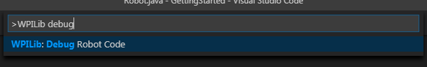
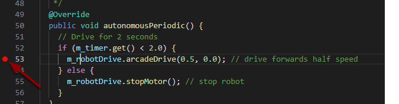

.. include:: <isonum.txt>

# Debugging a Robot Program

Inevitably, a program will not behave in the way we expect it to behave.  When this occurs, it becomes necessary to figure out why the program is doing what it is doing, so that we can make it do what we want it to do, instead.  Such an undesired program behavior is called a "bug," and this process is called "debugging."

A debugger is a tool used to control program flow and monitor variables in order to assist in debugging a program. This section will describe how to set up a debug session for an FRC\ |reg| robot program.

.. note:: For beginning users who need to debug their programs but do not know/have time to learn how to use a debugger, it is often possible to debug a program simply by printing the relevant program state to the console.  However, it is strongly recommended that students eventually learn to use a debugger.

## Running the Debugger



Press :kbd:`Ctrl+Shift+P` and type ``WPILib`` or click on the :guilabel:`WPILib Menu Item` to open the Command palette with WPILib pre-populated. Type Debug and select the Debug Robot Code menu item to start debugging. The code will download to the roboRIO and begin debugging.

## Breakpoints

A "breakpoint" is a line of code at which the debugger will pause the program execution so that the user can examine the program state.  This is extremely useful while debugging, as it allows the user to pause the program at specific points in problematic code to determine where exactly the program is deviating from the expected behavior.

The debugger will automatically pause at the first breakpoint it encounters.

### Setting a Breakpoint



Click in the left margin of the source code window (to the left of the line number) to set a breakpoint in your user program: A small red circle indicates the breakpoint has been set on the corresponding line.

## Debugging with Print Statements

Another way to debug your program is to use print statements in your code and view them using the RioLog in Visual Studio Code or the Driver Station.  Print statements should be added with care as they are not very efficient especially when used in high quantities.  They should be removed for competition as they can cause loop overruns.

.. tab-set-code::

    ```java
    System.out.print("example");
    ```

    ```c++
    wpi::outs() << "example\n";
    ```

## Debugging with NetworkTables

:doc:`NetworkTables </docs/software/networktables/networktables-intro>` can be used to share robot information with your debugging computer.  :term:`NetworkTables` can be viewed with your favorite Dashboard or :ref:`OutlineViewer <docs/software/wpilib-tools/outlineviewer/index:OutlineViewer>`.  One advantage of NetworkTables is that tools like :doc:`Shuffleboard </docs/software/dashboards/shuffleboard/getting-started/shuffleboard-tour>` can be used to graphically analyze the data.  These same tools can then be used with same data to later provide an operator interface for your drivers.

## Common Causes of Loop Overruns

Loop overruns occur when the robot's periodic methods (``robotPeriodic()``, ``teleopPeriodic()``, etc.) take longer than 20ms to complete. When this happens, the Driver Station will display a warning like ``Loop time of 0.03s overrun`` and the robot code may behave unpredictably. Here are common causes:

### Blocking Operations

- **Thread.sleep() or wait()**: Never use blocking sleep or wait calls in periodic methods
- **Synchronous I/O**: Reading files, network operations, or other blocking I/O operations
- **Busy-wait loops**: Loops that repeatedly check a condition without yielding (e.g., ``while(!sensor.isReady()) {}``)

### Excessive Computation

- **Complex calculations in periodic methods**: Move expensive calculations to separate threads or spread them across multiple loop iterations
- **Large data structure operations**: Sorting, searching, or iterating over large arrays or lists
- **Unoptimized algorithms**: O(n²) or worse algorithms running on large datasets

### Excessive Logging or Print Statements

- **System.out.println() in loops**: Console output is slow, especially when called frequently
- **Getting data to publish to NetworkTables**: While NetworkTables updates themselves are fast, retrieving complex data (e.g., vision processing results, large arrays) to publish can be slow
- **Excessive Shuffleboard updates**: Sending large amounts of data to the dashboard

### Hardware/Sensor Issues

- **Synchronous CAN calls**: Some motor controller methods may block waiting for a response
- **I2C or SPI timeouts**: Faulty sensors or loose connections can cause communication timeouts
- **USB device enumeration**: Plugging/unplugging USB devices during operation

### Tips to Avoid Loop Overruns

- Use :doc:`Notifier </docs/software/convenience-features/scheduling-functions>` for operations that need precise timing independent of the main loop
- Profile your code to identify slow sections (see :ref:`docs/software/advanced-gradlerio/profiling-with-visualvm:profiling with visualvm`)
- Remove or reduce print statements, especially in frequently-called code
- Cache values that are expensive to compute rather than recalculating every loop
- **Check the Driver Station log** to identify which periodic method is causing overruns. The log will show timestamps and which robot mode was active when the overrun occurred. Look for patterns - if overruns only happen during teleop, check ``teleopPeriodic()`` and subsystems used during teleop. If they occur consistently, check ``robotPeriodic()`` for code that runs regardless of mode.

## Learn More

- To learn more about debugging with VS Code see this [link](https://code.visualstudio.com/docs/editor/debugging).
- Some of the features mentioned in this VS Code [article](https://code.visualstudio.com/docs/editor/editingevolved) will help you understand and diagnose problems with your code.  The Quick Fix (yellow light bulb) feature can be very helpful with a variety of problems including what to import.
- One of the best ways to prevent having to debug so many issues is to do Unit Testing.
- Verifying that your robot works in :doc:`Simulation </docs/software/wpilib-tools/robot-simulation/introduction>` is also a great way to prevent having to do complex debugging on the actual robot.
