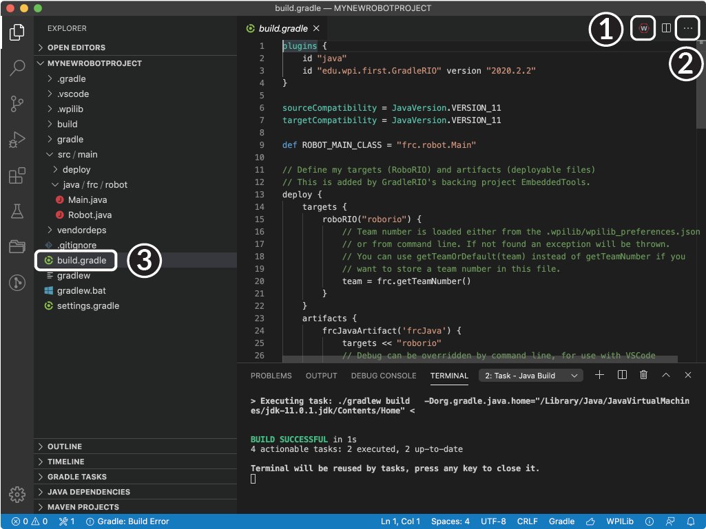
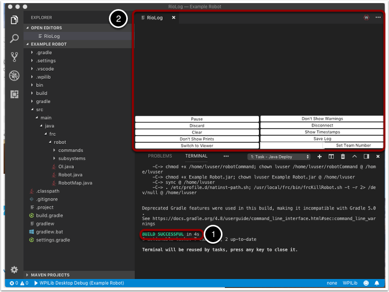

# Building and Deploying Robot Code

Robot projects must be compiled ("built") and deployed in order to run on Systemcore.  Since the code is not compiled natively on the robot controller, this is known as "cross-compilation."

## Build

To build a robot project, do one of:

1. In Visual Studio Code, click the WPILib logo in the top right to launch the WPILib Command Palette (or type :kbd:`ctrl+shift+p` and then type WPILib) and enter/select :guilabel:`Build Robot Code`
2. Open the shortcut menu indicated by the ellipses in the top right corner of the VS Code window and select :guilabel:`Build Robot Code`
3. Right-click on the build.gradle file in the project hierarchy and select :guilabel:`Build Robot Code`

## Deploy

To deploy a robot program, select :guilabel:`Deploy Robot Code` from any of the three locations from the previous instructions. That will build (if necessary) and deploy the robot program to Systemcore.

.. warning:: Avoid powering off the robot while deploying robot code. Interrupting the deployment process can corrupt the Systemcore filesystem and prevent your code from working until the Systemcore is :doc:`re-imaged </docs/zero-to-robot/step-3/imaging-your-roborio>`.

If successful, we will see a "Build Successful" message (1) and the RioLog will open with the console output from the robot program as it runs (2).

.. note:: The run button in VS Code's debug view is not used to run robot code. Instead, use the :guilabel:`Deploy Robot Code` command as described above. The debug view's run button is used for running and debugging code on the local machine in simulation, which is not applicable for robot code that runs on Systemcore.

## Build vs Deploy

Choosing to deploy robot code will first build the code if it has not been built since the last change. If the code has already been built, it will skip the build step and deploy the existing build artifacts to Systemcore. You can force a rebuild by selecting :guilabel:`Build Robot Code` before deploying. There are some differences when running the :guilabel:`Build Robot Code` command vs the :guilabel:`Deploy Robot Code` command:

1. :guilabel:`Build Robot Code` will download dependencies from the internet, while :guilabel:`Deploy Robot Code` will not. If you have not built the code before (for example, if you are working with a new project or you have recently cloned the repository, or you have added or changed a vendordep), you must run :guilabel:`Build Robot Code` at least once to download dependencies before you can deploy.
2. :guilabel:`Build Robot Code` will run unit tests, if your project has unit tests, while :guilabel:`Deploy Robot Code` will not.

## Clean

If you want to force a full rebuild of the code, you can select :guilabel:`Run Gradle Clean` from the WPILib Menu. This will delete all build artifacts and force a full rebuild the next time you build or deploy.
