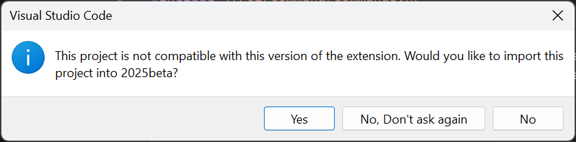
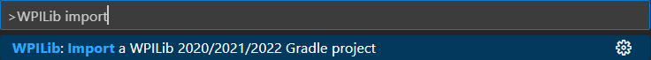
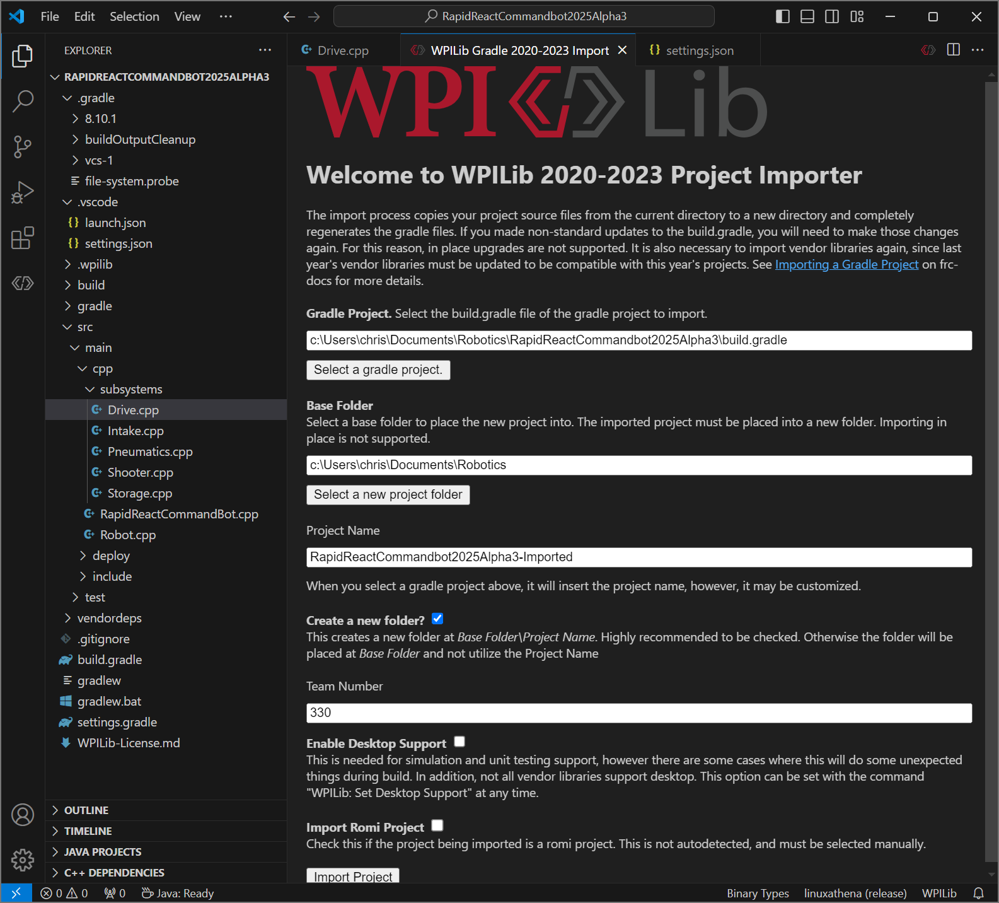
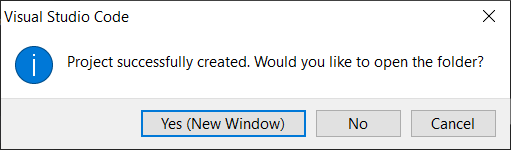
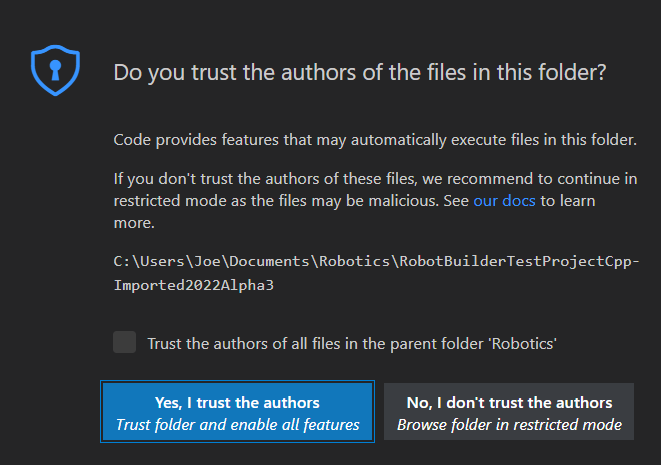
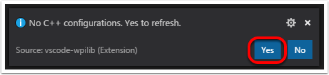

Importing a Gradle Project
==========================

Due to changes in the project, it is necessary to update the build files for a previous years Gradle project. It is also necessary to import vendor libraries again, since last year's vendor libraries must be updated to be compatible with this year's projects.

Automatic Import
----------------

To make it easy for teams to import previous years gradle projects into the current year's framework, WPILib includes a wizard for importing previous years projects into VS Code. This will generate the necessary gradle components and load the project into VS Code. In place upgrades are not supported.

.. important:: The import process copies your project source files from the current directory to a new directory and completely regenerates the gradle files. Additionally, it updates the code for the package changes made in 2022. If you made non-standard updates to the ``build.gradle``, you will need to make those changes again. For this reason, in place upgrades are not supported. It is also necessary to import vendor libraries again, since last year's vendor libraries must be updated to be compatible with this year's projects.

Launching the Import Wizard
^^^^^^^^^^^^^^^^^^^^^^^^^^^

When you open a previous year's project, you will be prompted to import that project. Click :guilabel:`yes`.

Alternately, you can chose to import it from the menu. Press :kbd:`Ctrl+Shift+P` and type "WPILib" or click the WPILib icon to locate the WPILib commands. Begin typing "Import a WPILib 2020/2021/2022 Gradle project" and select it from the dropdown as shown below.

You'll be presented with the WPILib Project Importer window. This is similar to the process of creating a new project and the window and the steps are shown below.  This window contains the following elements:

1. **Gradle Project**: Selects the project to be imported.  Users should select the build.gradle file in the root directory of the gradle project.
2. **Project Location**: This determines the folder in which the robot project will be located.
3. **Project Name**: The name of the robot project.  This also specifies the name that the project folder will be given if the Create New Folder box is checked. This must be a different directory from the original location.
4. **Create a New Folder**: If this is checked, a new folder will be created to hold the project within the previously-specified folder.  If it is *not* checked, the project will be located directly in the previously-specified folder.  An error will be thrown if the folder is not empty and this is not checked.
5. **Team Number**: The team number for the project, which will be used for package names within the project and to locate the robot when deploying code.
6. **Enable Desktop Support**: If this is checked, simulation and unit test support is enabled. However, there are some cases where this will do some unexpected things. In addition, all vendor libraries need desktop support which not all libraries do.
7. **Import Romi Project**: If this is checked, the project is imported using the Romi gradle template. This should only be checked for Romi projects.

Click :guilabel:`Import Project` to begin the upgrade.

The gradle project will be upgraded and copied into the new project directory. You can then either open the new project immediately using the pop-up below or open it later using the :kbd:`Ctrl+O` (or :kbd:`Command+O` for macOS) shortcut.

Click :guilabel:`Yes I trust the authors`.

C++ Configurations (C++ Only)
^^^^^^^^^^^^^^^^^^^^^^^^^^^^^

For C++ projects, there is one more step to set up IntelliSense. Whenever you open a project, you should get a pop-up in the bottom right corner asking to refresh C++ configurations.  Click :guilabel:`Yes` to set up IntelliSense.

3rd Party Libraries
^^^^^^^^^^^^^^^^^^^

It is necessary to update and re-import 3rd party libraries. See :doc:`3rd Party Libraries <3rd-party-libraries>` for details.
