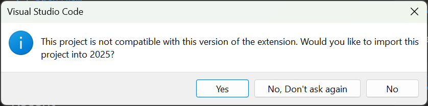

Importing a Gradle Project
==========================

Due to changes in the project, it is necessary to update the build files for a previous years Gradle project. It is also necessary to import vendor libraries again, since last year's vendor libraries must be updated to be compatible with this year's projects.

Automatic Import
----------------

To make it easy for teams to import previous years gradle projects into the current year's framework, WPILib includes a wizard for importing previous years projects into VS Code. This will generate the necessary gradle components and load the project into VS Code. In place upgrades are not supported. The importer automatically imports the old or new command framework 3rd party library (which ever one was used on the imported project).

.. important:: The import process copies your project source files from the current directory to a new directory and completely regenerates the gradle files. If you made non-standard updates to the build.gradle, you will need to make those changes again. For this reason, in place upgrades are not supported. It is also necessary to import vendor libraries again, since last year's vendor libraries must be updated to be compatible with this year's projects.

.. warning:: The automatic import process is broken in version 2021.3.1. As a workaround, the project may be :ref:`manually imported <docs/software/vscode-overview/importing-gradle-project:Manual Import Process (2020 to 2021)>`.

Launching the Import Wizard
^^^^^^^^^^^^^^^^^^^^^^^^^^^

When you open a previous year's project, you will be prompted to import that project. Click :guilabel:`yes`.

Alternately, you can chose to import it from the menu. Press :kbd:`Ctrl+Shift+P` and type "WPILib" or click the WPILib icon to locate the WPILib commands. Begin typing "Import a WPILib 2020 Gradle project" and select it from the dropdown as shown below.

.. image:: images/importing-previous-project/ImportGradleMenu.png

.. image:: images/importing-previous-project/VSCodeImport.png

You'll be presented with the WPILib Project Importer window. This is similar to the process of creating a new project and the window and the steps are shown below.  This window contains the following elements:

1. **Gradle Project**: Selects the project to be imported.  Users should select the build.gradle file in the root directory of the gradle project.
2. **Project Location**: This determines the folder in which the robot project will be located.
3. **Project Name**: The name of the robot project.  This also specifies the name that the project folder will be given if the Create New Folder box is checked. This must be a different directory from the original location.
4. **Create a New Folder**: If this is checked, a new folder will be created to hold the project within the previously-specified folder.  If it is *not* checked, the project will be located directly in the previously-specified folder.  An error will be thrown if the folder is not empty and this is not checked.
5. **Team Number**: The team number for the project, which will be used for package names within the project and to locate the robot when deploying code.
6. **Enable Desktop Support**: If this is checked, simulation and unit test support is enabled. However, there are some cases where this will do some unexpected things. In addition, all vendor libraries need desktop support which not all libraries do.

Click :guilabel:`Import Project` to begin the upgrade.

The gradle project will be upgraded and copied into the new project directory. You can then either open the new project immediately (the pop-up shown below should appear in the bottom right) or open it later using the :kbd:`Ctrl+O` (or :kbd:`Command+O` for macOS) shortcut.

.. image:: images/importing-eclipse-project/opening-project.png

C++ Configurations (C++ Only)
^^^^^^^^^^^^^^^^^^^^^^^^^^^^^

For C++ projects, there is one more step to set up IntelliSense. Whenever you open a project, you should get a pop-up in the bottom right corner asking to refresh C++ configurations.  Click :guilabel:`Yes` to set up IntelliSense.

.. image:: images/importing-eclipse-project/cpp-configurations.png

3rd Party Libraries
^^^^^^^^^^^^^^^^^^^

It is necessary to update and re-import 3rd party libraries. See :doc:`3rd Party Libraries <3rd-party-libraries>` for details.

Manual Import Process (2020 to 2021)
------------------------------------

As there were minimal changes to the gradle templates in 2021, it is possible to manually import a project from a 2020 version of GradleRIO to 2021, which may be convenient if you've heavily customized your build.gradle file. This method does *not* work for importing a 2019 project, and will not work for future years. There are two files that need to be updated.

wpilib_preferences.json
^^^^^^^^^^^^^^^^^^^^^^^

Open ``.wpilib\wpilib_preferences.json`` and change the ``projectYear`` to ``2021``.

.. code-block:: json
   :emphasize-lines: 4

   {
       "enableCppIntellisense": false,
       "currentLanguage": "java",
       "projectYear": "2021",
       "teamNumber": 330
   }

build.gradle
^^^^^^^^^^^^

.. tabs::

   .. tab:: Java

      .. code-block:: groovy
         :linenos:
         :emphasize-lines: 3, 60, 62-64, 67-71

         plugins {
             id "java"
             id "edu.wpi.first.GradleRIO" version "2021.1.2"
         }

         sourceCompatibility = JavaVersion.VERSION_11
         targetCompatibility = JavaVersion.VERSION_11

         def ROBOT_MAIN_CLASS = "frc.robot.Main"

         // Define my targets (RoboRIO) and artifacts (deployable files)
         // This is added by GradleRIO's backing project EmbeddedTools.
         deploy {
             targets {
                 roboRIO("roborio") {
                     // Team number is loaded either from the .wpilib/wpilib_preferences.json
                     // or from command line. If not found an exception will be thrown.
                     // You can use getTeamOrDefault(team) instead of getTeamNumber if you
                     // want to store a team number in this file.
                     team = frc.getTeamNumber()
                 }
             }
             artifacts {
                 frcJavaArtifact('frcJava') {
                     targets << "roborio"
                     // Debug can be overridden by command line, for use with VSCode
                     debug = frc.getDebugOrDefault(false)
                 }
                 // Built in artifact to deploy arbitrary files to the roboRIO.
                 fileTreeArtifact('frcStaticFileDeploy') {
                     // The directory below is the local directory to deploy
                     files = fileTree(dir: 'src/main/deploy')
                     // Deploy to RoboRIO target, into /home/lvuser/deploy
                     targets << "roborio"
                     directory = '/home/lvuser/deploy'
                 }
             }
         }

         // Set this to true to enable desktop support.
         def includeDesktopSupport = false

         // Defining my dependencies. In this case, WPILib (+ friends), and vendor libraries.
         // Also defines JUnit 4.
         dependencies {
             implementation wpi.deps.wpilib()
             nativeZip wpi.deps.wpilibJni(wpi.platforms.roborio)
             nativeDesktopZip wpi.deps.wpilibJni(wpi.platforms.desktop)

             implementation wpi.deps.vendor.java()
             nativeZip wpi.deps.vendor.jni(wpi.platforms.roborio)
             nativeDesktopZip wpi.deps.vendor.jni(wpi.platforms.desktop)

             testImplementation 'junit:junit:4.12'

             // Enable simulation gui support. Must check the box in vscode to enable support
             // upon debugging
             simulation wpi.deps.sim.gui(wpi.platforms.desktop, false)
             simulation wpi.deps.sim.driverstation(wpi.platforms.desktop, false)

             // Websocket extensions require additional configuration.
             // simulation wpi.deps.sim.ws_server(wpi.platforms.desktop, false)
             // simulation wpi.deps.sim.ws_client(wpi.platforms.desktop, false)
         }

         // Simulation configuration (e.g. environment variables).
         sim {
             // Sets the websocket client remote host.
             // envVar "HALSIMWS_HOST", "10.0.0.2"
         }

         // Setting up my Jar File. In this case, adding all libraries into the main jar ('fat jar')
         // in order to make them all available at runtime. Also adding the manifest so WPILib
         // knows where to look for our Robot Class.
         jar {
             from { configurations.runtimeClasspath.collect { it.isDirectory() ? it : zipTree(it) } }
             manifest edu.wpi.first.gradlerio.GradleRIOPlugin.javaManifest(ROBOT_MAIN_CLASS)
         }

   .. tab:: C++

      .. code-block:: groovy
         :linenos:
         :emphasize-lines: 4, 50, 52-54, 57-61, 85-86, 100-102

         plugins {
             id "cpp"
             id "google-test-test-suite"
             id "edu.wpi.first.GradleRIO" version "2021.1.2"
         }

         // Define my targets (RoboRIO) and artifacts (deployable files)
         // This is added by GradleRIO's backing project EmbeddedTools.
         deploy {
             targets {
                 roboRIO("roborio") {
                     // Team number is loaded either from the .wpilib/wpilib_preferences.json
                     // or from command line. If not found an exception will be thrown.
                     // You can use getTeamOrDefault(team) instead of getTeamNumber if you
                     // want to store a team number in this file.
                     team = frc.getTeamNumber()
                 }
             }
             artifacts {
                 frcNativeArtifact('frcCpp') {
                     targets << "roborio"
                     component = 'frcUserProgram'
                     // Debug can be overridden by command line, for use with VSCode
                     debug = frc.getDebugOrDefault(false)
                 }
                 // Built in artifact to deploy arbitrary files to the roboRIO.
                 fileTreeArtifact('frcStaticFileDeploy') {
                     // The directory below is the local directory to deploy
                     files = fileTree(dir: 'src/main/deploy')
                     // Deploy to RoboRIO target, into /home/lvuser/deploy
                     targets << "roborio"
                     directory = '/home/lvuser/deploy'
                 }
             }
         }

         // Set this to true to include the src folder in the include directories passed
         // to the compiler. Some eclipse project imports depend on this behavior.
         // We recommend leaving this disabled if possible. Note for eclipse project
         // imports this is enabled by default. For new projects, its disabled
         def includeSrcInIncludeRoot = false

         // Set this to true to enable desktop support.
         def includeDesktopSupport = false

         // Enable simulation gui support. Must check the box in vscode to enable support
         // upon debugging
         dependencies {
             simulation wpi.deps.sim.gui(wpi.platforms.desktop, true)
             simulation wpi.deps.sim.driverstation(wpi.platforms.desktop, true)

             // Websocket extensions require additional configuration.
             // simulation wpi.deps.sim.ws_server(wpi.platforms.desktop, true)
             // simulation wpi.deps.sim.ws_client(wpi.platforms.desktop, true)
         }

         // Simulation configuration (e.g. environment variables).
         sim {
             // Sets the websocket client remote host.
             // envVar "HALSIMWS_HOST", "10.0.0.2"
         }

         model {
             components {
                 frcUserProgram(NativeExecutableSpec) {
                     targetPlatform wpi.platforms.roborio
                     if (includeDesktopSupport) {
                         targetPlatform wpi.platforms.desktop
                     }

                     sources.cpp {
                         source {
                             srcDir 'src/main/cpp'
                             include '**/*.cpp', '**/*.cc'
                         }
                         exportedHeaders {
                             srcDir 'src/main/include'
                             if (includeSrcInIncludeRoot) {
                                 srcDir 'src/main/cpp'
                             }
                         }
                     }

                     // Defining my dependencies. In this case, WPILib (+ friends), and vendor libraries.
                     wpi.deps.vendor.cpp(it)
                     wpi.deps.wpilib(it)
                 }
             }
             testSuites {
                 frcUserProgramTest(GoogleTestTestSuiteSpec) {
                     testing $.components.frcUserProgram

                     sources.cpp {
                         source {
                             srcDir 'src/test/cpp'
                             include '**/*.cpp'
                         }
                     }

                     wpi.deps.vendor.cpp(it)
                     wpi.deps.wpilib(it)
                     wpi.deps.googleTest(it)
                 }
             }
         }

1. Change the GradleRIO version to the latest version (e.g. 2021.1.2 for the kickoff release)
2. (C++ Only) move ``wpi.deps.vendor.cpp(it)`` above ``wpi.deps.wpilib(it)`` (2 places)
3. (Optional) add ``simulation wpi.deps.sim.driverstation(wpi.platforms.desktop, XXXX)`` where XXXX is false for Java and true for C++. This allows the driver station to be used in simulation
4. (Optional) add the websocket and simulation configuration blocks to support websockets simulation (i.e. Romi)

imgui.ini
^^^^^^^^^

Delete ``imgui.ini`` (the Simulator GUI ini file) if it exists. The 2020 file format is not compatible with the 2021 format. The file will be regenerated when the Simulator GUI is run).

Update 3rd Party Libraries
^^^^^^^^^^^^^^^^^^^^^^^^^^

It is necessary to update 3rd party libraries. See :doc:`3rd Party Libraries <3rd-party-libraries>` for details.
